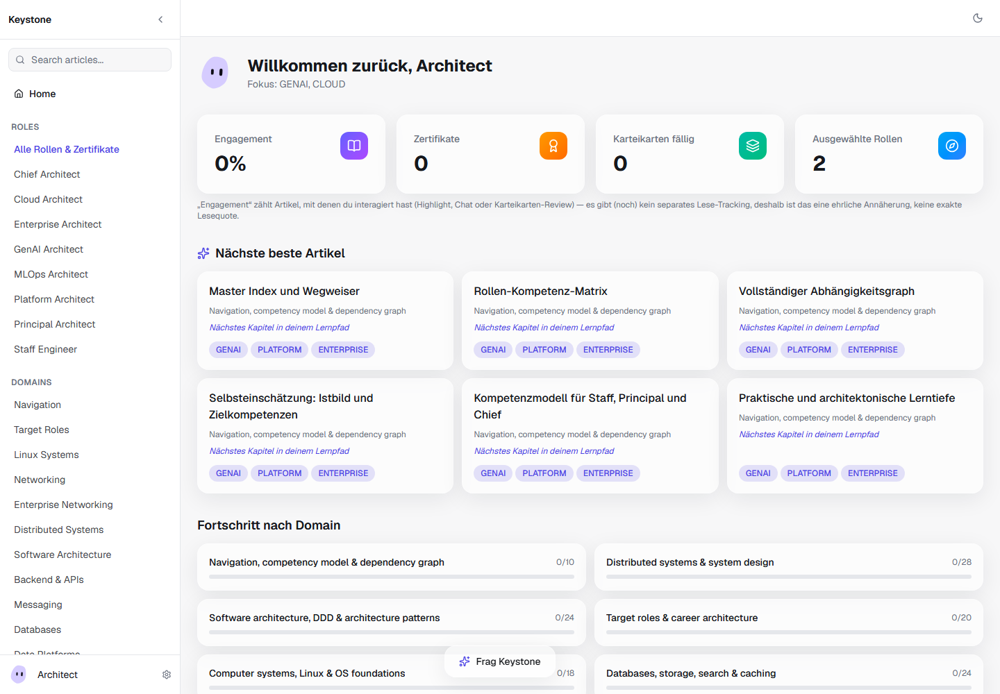

# Keystone



**The knowledge base that holds your architecture career together.**

A self-hosted platform for studying, practicing, and self-certifying across Enterprise / Solutions / Platform / Cloud / GenAI / MLOps architecture roles — built on a bundled 720-article Markdown knowledge base and running entirely on your own machine. An LLM is optional: reading, spaced repetition and self-assessed role tests work without one.

> **Language note:** the bundled articles are written in **German** (technical terms mostly in English). Parts of the UI are German as well.

---

## Features

- **720-article enterprise-architecture curriculum** in 31 domains (Linux and networking foundations through distributed systems, cloud, security, GenAI/agentic AI, MLOps, FinOps, IoT, commerce integration and architect practice), tagged for 8 roles (Staff, Principal, Chief, Platform, Enterprise, Cloud, GenAI, MLOps). Each article has learning goals, trade-offs, a production checklist, labs and interview questions with reference answers.
- **Spaced-repetition study mode (SM-2)** over the ~3,850 interview questions embedded in the articles.
- **Per-role certification tests**: 20 questions sampled from a role's articles, 70% pass threshold, and a shareable **PDF certificate** (with verification hash) plus a social-card PNG.
  - *Without an LLM:* self-assessed mode — reveal the reference answer and rate yourself.
  - *With an LLM:* graded mode — free-text answers are scored against the reference answer.
- **Reader with highlights and notes**: highlight any passage, keep per-article notes and conversations in a sidebar, full-text search and a command palette.
- **Bring your own LLM (optional)** — four pluggable backends, switchable in Settings:
  - your own **OpenAI** or **Anthropic** API key (encrypted at rest with AES-256-GCM),
  - your locally installed and logged-in **Claude Code CLI**,
  - your locally installed and logged-in **Codex CLI** (explicitly *experimental*, never preselected).
  With a provider you also get article-aware chat, "ask about this selection", conversation summaries and LLM-graded tests.
- **Own your data**: notes, highlights, chats, test attempts and certificates live in your own Postgres database. Nothing leaves your machine except the prompts you send to the LLM provider you chose — and the optional, off-by-default news feature, which fetches public RSS feeds.
- **Desktop app (Tauri) or plain browser**, installable as a **PWA**; a QR code in Settings opens it on your phone in the same network.

Not built yet: multi-user login (v1 is a single local user), and offline support for LLM-backed features.

---

## Quick start

Prerequisites: [Docker](https://www.docker.com/) and [Node.js](https://nodejs.org/) 20+.

```bash
git clone https://github.com/WestMoneyDE/keystone-architect.git
cd keystone-architect
docker compose up -d   # Postgres 16 on localhost:5432
npm install
npm run setup          # creates the schema and seeds the bundled knowledge base
npm run dev            # http://localhost:3000
```

No `.env` is required — the defaults match the bundled `docker-compose.yml` and `content/` folder. Copy `.env.example` to `.env` only to override something (other database, port, your own `ENCRYPTION_KEY`, …).

On first launch the setup wizard asks for a display name, an (optional) LLM provider, the roles you want to study, and whether to enable the news feature. You can skip the LLM step and add one later in **Settings**.

Production-style run: `npm run build && npm run start`.

See [`docs/SETUP.md`](docs/SETUP.md) for the full environment reference, provider setup and troubleshooting, and [`docs/REMOTE-ACCESS.md`](docs/REMOTE-ACCESS.md) for access from outside your network.

### Desktop app (Tauri)

`npm run tauri:build` produces a native window with a tray icon (Windows: NSIS `.exe` and `.msi` under `src-tauri/target/release/bundle/`; macOS/Linux targets are configured but must be built on those platforms). **Limitation:** the Next.js server is not bundled as a sidecar yet — Node.js/npm and Docker still need to be installed; the shell starts Postgres via `docker compose`, waits for a health check and opens the app.

---

## Configuring an LLM provider (optional)

1. **OpenAI API key** — billed per API call by OpenAI.
2. **Anthropic API key** — billed per API call by Anthropic.
3. **Claude Code CLI** — run `claude login` yourself in a terminal first; Keystone only invokes the already-authenticated `claude` binary and never handles your credentials.
4. **Codex CLI (experimental)** — run `codex login` first. Opt-in only; OpenAI's terms don't document this usage pattern as clearly, so use at your own risk.

The wizard's "Verfügbarkeit prüfen" (check availability) button runs the same check the app uses at runtime and reports `ok`, `not-authenticated`, `not-installed` or `invalid-key`. Stored API keys are encrypted with `ENCRYPTION_KEY`; if you don't set one, a random key is generated on first use in the git-ignored `storage/encryption.key`.

---

## Content

The knowledge base lives in [`content/knowledge-base/`](content/knowledge-base) (one Markdown file per article with JSON frontmatter) and [`content/manifest.json`](content/manifest.json) (domains). `npm run db:seed` re-imports it at any time (idempotent). `npm run check:content` (also part of `npm run lint`) scans the repository for personal data, private-source leftovers and secrets.

---

## License

Keystone — code **and** bundled content — is licensed under the **[PolyForm Noncommercial License 1.0.0](LICENSE)**.

In plain terms (the `LICENSE` file is authoritative):

- ✅ You **may** use, study, modify, fork and share Keystone for any **noncommercial** purpose — personal learning, hobby projects, research, teaching, and use by charities, educational or public institutions.
- ❌ You **may not** sell it, sublicense it for money, offer it as a paid or hosted commercial service, bundle it into a commercial product, or use it for any other commercial purpose — **unless you have a separate written commercial license**.
- Keep the license and the `Required Notice:` line when you share copies.

**Commercial use?** Open a GitHub issue titled **"Commercial license request"** — see [`COMMERCIAL-LICENSE.md`](COMMERCIAL-LICENSE.md). Please don't post confidential details in the public issue.

---

## Contributing & security

- Contributions are welcome — see [`CONTRIBUTING.md`](CONTRIBUTING.md).
- Found a vulnerability? Please report it privately — see [`SECURITY.md`](SECURITY.md).

## Credits

- Avatars are generated with [Blobatar](https://github.com/404khai/blobatar) (MIT).
- Built on Next.js, Prisma, PostgreSQL, Tailwind CSS, Framer Motion, `@react-pdf/renderer` and Tauri 2.

Copyright WestMoneyDE.
