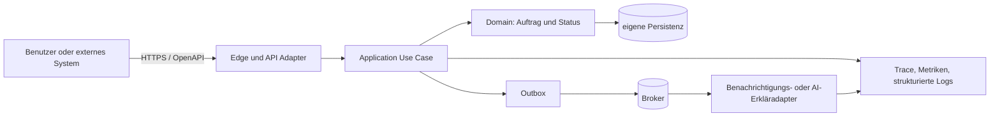

# Software Architect als Zielrolle

## Zweck, Definition und Scope

Ein Software Architect verantwortet, dass eine Software über ihre Lebenszeit verständlich verändert, sicher betrieben und an andere Systeme angeschlossen werden kann. Das Ergebnis ist nicht ein einmaliges Diagramm und auch nicht ein besonders abstraktes Codegerüst. Es ist eine überprüfbare Struktur aus fachlichen Grenzen, Abhängigkeiten, Datenverantwortung, Laufzeitpfaden, Schnittstellen, Tests, Telemetrie und Entscheidungen, mit der Teams neue Anforderungen umsetzen können, ohne unerwartet fremde Teile zu brechen.

Die Rolle liegt zwischen Produktabsicht und konkreter Implementierung. Sie formuliert nicht einfach „Microservices“ oder „Clean Architecture“, sondern beantwortet eine konkrete Änderungsfrage: *Welche Fähigkeit soll sich ändern, wer besitzt sie, welche Daten und Verträge berührt sie, wie erkennen wir einen Bruch, und wie ist die Änderung rückgängig zu machen?* Eine API, ein Event oder ein Datenmodell sind daher keine bloßen technischen Artefakte. Sie sind Versprechen zwischen Personen, Teams und Laufzeiten.

Eigene Projektarbeit – etwa ein Konzept mit Prozessruntime, Event Sourcing, Zustandsmaschinen und Authentisierung, eine überprüfungsorientierte Engineering-Schleife oder eine umgesetzte Systemintegration – liefert Lernkontext im jeweils belegten Umfang. Daraus folgt keine formale Software-Architect-Rolle, keine Führung eines Entwicklungsteams, keine produktive Plattform-SLA, keine globale Last und keine nicht nachgewiesene Technologiebeherrschung.

Nach diesem Kapitel kann der Leser:

1. fachliche, technische, Daten-, Sicherheits- und Betriebsgrenzen als überprüfbare Architektur beschreiben;
2. einen modularen Monolithen, Servicezuschnitt und Eventfluss anhand von Änderungskopplung statt Modebegriffen abwägen;
3. einen synchronen API- und asynchronen Eventvertrag mit Ownership, Versionierung, Idempotenz, Fehlerverhalten und Observability entwerfen;
4. Architekturentscheidungen durch ADRs, statische Abhängigkeitsregeln, Vertrags- und End-to-End-Tests sowie Betriebsdaten nachweisbar machen;
5. Performance, Zuverlässigkeit, Security, Governance und Kosten als Eigenschaften des Softwareentwurfs behandeln;
6. Staff-, Principal- und Chief-Entscheidungen von täglichem Coding und reinem Management sauber abgrenzen.

## Kompetenzmarker und Evidenzgrenzen

| Marker | Status | Bedeutung |
|---|---|---|
| CURRENT-EVIDENCE | offen | Eigene Selbsteinschätzung: belegte Praxis zu diesem Thema festhalten, Lücken als Lernziel markieren. |
| HANDS-ON-TARGET | aktiv | Eine echte oder sauber simulierte Änderung durchquert Modul, Vertrag, Persistenz, Test, Telemetrie und Rollback. |
| ARCHITECT-TARGET | aktiv | Fachlichkeit, Code, Daten, Integrationen und Laufzeit werden gegen explizite Qualitätsziele und Change-Szenarien geschnitten. |
| STAFF-TARGET | aktiv | Mehrere Teams erhalten gemeinsame, leichtgewichtige Entscheidungs-, Test-, Vertrags- und Telemetrieregeln. |
| CHIEF-TARGET | aktiv | Architektur wird als Portfolio von Lieferfähigkeit, Risiko, Kosten, Souveränität und Modernisierung geführt. |
| SPECIALIST-OPTIONAL | aktiv | Compiler, formale Methoden, Datenbankinternals, Kryptografie, Performance-Runtime und tiefes Security Testing sind klar übergebene Spezialdisziplinen. |

## Mental Model: Stadtplan mit stabilen Grundstücksgrenzen

Softwarearchitektur ähnelt einem Stadtplan. Straßen und Verträge erlauben Bewegung; Grundstücksgrenzen legen fest, wer umbauen darf; Versorgungsleitungen verbinden Gebäude; Bebauungsregeln verhindern, dass eine lokale Abkürzung die ganze Stadt unbewohnbar macht. Eine gute Grenze erzeugt nicht möglichst viele Mauern. Sie erlaubt häufige, lokale Änderungen und macht seltene, teure Änderungen ausdrücklich sichtbar.



Das Diagramm zeigt vier verschiedene Dinge, die oft vermischt werden:

- **Fachliche Ownership:** Der Auftrag- und Statuskern definiert seine Zustände und Regeln.
- **Abhängigkeitsrichtung:** Adapter kennen den Kern; der Kern kennt keine HTTP-, Broker- oder Datenbankspezifika.
- **Datenfluss:** Ein erfolgreicher Zustandswechsel kann ein Event veröffentlichen, ohne dass der API-Request auf jeden Consumer warten muss.
- **Betriebsfluss:** Trace-Kontext und Domänenereignisse machen eine Anfrage über Adapter sichtbar.

Die Analogie endet dort, wo Präzision beginnt. Softwaregrenzen sind nur dann real, wenn der Build, die Sprache, Reviews und Tests verbotene Abhängigkeiten erkennen. Ein Paketdiagramm ohne kontrollierte Imports ist ein Wunschbild.

Die Architektur hält sechs Invarianten:

1. **Fähigkeiten gehören einem Owner.** Ein Team oder Modul besitzt die fachlichen Regeln und den autoritativen Schreibpfad.
2. **Daten folgen Ownership.** Eine fremde Tabelle direkt zu ändern, um eine API zu umgehen, ist versteckte Kopplung.
3. **Verträge sind absichtlich kompatibel oder absichtlich gebrochen.** Beides braucht Version, Migration, Consumer- und Rollbackplan.
4. **Synchronität ist ein Produktversprechen.** Nur was der Nutzer vor dem nächsten Schritt wissen muss, gehört zwingend in den Requestpfad.
5. **Architektur ist ausführbar.** Tests, Telemetrie, Buildregeln und Releaseverfahren prüfen die Behauptungen.
6. **Keine Grenze ist kostenlos.** Jeder Service, Broker, Adapter oder Layer erzeugt Latenz, Betrieb, Security- und Lernaufwand.

## Prerequisites und Dependencies

Die harte Grundlage bilden die [Rollen-Kompetenz-Matrix](../00-navigation-governance/02-rollen-kompetenz-matrix.md), die [Selbsteinschätzung und Evidenzgrenzen](../00-navigation-governance/04-cv-istbild-und-zielkompetenzen.md), das [Kompetenzmodell](../00-navigation-governance/05-kompetenzmodell-fuer-staff-principal-und-chief.md), die [praktische und architektonische Lerntiefe](../00-navigation-governance/06-praktische-und-architektonische-lerntiefe.md) sowie die [Laborstrategie](../00-navigation-governance/09-laborstrategie-und-beweisartefakte.md). Sie verhindern, dass dieses Kapitel Lernziele als belegte Erfahrung ausgibt.

| Beziehung | Kapitel | Anschluss |
|---|---|---|
| related | [KB-0011: GenAI Solution Architect](01-genai-solution-architect-als-zielrolle.md) | GenAI-Lösungen brauchen testbare Prozess-, Daten- und Sicherheitsgrenzen, nicht nur einen Modellaufruf. |
| related | [KB-0012: GenAI Engineer](02-genai-engineer-als-zielrolle.md) | Implementierungsnähe macht Architekturannahmen messbar und widerlegbar. |
| related | [KB-0014: Platform Architect](04-platform-architect-als-zielrolle.md) | Plattformen standardisieren die wiederkehrenden Build-, Deploy-, Contract- und Observabilitypfade. |
| related | [KB-0017: Solution Architect](07-solution-architect-als-zielrolle.md) | Die Lösungsarchitektur setzt den End-to-End-Nutzen; Softwarearchitektur macht ihn innerhalb der Software veränderbar. |
| related | [KB-0018: System Architect](08-system-architect-als-zielrolle.md) | Runtime, OS, Netzwerk und Hardware begrenzen die Wirkung des Softwareentwurfs. |
| related | [KB-0020](10-mlops-architect-als-zielrolle.md) | Modell-, Daten- und Pipelinegrenzen erweitern dieselben Prinzipien für MLOps. |
| applies | [KB-0031](../00-navigation-governance/01-master-index-und-wegweiser.md#kb-0031) | Spätere Software- und Betriebssystemgrundlagen vertiefen die Laufzeitannahmen. |
| applies | [KB-0572](../00-navigation-governance/01-master-index-und-wegweiser.md#kb-0572) | Das spätere Observability-Kapitel konkretisiert Metriken, Traces und Logs. |
| applies | [KB-0618](../00-navigation-governance/01-master-index-und-wegweiser.md#kb-0618) | Enterprise-Architecture- und Governance-Fragen verbinden lokale Softwareentscheidungen mit dem Portfolio. |
| applies | [KB-0720](../00-navigation-governance/01-master-index-und-wegweiser.md#kb-0720) | Portfolioevidenz trennt Behauptung, Messung, Review und offenen Lernbedarf. |

## Core Concepts: Grenzen, Abhängigkeiten und Änderbarkeit

### Fachliche Grenze vor technischem Framework

Ein Modul ist kein Ordner, der nach einem Framework benannt ist. Es ist eine Fähigkeit mit Sprache, Regeln, Daten und einem klaren Vertrag. Beispiele sind `Auftrag`, `Berechtigung`, `Abrechnung`, `Wissenszugriff` oder `Fallbearbeitung`. Ein Modul kann eine Datenbanktabelle, einen Prozess, einen API-Endpunkt, Events und Hintergrundjobs besitzen. Entscheidend ist: Änderungen in einem Modul sollen nicht implizit die Interna eines anderen Moduls erzwingen.

Eine mögliche Struktur eines modularen Monolithen:

```text
src/
  order/
    domain/          Zustände, Regeln, Wertobjekte, Domänenereignisse
    application/     Use Cases, Ports, Transaktionen, Autorisierungskontext
    adapters/
      inbound/       HTTP, Event-Consumer, CLI
      outbound/      Persistenz, Broker, externe Anbieter
  notification/
    domain/
    application/
    adapters/
  shared-kernel/     nur stabil begründete, kleine gemeinsame Begriffe
```

Die Begriffe `domain`, `application` und `adapter` sind kein Dogma. Ihre Aufgabe ist die **Abhängigkeitsrichtung**: Fachregeln dürfen nicht importieren müssen, wie ein HTTP-Framework, ein ORM, eine Queue oder ein Modellanbieter funktioniert. Dadurch kann eine Integration ersetzt oder getestet werden, ohne die Fachregel umzuschreiben.

Ein `shared-kernel` ist besonders gefährlich: Jedes „gemeinsame Hilfspaket“ kann zu einer versteckten Plattform werden. Er darf nur stabile, gemeinsam verstandene Begriffe enthalten. Ein gemeinsames Datenmodell für alle Teams ist häufig ein Kopplungsknoten, keine Wiederverwendung.

### Modularer Monolith, Service und verteiltes System

Ein modularer Monolith ist ein einzelnes deploybares Artefakt mit intern erzwungenen Grenzen. Ein Service ist eine unabhängig deploybare Einheit mit eigener Betriebs-, Daten- und Vertragsverantwortung. Die zweite Variante erlaubt unabhängige Releases und Fehlerisolation, erzeugt aber Netzwerk, Authentisierung, Observability, CI/CD, Daten- und Incidentkomplexität.

| Frage | Modularer Monolith ist oft passend | Separater Service ist eher begründet |
|---|---|---|
| Änderung | Fähigkeiten ändern gemeinsam und ein Team besitzt sie. | Releasezyklen, Skalierung oder Compliancegrenzen sind wirklich unabhängig. |
| Daten | Starke Transaktion über dieselben Regeln ist nötig. | Autoritative Datenownership ist klar getrennt und Querzugriffe haben einen Vertrag. |
| Betrieb | Kleine Plattform- und On-call-Kapazität, geringe Komplexität. | Team kann SLO, Monitoring, Deployment, On-call und Incidentverantwortung tragen. |
| Leistung | Prozessaufruf erfüllt Budget und Last. | Eigene Lastcharakteristik, Failure Domain oder Ressourcenkonkurrenz verlangt Isolation. |
| Security | Einheitliche Trust Boundary und Berechtigung. | Unterschiedliche Datenklasse, externe Exposition oder Privilegien erfordern eine nachweisbare Grenze. |
| Organisation | Conway-konforme Zusammenarbeit ist eng. | Dauerhafte autonome Ownership besteht, nicht nur ein temporäres Projektteam. |

Ein Microservice ohne Datenownership ist ein verteilter Monolith. Eine API, die nur intern auf eine gemeinsame Datenbanktabelle zugreift, verlegt Kopplung vom Code in den Betrieb. Die richtige erste Frage lautet deshalb nicht „Wie viele Services?“, sondern „Welche Änderungen, Daten, Verantwortungen und Ausfallfolgen sind voneinander unabhängig?“.

### Ports, Adapter und Dependency Inversion

Ein **Port** beschreibt, was der Kern benötigt oder anbietet. Ein **Adapter** übersetzt zwischen Port und Technologie. Ein Outbound-Port kann `OrderRepository`, `EventPublisher` oder `IdentityDirectory` heißen. Der Kern braucht dann keine Kenntnis von PostgreSQL, Kafka oder OIDC-SDK. Ein Inbound-Adapter kann HTTP oder einen Eventconsumer in einen Use Case übersetzen.

Die Technik schafft allein keine Entkopplung. Ein `Repository`-Interface, das alle ORM-Details exponiert, trägt die Kopplung nur an eine andere Stelle. Ein guter Port ist klein, verwendet eine fachliche Sprache und besitzt eindeutige Fehlersemantik: „nicht gefunden“, „temporär nicht verfügbar“, „Version konfliktbehaftet“ statt technologieinterner Exceptions.

### Datenownership, Konsistenz und Events

Für jeden Datensatz sollte eine Tabelle im Architekturentscheid stehen:

| Frage | Beispiel für Auftragsstatus |
|---|---|
| Wer schreibt autoritativ? | `order`-Modul nach Autorisierungs- und Zustandsprüfung. |
| Wer liest wofür? | API-Adapter für aktuellen Status; Reporting aus repliziertem, klar als abgeleitet markiertem Read Model. |
| Wie wird Änderung sichtbar? | Domain Event `order.status.changed` aus transaktional gesicherter Outbox. |
| Welche Konsistenz braucht der Nutzer? | Nach bestätigter Änderung zeigt die Auftragsansicht den neuen Status; E-Mail kann nachziehen. |
| Was geschieht bei Duplikat? | Consumer ist idempotent anhand Event-ID und Business-Key. |
| Wie werden alte Consumer geschützt? | Additive Felder zuerst; Consumer-Verträge, Nutzungsinventar, Deprecationfenster und Migration. |
| Wie wird korrigiert? | Fachliche Kompensationsaktion oder neue Statusänderung, nicht unsichtbares Überschreiben historischer Fakten. |

Ein Event ist eine Aussage über eine eingetretene Tatsache. Ein Befehl verlangt eine Aktion. `change-order-status` ist ein Befehl; `order.status.changed` ist ein Event. Die Begriffe nicht zu trennen führt zu Consumerlogik, die unbemerkt in den Autoritätspfad schreibt.

Die **Transactional Outbox** reduziert das Dual-Write-Problem: Fachzustand und ausgehender Eventeintrag werden in einer lokalen Transaktion geschrieben. Ein separater Publisher liefert den Outboxeintrag später an den Broker. Das verhindert nicht alle Duplikate, Verzögerungen, falschen Consumer oder Brokerausfälle. Es ersetzt „exactly once“ durch ein ehrlicheres Modell: mindestens einmal liefern, idempotent verarbeiten, Fortschritt und Dead-Letter-Pfad beobachten.

### Contracts: API, Event und Fehler

Die OpenAPI Specification definiert eine sprachneutrale Schnittstellenbeschreibung für HTTP APIs. Laut aktueller Spezifikationsseite ist OAS 3.2.1 die jüngste veröffentlichte Fassung (Stand 2026-09-15); eine konkrete Implementierung muss trotzdem die von ihren Tools unterstützte Version festlegen. OpenAPI unterstützt Dokumentation, Client-/Servergeneration und Contract Tests, garantiert aber keine Fachsemantik oder Verfügbarkeit. Quelle: [OpenAPI Specification](https://spec.openapis.org/oas/v3.2.1.html).

Ein Contract enthält mindestens:

- fachlichen Zweck und Autorisierung;
- Request-/Response- oder Event-Schema sowie Semantik der Felder;
- Fehlerklasse, Retrybarkeit, Idempotenz und Zeitschranke;
- Version, Kompatibilitätsregel und Deprecationdatum;
- Korrelation und minimale Telemetriedaten ohne sensible Nutzdaten;
- Datenklassifikation, Retention und Ownership;
- SLO-/Rate-/Quota-Grenzen, falls sie zugesichert sind;
- Consumer- oder Provider-Test und klare Kontakt-/Escalationownership.

Für HTTP sollten Fehler nicht nur als Text erscheinen. RFC 9457 definiert ein Problem-Details-Format für HTTP APIs und löst RFC 7807 ab. Ein Contract muss außerdem erklären, ob `404` eine fehlende Ressource, eine bewusst nicht preisgegebene Berechtigung oder ein temporär nicht repliziertes Read Model bedeutet. Quellen: [RFC 9457](https://www.rfc-editor.org/rfc/rfc9457.html), [OpenAPI Specification](https://spec.openapis.org/oas/v3.2.1.html).

### Architekturentscheidungen und Fitness Functions

Eine Architekturentscheidung ist dann gut, wenn sie ihren Kontext, die Alternativen, die Folge und die spätere Revisionsbedingung zeigt. Ein Architecture Decision Record (ADR) ist kein Freigabeformular. Er macht eine reversible oder irreversible Entscheidung überprüfbar.

| ADR-Feld | Beispiel |
|---|---|
| Kontext | Auftragsstatus muss synchron bestätigt werden; Benachrichtigungen dürfen verzögert eintreffen. |
| Entscheidung | Modularer Monolith; Statuswechsel schreibt Outboxevent; Notifications konsumieren asynchron. |
| Alternativen | Direkter E-Mail-Aufruf im Request; separates Auftrags- und Benachrichtigungsservice-Paar; zentraler Shared-Database-Trigger. |
| Konsequenzen | Async-Verzögerung und idempotenter Consumer nötig; API bleibt bei Notification-Ausfall verfügbar. |
| Evidenz | Contract Test, Outbox-Metrik, Fehlerprobe, p95-Budget, Consumer-Owner. |
| Revisions-Trigger | Mehrere autonome Teams, anhaltend andere Skalierung, regulatorische Datengrenze oder wiederholte Betriebsprobleme. |

**Fitness Functions** prüfen beabsichtigte Eigenschaften regelmäßig. Sie können statisch, dynamisch oder organisatorisch sein.

| Eigenschaft | Test oder Signal | Fehlersignal |
|---|---|---|
| Abhängigkeitsrichtung | Architekturtest verbietet `domain → adapters`. | Import eines HTTP-/ORM-/Brokerpakets im Domainbereich. |
| Vertragskompatibilität | Provider-/Consumercontract in CI. | Entferntes Feld oder geänderte Fehlersemantik bricht Consumer. |
| Änderbarkeit | Durchlaufzeit eines bekannten Change-Szenarios, Reviewbefund. | Eine Fachregel braucht Änderungen in unbeteiligten Modulen. |
| Zuverlässigkeit | Error budget, Outbox-Lag, Wiederholungs-/DLQ-Rate, Wiederherstellungstest. | Funktion wird als erfolgreich gemeldet, Event bleibt dauerhaft ungeprüft. |
| Security | Threat-Model-Review, SAST/Dependency Scan, Authorization Tests. | Zugriff vor Fachautorisierung oder sensibles Ereignis im Log. |
| Observability | Trace-Korrelation, Version und Ownerlabel auf kritischen Pfaden. | Incident kann nicht einem Change oder Contract zugeordnet werden. |
| Kosten | Kosten je akzeptiertem Auftrag, Queue-/Retry-/Storagevolumen. | „Billiger“ Pfad erzeugt mehr Fehlversuche, Support oder Lock-in. |

## Architecture und Data Flow: Nachvollziehbarer Statuswechsel

Ein Beispiel verbindet Commerce-Integration mit einem optionalen AI-Erklärpfad. Es ist ein Lehrmodell, keine Aussage über eine vorhandene Produktion.

```text
1. Client → HTTPS POST /orders/{id}/status
2. HTTP Adapter → Authentisierung, syntaktische Validierung, Trace-Kontext
3. Application Use Case → Autorisierung und Transaktionsgrenze
4. Domain → gültiger Zustandsübergang und Fachereignis
5. Persistenz + Outbox → Status und Eventeintrag atomar lokal sichern
6. Response → bestätigten, autoritativen Status zurückgeben
7. Outbox Publisher → Event mindestens einmal an Broker
8. Consumer → idempotente Benachrichtigung, Reporting, optionale AI-Erklärung
9. Telemetrie → Trace, Event-ID, Revision, Outcome, Lag, Fehlerklasse
```

| Schritt | Verantwortliche Entscheidung | Failure Mode | Sichere Haltung |
|---|---|---|---|
| API-Eingang | Authentisierung ist nicht gleich Fachautorisierung. | Token gültig, aber Zugriff auf fremden Auftrag. | Tenant-/Ressourcenzuordnung vor Statusänderung prüfen. |
| Zustandswechsel | Nur der Domainkern bewertet Übergänge. | Zwei konkurrierende Änderungen überschreiben einander. | Optimistische Version oder fachliche Konfliktsemantik. |
| Persistenz | Status und Outbox gemeinsam schreiben. | Daten stehen da, Event fehlt. | Lokale Transaktion und Outboxrecovery. |
| Publishing | At-least-once ist erwartbar. | Duplikat, Reihenfolge, Brokerunterbrechung. | Idempotenz, Key/Partition, Lag/DLQ, Replayplan. |
| Consumer | Abgeleitete Wirkung darf nicht API-Erfolg verfälschen. | E-Mail/AI-Runtime fällt aus. | Status bleibt gültig; Consumeralarm, Retry oder sichtbarer ausstehender Zustand. |
| AI-Erklärung | Generierter Text ist nicht autoritativ. | Halluzination, Datenabfluss, Anbieterfehler. | Quellen-/Policygrenze, Fallback, Human Gate bei risikoreichen Wirkung. |
| Telemetrie | Kontext ohne vertrauliche Payload. | PII/Secrets in Trace oder Log. | Schema, Redaction, Zugriff, Retention und Sampling definieren. |

Die Aufteilung zeigt eine zentrale Trade-off-Entscheidung: Ein Nutzer braucht die Wahrheit über den Status sofort; eine E-Mail oder generierte Erklärung darf verzögert auftreten. Wird alles synchron gekoppelt, wächst die Latenz- und Ausfallfläche. Wird alles asynchron gestellt, fehlt dem Nutzer möglicherweise die notwendige Bestätigung. Architektur beginnt mit dieser fachlichen Zeitsemantik.

## Protocols, Standards und Tools

| Bereich | Standard oder Werkzeug | Sinnvoller Einsatz | Grenze |
|---|---|---|---|
| Architekturdescription | [ISO/IEC/IEEE 42010](https://www.iso.org/standard/74393.html) | Stakeholder, Concerns, Viewpoints, Modelle und Begründungen einer Architektur strukturieren. | Ein Standard erzeugt weder korrekte Implementierung noch Akzeptanz. |
| HTTP Contract | [OpenAPI 3.2.1](https://spec.openapis.org/oas/v3.2.1.html) | API-Beschreibung, Dokumentation, Validierung und Contract-Test als maschinenlesbarer Vertrag. | Versionssupport der Toolchain und Fachsemantik bleiben zu prüfen. |
| Fehlerformat | [RFC 9457](https://www.rfc-editor.org/rfc/rfc9457.html) | Konsistente, maschinenlesbare HTTP-Fehlerdetails. | Keine Berechtigungs-, Retry- oder Geschäftssemantik ohne Ergänzung. |
| Asynchroner Vertrag | [AsyncAPI](https://www.asyncapi.com/docs/reference/specification/latest) | Topics, Nachrichten, Channels, Operationen und Eventdokumentation. | Liefert keinen Betrieb, keine Datenownership und keine Idempotenz. |
| Event-Hülle | [CloudEvents](https://cloudevents.io/) | Metadaten für Ereignisse über Protokolle und Brokergrenzen. | Fachschema, Verträge und Datenklassifikation bleiben eigene Arbeit. |
| Telemetrie | [OpenTelemetry Semantic Conventions](https://opentelemetry.io/docs/specs/semconv/) | Gemeinsame Namen und Bedeutung für Spans, Metrics, Logs und Events. | Konventionen haben unterschiedliche Reifegrade und dürfen keine sensitiven Daten normalisieren. |
| Security Verification | [OWASP ASVS 5.0.0](https://owasp.org/projects/asvs) | Prüfbare technische Sicherheitsanforderungen für Webanwendungen. | ASVS-Nutzung beweist keine pauschale Compliance oder Abwesenheit aller Risiken. |
| Architekturtests | ArchUnit, dependency-cruiser, ESLint boundaries, Import-Linter oder eigene Buildregeln | Abhängigkeitsrichtung und Modulgrenzen automatisiert prüfen. | Regeln müssen die Architektur ausdrücken; ein grüner Test ersetzt kein fachliches Review. |
| Delivery | Git, CI, Feature Flags, Migration Tools, SBOM/Dependency Scan | Änderungen klein, rückverfolgbar und reversibel ausliefern. | Feature Flag ohne Ablaufdatum und Owner wird technische Schuld. |

Zeitabhängig: OpenTelemetry dokumentiert am Stichtag Semantic Conventions 1.44.0 und unterschiedliche Stabilitätsstufen. Sie definieren gemeinsame Attribute, Span-Namen und Einheiten, damit polyglotte Systeme besser korreliert werden können. Eine Organisation sollte stabile und experimentelle Konventionen getrennt versionieren, bevor sie Dashboards oder Alerts fest bindet. Quelle: [OpenTelemetry Semantic Conventions](https://opentelemetry.io/docs/specs/semconv/).

## Konfiguration und Implementierung: Ein kleiner, überprüfbarer Schnitt

Das folgende Pseudocode-Beispiel beschreibt einen beabsichtigten Zuschnitt. Es ist absichtlich frameworkneutral und nicht als produktionsfertiger Code ausgegeben. Die Domäne definiert den Übergang; die Anwendung steuert Transaktion und Ports; Adapter übersetzen Technologie.

```typescript
// domain/order.ts
export type OrderStatus = "created" | "paid" | "shipped" | "cancelled";

export function changeStatus(
  order: { id: string; status: OrderStatus; version: number },
  next: OrderStatus
): { order: typeof order; event: { type: "order.status.changed"; id: string } } {
  const allowed: Record<OrderStatus, OrderStatus[]> = {
    created: ["paid", "cancelled"],
    paid: ["shipped", "cancelled"],
    shipped: [],
    cancelled: []
  };
  if (!allowed[order.status].includes(next)) throw new InvalidTransition(order.status, next);
  return {
    order: { ...order, status: next, version: order.version + 1 },
    event: { type: "order.status.changed", id: crypto.randomUUID() }
  };
}

// application/change-order-status.ts
export async function execute(command: ChangeStatus, ports: Ports) {
  return ports.transaction(async () => {
    const order = await ports.orders.getForUpdate(command.orderId);
    ports.authorize(command.actor, order.tenantId, "order:write");
    const result = changeStatus(order, command.nextStatus);
    await ports.orders.save(result.order);
    await ports.outbox.append(result.event, { aggregateId: order.id });
    return result.order;
  });
}
```

Die entscheidende Konfiguration liegt nicht nur im Code:

```yaml
# Architekturvertrag als Lernbeispiel
module_rules:
  domain_must_not_import:
    - http_framework
    - orm
    - broker_client
  application_may_import:
    - domain
    - ports
contract:
  api_version: "v1"
  compatibility: "additive changes first; breaking change requires consumer inventory"
event_delivery:
  guarantee: "at_least_once"
  consumer_requirement: "idempotent by event.id and business key"
observability:
  required_resource_attributes: ["service.name", "service.version", "deployment.environment"]
  prohibited_data: ["access_token", "password", "raw_customer_content"]
```

Die Regel ist wirksam, wenn sie in CI ausgeführt, durch Code Review verstanden und mit einem Beispielbruch getestet wird. Ein einfacher Architekturtest könnte prüfen: `domain` importiert keine Adapterbibliothek; ein Contract-Test prüft, dass ein bestehender Consumer das neue Responseformat weiter lesen kann; ein End-to-End-Test prüft, dass ein Statuswechsel nach Brokerverzug nicht doppelt benachrichtigt.

### Migrations- und Releaseablauf

1. **Contract inventarisieren:** Provider, bekannte Consumer, Datenklasse, Owner, Version, SLO und Decommissiondatum erfassen.
2. **Additiv erweitern:** Neues optionales Feld, neues Event oder neue Capability bereitstellen, ohne bestehendes Verhalten zu entfernen.
3. **Consumer beobachten:** Nutzung, Validierungsfehler, Lag und kritische Pfade messen. „Keine Rückmeldung“ ist kein Abnahmekriterium.
4. **Dual Read/Write nur mit Ablaufplan:** Falls nötig, beide Schemata zeitlich begrenzt bedienen; Metrik und Deadline machen Restnutzung sichtbar.
5. **Migration validieren:** Backfill, Datenqualität, Performance, Berechtigung, Restore und Rollback in nicht produktiver Umgebung prüfen.
6. **Deprecation beenden:** Nach bestätigter Consumerumstellung, Review und dokumentiertem Cutover entfernen.
7. **ADR aktualisieren:** Annahme, Resultat, Abweichung und Folgeentscheidung festhalten.

## Scalability und Performance

Skalierung beginnt mit einer Lasthypothese. Sie umfasst nicht nur Requests pro Sekunde, sondern Datenvolumen, Gleichzeitigkeit, Burst, Schlüsselverteilung, Nachrichtenrate, Nebenwirkungen, Abhängigkeiten, Recovery und akzeptierte Qualität.

\[
L_{end\text{-}to\text{-}end} =
L_{edge}+L_{application}+L_{data}+L_{queue}+L_{dependency}+L_{retry}
\]

Die Formel ist ein Denkrahmen. Sie darf erst nach Messung mit einer konkreten Last als Budget verwendet werden. Ein p50 kann gut aussehen, während Warteschlange, Retry-Sturm oder Hot Key den p99 dominieren.

| Hebel | Nutzen | Gefahr | Messung |
|---|---|---|---|
| Stateless API horizontal skalieren | Mehr parallele Requests. | Datenbank, Auth oder Broker bleibt Engpass. | Durchsatz, p95/p99, Sättigung pro Dependency. |
| Caching | Weniger Lese- und Providerlast. | Stale Daten, Rechteumgehung, Stampede, unklare Invalidation. | Hit Rate, Staleness, miss cost, Cache-Fehlerpfad. |
| Asynchronisierung | Entkoppelt lange Nebenwirkung vom Request. | Lag, Duplikat, Reihenfolge, schwerer Nutzerstatus. | Queue age, consumer lag, DLQ, End-to-End-Wirkzeit. |
| Partitionierung | Parallelität und lokale Ownership. | Hot partitions, Rebalance, Cross-partition query. | Key-Verteilung, lag, throughput, recovery time. |
| Batch | Mehr Durchsatz pro Overhead. | Höhere Latenz und größere Fehlerblöcke. | Batchgröße gegen p95/p99 und Fehlerquote. |
| Read Model | Entlastet Schreibmodell. | Eventual consistency, Backfill und Betrieb weiterer Daten. | Replikationslag, Vollständigkeit, Read-/Write-Korrektheit. |
| Rate Limit und Admission | Schützt kritische Ressourcen. | Unfaire Ablehnung oder verlorene Geschäftsaktion. | Rejections nach Tenant/Route, Retry-Rate, Outcome. |

Performancearbeit erfordert immer eine Gegenprobe. Eine Cache-Optimierung ist kein Erfolg, wenn ein Berechtigungswechsel alte Daten zeigt. Mehr Consumer sind keine Lösung, wenn derselbe Partitionsschlüssel alle Last bündelt. Ein AI-Adapter darf nicht durch unbounded Prompt, Modelretry oder Context Retrieval die einzige Geschäftstransaktion blockieren.

## Reliability und Failure Modes

Zuverlässigkeit ist eine Eigenschaft der erwarteten Fehlerbehandlung, nicht die Hoffnung auf fehlerfreie Dependencies. Für jedes kritische Verhalten wird klar festgelegt: Was ist atomar? Was darf später eintreffen? Was wird wiederholt? Wann wird abgebrochen? Welche Korrektur ist fachlich gültig? Wer erkennt eine Steckenbleiber?

| Failure Mode | Ursache | Architekturreaktion | Erforderliche Evidenz |
|---|---|---|---|
| Request Timeout nach Commit | Client verliert Antwort, Status wurde gespeichert. | Idempotency Key oder Statusabfrage; keine zweite unkontrollierte Schreibaktion. | Test mit abgebrochener Antwort und erneutem Request. |
| Doppeltes Event | Publisher oder Broker liefert erneut. | Consumer speichert verarbeitete Event-ID/Business-Key; Wirkung ist idempotent. | Duplikatprobe und Metrik. |
| Falsche Eventreihenfolge | Mehrere Producer, Replays, Partitionierung. | Sequenz-/Versionregel oder fachlich zulässige Kompensation. | Dokumentierte Ordnungsannahme und Test. |
| Datenbank langsam/unverfügbar | Lock, Kapazität, Failover, Netzwerk. | Timeouts, begrenzte Retries, Circuit/Bulkhead, sichere Fehlermeldung, Recovery. | Last-/Fehlerprobe, Connection- und Lockmetriken. |
| Consumer steckt fest | Poison message, Codefehler, fremde Dependency. | Begrenzte Retries, DLQ mit Owner, Replayplan, Alert auf Alter/Lag. | Runbook und isolierte Wiederanlaufprobe. |
| Schemabruch | Provider entfernt/ändert Feld oder Semantik. | Additive Migration, Consumercontract, Version/deprecation. | CI-Contract-Test und Consumerinventar. |
| Authz-Fehler | Gültige Identität erhält falsche Ressource. | Authz nahe am Use Case, Tenant-/Ressourcenzuordnung, deny-by-default. | Negative Authorization Tests und Audit. |
| Telemetrie-Ausfall | Collector/Backend drosselt oder fällt aus. | Anwendung bleibt funktionsfähig; Sampling/buffering/Drop sichtbar; kein Secretlogging. | Degradationstest und monitoring-of-monitoring. |
| AI-Dependency degradierte Qualität | Anbieter-, Retrieval- oder Modellfehler. | Autoritative fachliche Aktion trennen, Fallback, Quellen-/Policygrenze, Human Gate. | Qualitäts- und Fallbacknachweis, kein Erfolg nur wegen HTTP 200. |

Ein Retry ohne Budget ist ein Multiplikator für Ausfälle. Er braucht eindeutige Retrybarkeit, Exponential Backoff mit Jitter, Obergrenze, Zeitbudget, Idempotenz und eine Antwort darauf, was nach Ende des Budgets geschieht. Genau einmal („exactly once“) ist selten eine End-to-End-Zusage: Datenbank, Publisher, Broker, Consumer, Side Effect und Recovery müssen gemeinsam betrachtet werden.

## Security, Governance und Compliance

Ein Software Architect übersetzt Sicherheitsanforderungen in Pfade und Entscheidungen. „TLS“ oder „verschlüsselte Datenbank“ ist kein vollständiges Sicherheitskonzept. Die Fragen lauten: Wer handelt? An welcher Ressource? In welchem Tenant? Mit welcher Berechtigung? Welche Daten verlassen die Grenze? Welche Entscheidung wird protokolliert? Wie lange bleiben Daten, Logs und Backups? Wer genehmigt Ausnahme und Löschung?

| Grenze | Mindestentscheidung | Fehlannahme |
|---|---|---|
| Client → API | Authentisierung, Rate Limit, Eingabegrenze, Fehlerverhalten, Abuse-Signal. | Ein valides Token autorisiert jede Aktion. |
| API → Use Case | Fachautorisierung und Tenant-/Ressourcenkontext. | Authorization gehört nur in den Gateway. |
| Domain → Daten | Least-privilege-Serviceidentität, Query-/Tenantbegrenzung, Verschlüsselungs-/Backupowner. | Eine DB-Verbindung ist eine ausreichende Datenrichtlinie. |
| Event → Consumer | Schema-, Datenklassifikation, Topic ACL, Retention, Replay-/Löschkonzept. | Events sind intern und deshalb nicht schutzbedürftig. |
| Adapter → externer Anbieter | Datenminimierung, Egress-/Providerfreigabe, Timeout/Fallback, Schlüsselrotation, Exit. | API-Key im Secret Store löst alle Drittanbieterfragen. |
| Telemetrie | Redaction, Zugriff, Retention, Sampling, Audit. | Logs sind Debugdaten ohne Datenklassifikation. |
| Build → Release | Abhängigkeitspolitik, signierte Artefakte wo angemessen, SBOM/Scan, Review und Rollback. | Ein grüner Build bedeutet vertrauenswürdige Lieferkette. |

OWASP ASVS 5.0.0 stellt überprüfbare technische Sicherheitsanforderungen für Webanwendungen bereit. Es ist ein nützlicher Katalog für den Security-Backlog und die Abnahmekriterien. Ob er rechtliche, vertragliche oder regulatorische Pflichten vollständig abdeckt, hängt vom Produkt, Gebiet, Daten, Vertrag und den zuständigen Fachstellen ab. Quelle: [OWASP ASVS](https://owasp.org/projects/asvs).

**Governance** bedeutet hier nachvollziehbare Entscheidung, nicht Bürokratie um ihrer selbst willen. Ein kritischer Contract braucht Owner, Datenklasse, Consumer, Reviewtermin, Ausnahmeprozess und Decommissiondatum. Ein risikoreicher AI-Pfad braucht zusätzlich Modell-/Prompt-/Quellen-/Egresskontext, Qualitätsziel, Human-Gate-Entscheidung und eine klare Aussage, welche Wirkung das Modell keinesfalls autonom auslösen darf.

## Observability und Troubleshooting

OpenTelemetry Semantic Conventions definieren gemeinsame Namen und Bedeutungen für Telemetriedaten, damit Teams Daten über Sprachen und Plattformen hinweg korrelieren können. Die Konventionen unterscheiden jedoch Reifegrade. Ein Attribut mit personenbezogenem Inhalt bleibt auch dann riskant, wenn es semantisch gut benannt ist. Quellen: [OpenTelemetry Semantic Conventions](https://opentelemetry.io/docs/specs/semconv/), [Guidance zum Schreiben von Konventionen](https://opentelemetry.io/docs/specs/semconv/how-to-write-conventions/).

Für den Statuswechsel reichen drei isolierte Signale nicht. Sie müssen korrelierbar sein:

| Signal | Beispiele | Diagnosefrage |
|---|---|---|
| Trace | `trace_id`, Route, Use Case, Dependency Span, Releaseversion. | Wo beginnt und endet Zeit oder Fehler? |
| Metrik | Requestrate, p95/p99, Error Rate, Outbox-Lag, Consumerlag, DLQ, Retry, DB-Pool. | Ist es Last, Sättigung, Fehler oder Rückstau? |
| Strukturierter Log/Event | Fehlerklasse, Event-ID, Aggregate-ID pseudonymisiert/geschützt, Owner, State Transition. | Welche fachliche Wirkung und welcher Change hängen zusammen? |
| Audit | Autorisierungsentscheidung, sensible Mutation, Admin-/Break-glass-Handlung. | Wer durfte eine relevante Wirkung auslösen? |
| Deploymentdaten | Service-, Contract-, Schema- und Config-Version, Feature Flag State. | Begann das Problem mit einem Change? |
| Kosten-/Outcome-Signal | Akzeptierte Aufträge, Retry-Kosten, AI-Token bei Qualitätsgrenze, Supportfälle. | Verbessert die Änderung die Nutzerwirkung oder nur eine Infrastrukturmetrik? |

Ein robuster Diagnosepfad:

1. Eine betroffene Anforderung über `trace_id`, Zeitfenster, Route, Contract- und Releaseversion eingrenzen.
2. Zwischen autoritativem Status, abgeleitetem Read Model und Nebenwirkung unterscheiden. Ein erfolgreicher HTTP-Response sagt nicht, dass eine asynchrone E-Mail oder AI-Erklärung fertig ist.
3. Fehlerklasse und Retrybudget prüfen: clientseitige Wiederholung, Provider-Timeout, DB-Lock, Brokerlag, Poison Message oder Authorization Denial benötigen andere Handlungen.
4. Event-ID und Idempotenznachweis verfolgen. Nicht eine Nachricht manuell erneut senden, bevor der Consumerzustand und mögliche Side Effects verstanden sind.
5. Contract- oder Configänderung gegen den letzten funktionierenden Zustand vergleichen. Ein „kleines“ Feld kann ein striktes Consumer-Schema brechen.
6. Nur in einem erlaubten Testscope reproduzieren. Datenzugriff, Secrets, Production Topic oder direkte Tabellenmutation sind keine Diagnoseabkürzung.
7. Recovery und Folgeentscheidung dokumentieren: Wiederherstellung, Datenkorrektur, Consumerreplay, Feature Flag, Rollback, ADR-/Runbook-Änderung.

## Cost / FinOps

Softwarekosten entstehen nicht allein aus Compute. Kopplung produziert Entwicklungssynchronisation, Incidentzeit, Onboarding, Risk und Exitkosten. Eine Architekturoption sollte daher pro sinnvolle Geschäftseinheit bewertet werden.

\[
C_{useful\ action} =
\frac{C_{build}+C_{run}+C_{operate}+C_{risk}+C_{change}+C_{exit}}
{\max(1,\; accepted\ business\ actions)}
\]

Der Nenner muss fachlich abgesichert sein: ein autorisierter Statuswechsel, ein korrekt verarbeiteter Auftrag oder eine qualitätsgeprüfte AI-Unterstützung. Ein großer Durchsatz wertloser, abgelehnter oder doppelt verarbeiteter Nachrichten ist kein Erfolg.

| Kostentreiber | Architektureffekt | Mess- und Entscheidungsregel |
|---|---|---|
| Servicezahl | Mehr Pipelines, Identitäten, Dashboards, On-call, Verträge. | Separiere nur bei belegter unabhängiger Ownership/Skalierung/Boundary. |
| Sync Coupling | Längere Nutzerlatenz und größere Ausfallfläche. | Nebenwirkung asynchron, wenn Nutzer nicht sofort ihre Wirkung braucht. |
| Event Retention und Replay | Storage, Egress, Datenschutz, Betriebsaufwand. | Retention/Datenklasse/Replayscope explizit; keine „für immer“-Topics ohne Owner. |
| Retry und DLQ | Laststeigerung, manuelle Klärung, doppelte Side Effects. | Retrybudget und Kosten pro endgültigem Outcome messen. |
| Generative AI | Token, Retrieval, Observability, Evaluation, Provider-/Exitkosten. | Nutzwert/Qualität gegen Token und Risiko; Modell nicht als Nebenwirkung verstecken. |
| Abhängigkeiten | Lizenz, Schwachstellen, Upgrade-, Lock-in- und Supportkosten. | Herkunft, Version, Owner, Lifecycle und Ausstieg vor Standardisierung bewerten. |
| Technische Schuld | Langsamere Änderungen und Incidentrisiko. | Sichtbare Schuldregister mit Impact, Zinssatz, Owner und Reviewtrigger. |

FinOps ist keine Anweisung, jede Redundanz abzubauen. Eine geprüfte Reserve, ein sauberer Outboxpfad oder ein Contract-Test kann höhere direkte Kosten und deutlich geringere Wiederherstellungs- oder Geschäftsrisiken haben.

## Trade-offs und Anti-Patterns

| Entscheidung | Gewinn | Kosten und Prüffrage |
|---|---|---|
| Modularer Monolith | Einfache Transaktion, Debugging und Deployment bei echten internen Grenzen. | Disziplin für Grenzen nötig; prüfe, ob unabhängige Ownership später wirklich entsteht. |
| Microservices | Unabhängige Release-/Skalierungs-/Failuregrenzen möglich. | Netzwerk, Daten, Security und Betrieb wachsen; prüfe dauerhafte Teamfähigkeit und Datenownership. |
| Sync API | Direkte Bestätigung und einfache Nutzersemantik. | Kaskadierende Latenz und Ausfälle; prüfe Zeitbudget und Fallback. |
| Asynchrones Event | Entkopplung und Replay möglich. | Eventual consistency, Duplikate und Betrieb; prüfe Idempotenz, Lag, Statussicht und Owner. |
| Shared Library | Konsistenz und weniger Wiederholung bei stabilen Begriffen. | Version-/Releasekopplung; prüfe, ob sie nicht ein verdeckter Distributed Monolith wird. |
| Frameworkstandard | Gemeinsame Lern- und Betriebssprache. | Innovationsbremse oder unpassender Abstraktionszwang; prüfe Ausnahmeprozess und Upgradepfad. |
| Feature Flag | Entkoppelter Rollout und schneller Rückweg. | Konfigurationsschuld und ungetestete Kombinatorik; prüfe Owner, Ablaufdatum, Audit, Cleanup. |
| Generated Client/Code | Weniger Implementierungsfehler bei stabilen Contracts. | Tool-/Version-/Template-Kopplung; prüfe Contract, Sicherheit und manuelle Erweiterung. |

Wiederkehrende Anti-Patterns:

- **Layered-Architecture-Theater:** Packages heißen `controller/service/repository`, aber jeder Layer kennt jedes Fachgebiet und der Controller enthält die Geschäftsregeln.
- **Shared Database als Integrationsbus:** Teams greifen direkt auf fremde Tabellen zu; jede Migration wird zum organisationsweiten Risiko.
- **Microservice durch Kopieren:** Ein Service repliziert fachliche Regeln oder Daten, weil ein Vertrag als „zu langsam“ gilt.
- **API-Version ohne Migrationsstrategie:** `/v2` entsteht, aber Consumer, Daten und Decommission der alten Version bleiben unbekannt.
- **Asynchronität ohne Produktstatus:** Nutzer erhalten „angenommen“, ohne herauszufinden, ob Wirkung, Fehler oder Korrektur später eintraten.
- **Retry als Zuverlässigkeitsmagie:** Ausfälle werden mit unbounded Retries verstärkt und erzeugen doppelte Wirkungen.
- **AI als autoritativer Kern:** Generierte Ausgabe wird ohne Quellen-, Policy-, Qualitäts- und Human-Gate-Grenze in einen fachlich bindenden Zustand übernommen.
- **Observability ohne Datenklassifikation:** Debugging bringt Tokens, PII oder Secrets in Logs und Traces.
- **ADR-Friedhof:** Entscheidungen werden geschrieben, aber nie mit Messung, Revisiontrigger oder Code-/Testregel verbunden.
- **Standardisierung ohne Exit:** Ein internes Framework oder Anbieter wird breit gesetzt, ohne Ownership, Versionspolitik, Support und Migrationsweg.

## Staff-, Principal- und Chief-Entscheidungen

| Ebene | Entscheidung | Evidenz, Grenze und Reviewtrigger |
|---|---|---|
| Staff | Ein kleines, wiederholbares Architekturpaket definieren. | Context/Container/Component View, Datenflow, ADR, Contract, Test, SLO-Signal, Owner und Risiko reichen oft aus. Wiederholte unklare Reviews zeigen fehlende Standards. |
| Staff | Modul- und Contract-Fitness-Functions in die normale Delivery integrieren. | Architekturtests und Consumercontracttests müssen schnell, verständlich und mit klarer Ausnahme funktionieren. Hohe False-Positive-Rate triggert Regelreview. |
| Staff | Operationale Ownership sichtbar machen. | Jedes kritische Event/Interface hat Team, Kontakt, Dashboards, Runbook, Retention und Decommission. Unowned DLQ oder Contract triggert Stop für Ausbau. |
| Principal | Domänen-/Servicegrenzen über Teams hinweg entscheiden. | Change-Kopplung, Datenautorität, Skalierung, Security, Betriebsfähigkeit und Migrationskosten bewerten. Reorganisation oder neue Datenklasse erzwingt Reassessment. |
| Principal | Modernisierung als inkrementären Pfad führen. | Strangler, Contract Migration, parallel gemessene Wirkung und reversibler Cutover statt Big Bang. Fehlende Baseline oder Rollback blockiert produktive Migration. |
| Principal | AI- und Datenpfade in den Softwarekern integrieren. | Autorität, Evaluation, Datenklasse, Kosten und Human Gate bestimmen Sync/Async, Providergrenze und Fallback. Qualitätsdrift oder Egressänderung triggert Review. |
| Chief | Plattform- und Produktgrenzen im Portfolio steuern. | Teamtopologie, Lieferzeit, Incidents, Risiko, Cost-of-Change und strategische Differenzierung leiten Build/Buy/Standard. Quartalsreport ohne Outcome ist unzureichend. |
| Chief | Technische Schuld und Lebenszyklus finanzieren. | Schuldportfolio enthält Zins, Sicherheits-/EOL-Risiko, Owner, Zieltermin und Opportunitätskosten. Wiederholte Ausnahmeentscheidungen signalisieren falsche Basisstandards. |
| Chief | Entscheidungshoheit und Risikoakzeptanz definieren. | Lokal reversible Entscheidungen sollen nahe am Team liegen; irreversibele Daten-, Sicherheits-, Souveränitäts- und Vertragsfolgen brauchen eine geeignete Eskalation. |

## Production Checklist

| Bereich | Prüfnachweis | Owner | Stop- oder Rollbackkriterium |
|---|---|---|---|
| Problem und Grenze | Fachfähigkeit, Kontext, Daten-/Trust-/Failure-/Operationsboundary, externe Dependencies. | Product + Architecture | Owner oder autoritativer Schreibpfad unklar. |
| Modulstruktur | Abhängigkeitsregel, Modulkarte, erlaubte Shared-Kernel-Inhalte. | Team | Domain importiert Adapter/Framework oder Regel nicht automatisch prüfbar. |
| Daten und Event | Autorität, Schema, Konsistenz, Outbox, Idempotenz, Retention, Replay/DLQ. | Data + Service Owner | Dual Write ohne Recovery/Consumerplan. |
| API und Contract | OpenAPI/AsyncAPI, Authz, Fehler, Timeout, Idempotenz, Version, Consumerinventar. | Provider + Consumer Owner | Breaking Change ohne bestätigte Migration/Rollback. |
| Security | Threat Model, Least Privilege, Secrets, Input/Output, Audit, Supply Chain. | Security + Team | Sensible Daten/Secret im Telemetriepfad oder fehlende Freigabe. |
| Reliability | SLO, Timeout/Retry/Bulkhead, Failure Mode, Runbook, Recoverytest. | SRE/Team | Retry ohne Budget, unowned DLQ, ungetestete Korrektur. |
| Observability | Trace/Metrics/Logs/Audit, Version/Owner, Sampling/Redaction/Retention. | SRE/Team | Critical path nicht einem Change oder Outcome zuordenbar. |
| Performance und Capacity | Workloadprofil, Budget, Baseline, limitierende Dependency, Failure reserve. | Team/Platform | Nur Durchschnittswerte, keine Tail- oder Gegenprobe. |
| Cost und Exit | Kosten pro Nutzwert, Retention, Provider-/Frameworkexit, Lifecycle. | Product/Finance/Architecture | Standardisierung ohne Owner, Version- oder Ausstiegspfad. |
| Change | ADR, Testplan, Flag/Migration, Canary/Monitor, Rollback, Kommunikationsowner. | Release Owner | Kein Weg zurück oder unklare Nutzer-/Datenwirkung. |

## Interviewfragen mit Antwortleitfäden

1. **Wie unterscheiden Sie einen modularen Monolithen von einem verteilten Monolithen?** Ein modularer Monolith besitzt intern überprüfbare Grenzen, bleibt aber in einer Runtime und Deployment-Einheit. Ein verteilter Monolith hat Netzwerkgrenzen ohne echte unabhängige Ownership, Datenautorität, Releases und Betriebsfähigkeit; seine Kopplung wird teurer statt geringer.

2. **Wann wählen Sie asynchrone Kommunikation?** Wenn der Nutzer nicht sofort die Nebenwirkung braucht und der Nutzen aus Entkopplung größer ist als Lag, Duplikat-, Reihenfolge- und Betriebskosten. Ich dokumentiere Statussicht, Idempotenz, Retrybudget, DLQ, Owner und Reconciliation.

3. **Was liefert eine Transactional Outbox und was nicht?** Sie schreibt Fachzustand und ausgehenden Eventeintrag lokal atomar und reduziert damit Dual Write. Sie liefert keine globale Exactly-once-Garantie; Publisher, Broker und Consumer müssen Duplikate, Reihenfolge, Recovery und Side Effects behandeln.

4. **Wie machen Sie Architektur messbar?** Mit kleinen Fitness Functions: Import-/Dependencytests, Provider-/Consumercontracttests, End-to-End-Failureproben, Telemetriesignalen, Change-Durchlaufzeit und eindeutigen Ownern. Ich verknüpfe jedes wichtige Diagramm mit mindestens einer Prüfung oder einem Signal.

5. **Warum ist eine API-Beschreibung allein kein Contract?** OpenAPI beschreibt Form und kann Tools steuern. Semantik, Autorisierung, Fehlerklasse, Retrybarkeit, SLO, Datenklassifikation, Versionierung, Owner und Decommission müssen zusätzlich präzisiert und getestet sein.

6. **Wie versionieren Sie einen API- oder Eventvertrag?** Zuerst additiv ändern, Consumer inventarisieren und Verträge testen. Für eine notwendige Brechung definiere ich parallele Nutzung, Migration, Messung, Ablaufdatum, Cutover und Entfernung. Versionierung ohne Decommission erzeugt Dauerbetrieb für jede Altlast.

7. **Wie verhindern Sie Sicherheitslücken an internen Interfaces?** Intern ist kein Vertrauensmodell. Ich ordne Daten- und Trust Boundaries zu, prüfe Serviceidentität und Fachautorisierung, begrenze Egress und Schema, klassifiziere Telemetrie und teste negative Autorisierungsfälle.

8. **Wie entscheiden Sie zwischen Microservice und Modul?** Mit Change-Kopplung, Datenautorität, Skalierung, Security-/Compliancegrenze, Teamtopologie, Betriebsfähigkeit und Migrationkosten. „Skaliert besser“ genügt ohne konkrete Last-, Ownership- und SLO-Evidenz nicht.

9. **Wie behandeln Sie generative AI im Softwaredesign?** Ich trenne den nicht deterministischen Modellpfad von autoritativer Fachentscheidung, begrenze Daten und Egress, verknüpfe Output mit Quellen/Evaluation/Policy, setze Timeouts und Fallback und ergänze bei riskanter Wirkung ein Human Gate.

10. **Welche Chief-Level-Kennzahl zeigt Architekturwirkung?** Keine Einzelzahl reicht. Ich kombiniere Time-to-Change, Change-Failure-Rate, Recovery, Cost-per-useful-action, Contract-/Securityrisiko, EOL-Schuld und Teamautonomie. Die Messung muss erklären, welche Nutzerwirkung verbessert wurde.

## Praktisches Lab / Fallarbeit: Änderung am Commerce-Statusservice

**Status:** **reviewed_only**, Stand 2026-09-15. Diese vollständige Fallarbeit ist ein Entwurf für eine spätere nicht produktive Ausführung. In dieser Bearbeitung wurden keine Anwendung, Datenbank, Queue, Cloudressource, Zugangsdaten, Secrets oder produktiven Systeme erstellt, ausgeführt oder verändert.

### Ziel

Ein fiktiver Service erhält die Fachregel „Ein bezahlter Auftrag kann in `shipped` wechseln. Eine Benachrichtigung und optional eine AI-Erklärung werden danach asynchron erzeugt.“ Die Fallarbeit beweist nicht den Einsatz einer konkreten Technologie. Sie übt die Architekturfrage, ob die neue Regel lokal bleibt, welcher Contract entsteht, was bei Ausfall sichtbar ist und wie eine sichere Korrektur erfolgt.

### Eingaben und geplanter Aufbau

1. Formuliere Nutzerwert, Datenklasse, Nicht-Ziele und messbare Annahmen: etwa maximale Antwortzeit, zulässige Verzögerung der Benachrichtigung, Kosten-/Qualitätsgrenze für den AI-Pfad und keinen automatischen fachlich bindenden AI-Entscheid.
2. Zeichne Context-, Container- und Component-View. Markiere Owner, autoritativen Schreibpfad, Trust Boundary, Failure Domain und Operations Boundary.
3. Lege drei Module an: `order`, `notification` und `explanation`. Das `order`-Modul ist alleiniger Owner von Statusübergängen; die anderen lesen nur den versionierten Eventvertrag.
4. Schreibe einen ADR: modularer Monolith mit lokal atomarem Status und Outbox, dann mindestens-einmalige Eventverteilung. Nenne direkten synchronen Versand und zwei separate Services als Alternativen.
5. Erstelle einen kleinen OpenAPI-Entwurf für `POST /orders/{id}/status` mit Idempotency-Key, Fachautorisierung, Fehlerformat und einer klaren Unterscheidung zwischen bestätigtem Status und asynchroner Nebenwirkung.
6. Definiere das Event `order.status.changed` mit Event-ID, Schema-/Eventversion, Aggregate-ID, Tenant-/Klassifikationsregel, Zeit, Status und Korrelation. Keine Payload mit Secret, Rohinhalt oder unnötigem PII.
7. Ergänze Architekturtests: Der Domainbereich importiert keinen HTTP-/ORM-/Brokeradapter; ein Contract-Test hält ein bestehendes Responseformat; ein Consumer-Test behandelt ein Eventduplikat als genau eine Nebeneffektwirkung.
8. Plane Telemetrie: Request-/Trace-ID, Event-ID, Version, Outcome, Outbox- und Consumerlag, Retry/DLQ, Cost/Quality Signal am optionalen AI-Pfad. Beschreibe Redaction und Retention.
9. Beschreibe den Rollout: additive Änderung, Flag/Canary nur wenn sinnvoll, Monitorfenster, Consumerbeobachtung, Cutover, Rollback und anschließend verpflichtendes Flag-/Vertrags-Cleanup.
10. Lege ein Evidence Pack ab: Diagramm, ADR, Contracts, Testergebnisse, Datenklassifikationsentscheidung, Last-/Fehlerhypothese, Messplan, Runbook und offene Annahmen.

### Negative Gegenproben

| Probe | Erwartete Beobachtung | Was sie nicht beweist |
|---|---|---|
| Ein Domainfile importiert hypothetisch einen HTTP-Adapter. | Architekturtest schlägt fehl und nennt die verbotene Richtung. | Dass jede sinnvoll mögliche Abhängigkeit schon richtig modelliert ist. |
| Ein Consumer erhält dieselbe Event-ID zweimal. | Idempotenzspeicher oder Business-Key verhindert doppelte Benachrichtigung; Duplikat wird als Signal gezählt. | Globale Exactly-once-Lieferung. |
| Der API-Client bricht die Verbindung nach Commit ab und wiederholt mit Idempotency-Key. | Der zweite Versuch liefert denselben fachlichen Outcome, ohne zweiten Statuswechsel. | Reale Netzwerk-/Client-Library-Semantik ohne Ausführung. |
| Der Notification-Adapter fällt aus. | Statuswechsel bleibt autoritativ; Outbox/Lag/Retry/DLQ und Nutzerstatus machen die Nebenwirkung sichtbar. | Dass jeder externe Anbieter zuverlässig wiederkehrt. |
| Ein neues Pflichtfeld würde einen alten Consumer brechen. | Contract-Test/Migrationsreview stoppt oder erfordert additive Alternative. | Dass alle unbekannten Consumer inventarisiert sind. |
| Der AI-Adapter gibt eine unzureichend belegte Erklärung zurück. | Nichtautoritativer Fallback, Qualitätsflag oder Human Gate statt fachlicher Statusmutation. | Eine produktive Modellevaluation. |
| Telemetrie enthält testweise einen sensitiven Feldnamen. | Schema-/Reviewregel blockiert oder redigiert die Ausgabe; Zugriff und Retention bleiben sichtbar. | Vollständige regulatorische Konformität. |
| Brokerlag steigt über das Lernbudget. | Alert/Runbook unterscheidet Backlog, Poison Message und Consumerkapazität; kein blindes unbounded Scaling. | Reale Kapazitätszahlen für einen bestimmten Broker. |

### Auswertung, Entscheidung und Cleanup

Die Fallarbeit ist nur als vollständig dokumentiert anzusehen, wenn jede Architekturbehauptung ein Artefakt hat: eine Grenze im Diagramm, eine Regel im Code-/Testkonzept, einen Contract, einen Owner, ein Signal und eine Fehler- oder Rückwegannahme. Das Ergebnis kann ausdrücklich sein, dass ein modularer Monolith derzeit günstiger und sicherer ist als eine Serviceaufteilung.

Nach einer realen, nicht produktiven Durchführung werden Testdaten, temporäre Topics/Queues, lokale Datenbanken, Feature Flags, Testsecrets und erzeugte Artefakte nach dem vereinbarten Aufbewahrungsplan entfernt. Da diese Bearbeitung ausschließlich `reviewed_only` ist, existieren keine technischen Ressourcen, Zugangsdaten oder Systemänderungen zum Cleanup.

## Dependencies, Cross-References und Quellen

Die methodische Grundlage steht in [KB-0002](../00-navigation-governance/02-rollen-kompetenz-matrix.md), [KB-0004](../00-navigation-governance/04-cv-istbild-und-zielkompetenzen.md), [KB-0005](../00-navigation-governance/05-kompetenzmodell-fuer-staff-principal-und-chief.md), [KB-0006](../00-navigation-governance/06-praktische-und-architektonische-lerntiefe.md) und [KB-0009](../00-navigation-governance/09-laborstrategie-und-beweisartefakte.md). Ergänzende Zielrollen sind [KB-0011](01-genai-solution-architect-als-zielrolle.md), [KB-0012](02-genai-engineer-als-zielrolle.md), [KB-0014](04-platform-architect-als-zielrolle.md), [KB-0017](07-solution-architect-als-zielrolle.md), [KB-0018](08-system-architect-als-zielrolle.md) und [KB-0020](10-mlops-architect-als-zielrolle.md).

| Quelle | Verwendete Aussage | Stand |
|---|---|---|
| Dateikatalog der Knowledge Base, KB-0019 | Verbindlicher Scope, Reihenfolge und Zielrollenfokus. | Planstand 2026-09-14 |
| [ISO/IEC/IEEE 42010](https://www.iso.org/standard/74393.html) | Bezug für strukturierte Architekturdescription mit Stakeholder-/Concern-/Viewpointbezug. | Abgerufen 2026-09-15 |
| [OpenAPI Specification 3.2.1](https://spec.openapis.org/oas/v3.2.1.html) | Sprachneutrale Beschreibung von HTTP APIs und zeitabhängiger Versionsstand. | Abgerufen 2026-09-15 |
| [OpenTelemetry Semantic Conventions](https://opentelemetry.io/docs/specs/semconv/) | Gemeinsame Semantik für Telemetrie und Reifegrade der Konventionen. | Abgerufen 2026-09-15 |
| [OWASP ASVS 5.0.0](https://owasp.org/projects/asvs) | Prüfbare technische Sicherheitsanforderungen für Webanwendungen. | Abgerufen 2026-09-15 |
| [RFC 9457](https://www.rfc-editor.org/rfc/rfc9457.html) | Problem Details für HTTP APIs als Fehlerformat. | Abgerufen 2026-09-15 |
| [AsyncAPI Specification](https://www.asyncapi.com/docs/reference/specification/latest) | Beschreibung asynchroner Schnittstellen und Nachrichtenkanäle. | Abgerufen 2026-09-15 |

## Bonus: New Tech and Innovations

**Stand 2026-09-15 — OpenAPI 3.2.1 als aktueller Vertragstand mit Toolchain-Prüfung.** Die OpenAPI Initiative führt OAS 3.2.1 als jüngste veröffentlichte Fassung. **Reifegrad: Established für HTTP-Contract-First, Adopting für neue 3.2-spezifische Möglichkeiten.** Der Gewinn liegt in einem klaren, maschinenlesbaren Vertrag für Dokumentation, Validierung, Tests und Generierung. Das Risiko ist nicht die Spezifikation selbst, sondern eine Toolchain, die nur frühere Varianten vollständig versteht, oder ein Team, das Schemaform mit Fachsemantik verwechselt. Ein Pilot wählt eine konkrete unterstützte Version, validiert Provider und mindestens einen Consumer, prüft Fehler- und Authzsemantik sowie Deprecation und veröffentlicht erst dann eine verbindliche Organisationsvorgabe. Quelle: [OpenAPI Specification 3.2.1](https://spec.openapis.org/oas/v3.2.1.html).

**Stand 2026-09-15 — Versionierte Telemetriesemantik statt lokaler Attributwildwuchs.** OpenTelemetry dokumentiert Semantic Conventions 1.44.0; sie umfassen unter anderem HTTP, Datenbanken, Messaging, Exceptions, Cloud und Resource Attributes und unterscheiden Stabilitätsstufen. **Reifegrad: Established für den Kern, variabel je Signalkategorie.** Das senkt die Kosten korrelierbarer Diagnose über verschiedene Sprachen und Teams. Es erzeugt aber Migrations-, Kardinalitäts-, Datenschutz- und Stabilitätsrisiken. Ein Pilot instrumentiert einen kritischen API-zu-Event-Pfad, trennt stabile von experimentellen Attributen, setzt Redaction/Retention durch und prüft, ob ein Incident mit dem neuen Schema schneller und ohne sensiblen Inhalt eingegrenzt werden kann. Quelle: [OpenTelemetry Semantic Conventions](https://opentelemetry.io/docs/specs/semconv/).

**Stand 2026-09-15 — AI-gestützte Entwicklung erhöht die Bedeutung maschinenprüfbarer Architekturgrenzen.** Generativer Code kann Implementierung beschleunigen, erzeugt aber auch plausible, unpassende Abhängigkeiten, unsichere Defaults und Contractabweichungen. **Reifegrad: Adopting.** Der richtige Gegenpol ist nicht ein pauschales Verbot, sondern kleine ausführbare Regeln: Dependency Tests, Contract Tests, Secret-/Dependency Scans, Review von Sicherheits- und Datenpfaden sowie nachvollziehbare ADRs. Ein Pilot misst Change-Durchlaufzeit, Testbefunde, nachträgliche Architekturverletzungen und Reviewlast; AI-generierter Code wird nur über denselben Vertrag, Test- und Ownershippfad akzeptiert wie jeder andere Change. Quellen: [OWASP ASVS](https://owasp.org/projects/asvs), [OpenTelemetry Guidance](https://opentelemetry.io/docs/specs/semconv/how-to-write-conventions/).

