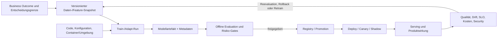

# MLOps Architect als Zielrolle

## Zweck, Definition und Scope

Ein MLOps Architect gestaltet den Lebenszyklus von Daten, Trainings- oder Anpassungscode, Modellartefakten, Evaluation, Freigabe, Auslieferung, Serving, Monitoring und Ablösung. Die Rolle macht aus einem vielversprechenden Notebook oder Modellcheckpoint eine überprüfbare Produktfähigkeit. Sie beantwortet nicht nur, ob ein Modell eine Kennzahl erreicht. Sie beantwortet auch: *Aus welchen Daten und welchem Code stammt dieses Artefakt? Für welche Nutzer- und Entscheidungsgrenze ist es zugelassen? Wie wird es wiederholbar bereitgestellt, überwacht, zurückgesetzt und beendet?*

MLOps ist kein Name für einen CI-Server neben einem Modell. Es ist eine Verbindung von Data Science, ML Engineering, Software Engineering, Plattform, Security, Betrieb, Produkt, Risiko- und Fachverantwortung. Je nach System schließt der Lebenszyklus klassisches Training, Fine-Tuning, Feature Engineering, Retrieval-Indizes, Prompts, Regeln, externe Modelle und humanische Freigabeschritte ein. Diese Datei konzentriert sich auf den allgemeinen ML-Lebenszyklus. LLM-spezifische Prompt-, Retrieval- und Generationsfragen werden in [KB-0021](11-llmops-architect-als-zielrolle.md) vertieft.

Eigene Konzept- oder Projektarbeit zu AI-Runtime, Evaluation, Tests, Human Gates, Python und LLM-Anwendungen liefert höchstens begrenzten Lernkontext. Sie belegt keine produktiv betriebene Trainingspipeline, keinen Feature Store, kein Modellregister, keine MLOps-SLA, keinen Security-/Compliance-Abschluss und keine formale MLOps-Architect-Rolle.

Nach diesem Kapitel kann der Leser:

1. einen ML-Lebenszyklus als durchgehende Kette von Business Outcome, Daten, Code, Umgebung, Run, Modell, Evaluation, Freigabe, Deployment, Serving und Monitoring beschreiben;
2. Reproduzierbarkeit als konkrete Kombination aus Daten-, Code-, Konfigurations-, Umgebungs- und Entscheidungsnachweisen erklären;
3. Data-, Feature-, Modell-, Registry-, Serving- und Observabilitygrenzen mit klarer Ownership entwerfen;
4. Offline-Metriken, Online-Qualität, SLO, Drift, Kosten und Sicherheitsrisiken unterscheiden und in ein Freigabegate übersetzen;
5. Modellpromotion, Canary, Shadow, A/B-Test und Rollback als risikobewusste Deliverypfade abwägen;
6. Staff-, Principal- und Chief-Entscheidungen über MLOps-Plattform, Governance, Souveränität und Investition begründen.

## Kompetenzmarker und Evidenzgrenzen

| Marker | Status | Bedeutung |
|---|---|---|
| CURRENT-EVIDENCE | offen | Eigene Selbsteinschätzung: belegte Praxis zu diesem Thema festhalten, Lücken als Lernziel markieren. |
| HANDS-ON-TARGET | aktiv | Ein synthetischer, nicht produktiver End-to-End-Fall liefert Data-/Code-/Run-/Model-/Eval-/Promotion-/Monitoring-Evidenz und negative Gegenproben. |
| ARCHITECT-TARGET | aktiv | Verantwortlichkeiten und Verträge entlang des Modelllebenszyklus werden mit NFR, Risiko und Betrieb verbunden. |
| STAFF-TARGET | aktiv | Wiederverwendbare Pipelines, Metadatenschemata, Quality Gates, Lineage und Golden Paths ermöglichen sichere Teamautonomie. |
| CHIEF-TARGET | aktiv | Plattform- und Lieferantenwahl, Souveränität, Capability-Aufbau, Modellrisiko, Kosten und Portfolio-Lebensdauer werden gesteuert. |
| SPECIALIST-OPTIONAL | aktiv | Statistik, Optimierung, Data Science, Data Governance, Security Testing, GPU- und Datenschutzspezialisierung bleiben explizite Fachübergaben. |

## Mental Model: Reisepass und Lieferkette eines Modells

Ein Modellartefakt ist wie ein Medikament in einer Lieferkette: Ein Name und ein gutes Testergebnis genügen nicht. Man muss Herkunft, Rezeptur, Charge, Test, Freigabe, zulässige Anwendung, Auslieferung, Beobachtung und Rückruf kennen. Die Analogie soll keine medizinische Zulassung unterstellen; sie zeigt nur die Nachweiskette.



Der Pfeil zurück ist entscheidend. Betrieb erzeugt neue Erkenntnisse, aber nicht automatisch neue Trainingsdaten oder eine automatische Promotion. Ein beobachteter Fehler kann Datenproblem, Labelproblem, Modellproblem, Serving-/Feature-Skew, Missbrauch, Produktänderung oder falsche Messung sein. Ein gutes MLOps-System hält diese Hypothesen getrennt.

Die zentralen Invarianten:

1. **Ein Modell hat eine Identität plus Kontext.** Ein Checkpoint ohne Daten-, Code-, Konfigurations-, Umgebungs- und Evaluationsbezug ist nicht reproduzierbar.
2. **Ein Qualitätswert hat eine Geltungsgrenze.** Offline Accuracy, Kosten, Latenz, Fairness, Kalibrierung und Nutzwert beantworten unterschiedliche Fragen.
3. **Promotion ist eine Entscheidung, kein Dateikopieren.** Sie benötigt Berechtigung, Gate, Nachweis, Rollback und Owner.
4. **Serving ist ein anderes System als Training.** Last, Datenverfügbarkeit, Sicherheit, Latenz, Abhängigkeiten und Fehlerfolgen können völlig anders sein.
5. **Lineage beschreibt Herkunft, nicht Wahrheit.** Sie hilft Ursachen, Zuständigkeit und Impact zu verstehen, beweist aber keine Datenqualität oder Modellgüte.
6. **Automation bleibt begrenzt.** Je riskanter die Wirkung, desto klarer müssen menschliche Freigabe, Escalation und fachliche Korrektur sein.

## Prerequisites und Dependencies

Die [Rollen-Kompetenz-Matrix](../00-navigation-governance/02-rollen-kompetenz-matrix.md), die [Selbsteinschätzung und Evidenzgrenzen](../00-navigation-governance/04-cv-istbild-und-zielkompetenzen.md), das [Kompetenzmodell](../00-navigation-governance/05-kompetenzmodell-fuer-staff-principal-und-chief.md), die [praktische und architektonische Lerntiefe](../00-navigation-governance/06-praktische-und-architektonische-lerntiefe.md) und die [Laborstrategie](../00-navigation-governance/09-laborstrategie-und-beweisartefakte.md) sind harte Voraussetzungen. Sie trennen eine dokumentierte Fallarbeit von einer behaupteten Produktionskompetenz.

| Beziehung | Kapitel | Anschluss |
|---|---|---|
| related | [KB-0011: GenAI Solution Architect](01-genai-solution-architect-als-zielrolle.md) | Der End-to-End-Nutzen setzt Anforderungen für Qualität, Daten, Sicherheit und Human Gates. |
| related | [KB-0012: GenAI Engineer](02-genai-engineer-als-zielrolle.md) | Engineering-Artefakte machen Modell- und Datenannahmen konkret testbar. |
| related | [KB-0013: AI Platform Architect](03-ai-platform-architect-als-zielrolle.md) | Die Plattform stellt kontrollierte Lifecyclepfade als Produkt für Teams bereit. |
| related | [KB-0014: Platform Architect](04-platform-architect-als-zielrolle.md) | Identity, CI/CD, Secrets, Observability und Golden Paths sind gemeinsame Plattformfähigkeiten. |
| related | [KB-0016: Cloud Architect](06-cloud-architect-als-zielrolle.md) | Datenresidenz, Konten, Kapazität, Managed Services und Exit prägen die MLOps-Architektur. |
| related | [KB-0017: Solution Architect](07-solution-architect-als-zielrolle.md) | Akzeptanzkriterien verbinden Modellgüte mit Geschäftswirkung und Betriebsgrenzen. |
| related | [KB-0019: Software Architect](09-software-architect-als-zielrolle.md) | Modell- und Featurecontracts müssen in eine veränderbare Laufzeit- und Datenstruktur passen. |
| related | [KB-0021: LLMOps Architect](11-llmops-architect-als-zielrolle.md) | LLM-spezifische Artefakte wie Prompts, Retrieval und nichtdeterministische Ausgabe bauen auf der Lifecyclebasis auf. |
| applies | [KB-0351](../00-navigation-governance/01-master-index-und-wegweiser.md#kb-0351) | Spätere Vertiefung zu MLflow und Modelllebenszyklen. |
| applies | [KB-0353](../00-navigation-governance/01-master-index-und-wegweiser.md#kb-0353) | Spätere Vertiefung zur Datenversionierung. |
| applies | [KB-0565](../00-navigation-governance/01-master-index-und-wegweiser.md#kb-0565) | SLI/SLO/SLA werden als Betriebsvertrag vertieft. |
| applies | [KB-0617](../00-navigation-governance/01-master-index-und-wegweiser.md#kb-0617) | AI-Governance und Klassifikation vertiefen die rechtlich-organisatorische Ebene. |
| applies | [KB-0618](../00-navigation-governance/01-master-index-und-wegweiser.md#kb-0618) | Datenschutzarchitektur konkretisiert Datenrolle, Zweck, Retention und Rechte. |
| applies | [KB-0720](../00-navigation-governance/01-master-index-und-wegweiser.md#kb-0720) | Portfolioevidenz ordnet tatsächliche Artefakte statt Zieltitel ein. |

## Core Concepts und Mechanismen

### Der MLOps-Lebenszyklus und seine Artefakte

Die Einheit des Lebenszyklus ist kein einzelnes Modellfile. Sie ist ein **modellfähiger Entscheidungsfall**: ein klarer Nutzer- oder Prozesskontext, eine vorab definierte Wirkung, eine Daten- und Sicherheitsgrenze, eine Fehlertoleranz und ein Betriebspfad.

| Stufe | Primäres Artefakt | Kernfrage | Typischer Owner |
|---|---|---|---|
| Problem framing | Decision brief, Nutzen-/Schadenshypothese, Nicht-Ziele | Welche Entscheidung oder Unterstützung ist überhaupt zulässig und nützlich? | Product + Fachbereich + Architecture |
| Data contract | Schema, Quelle, Eigentümer, Klassifikation, Qualitätsregeln, Retention | Welche Daten dürfen und sollen wofür verwendet werden? | Data Owner + Security/Privacy |
| Dataset/Feature snapshot | immutable Referenz oder reproduzierbare Abfrage plus Fingerprint | Welche konkrete Inputbasis lag einem Run zugrunde? | Data/ML Engineering |
| Code und Environment | Commit, Dependencies, Containerdigest, Konfiguration, Seed | Kann derselbe Prozess in kontrollierter Umgebung wiederholt werden? | ML Engineering + Platform |
| Experiment run | Parameter, Metriken, Logs, Artefakte, Zeit, Ausführungskontext | Was wurde wie getestet und welches Ergebnis entstand? | ML/Data Science |
| Model package | Gewicht, Signatur, Input-/Output-Schema, Lizenz/Herkunft, Card | Was wird später geladen und mit welcher Semantik? | ML Engineering |
| Evaluation | Daten-/Slice-/Robustheits-/Kosten-/Safetybericht | Reicht die Güte für den vorgesehenen Einsatz aus? | Model Owner + Fach-/Risikoowner |
| Promotion | Freigabe, Stage, Change Record, Deploymentplan | Wer hat welche Version für welche Umgebung zugelassen? | Model/Release Owner |
| Serving | Endpoint, Feature-/Inputcontract, Skalierung, Authz, Fallback | Wie wird das Artefakt in einem echten Produktpfad nutzbar? | Product/Platform/SRE |
| Monitoring | Outcome, Qualität, Drift, SLO, Kosten, Sicherheit, Feedback | Bleibt der zugelassene Nutzen innerhalb seiner Annahmen? | Model Owner + Operations |
| Retirement | Abschaltung, Archiv-/Retention, Migration, Revoke | Wann endet Nutzung und wie werden Abhängigkeiten sauber entfernt? | Product + Data/Compliance + Platform |

Dieser Ablauf ist nicht zwingend linear. Ein Regressionsbefund kann eine Datenkorrektur statt eines Retrains verlangen. Ein neues Modell kann vor Produktion verworfen werden. Ein Modell kann im Shadow Mode hilfreiche Signale liefern, ohne aktiv Entscheidungen zu beeinflussen. Die Architektur gewinnt dadurch, dass alle Übergänge explizit, berechtigt und nachvollziehbar sind.

### Reproduzierbarkeit ist eine Vektoraussage

„Wir können es reproduzieren“ bedeutet mindestens, dass ausreichend Kontext vorliegt, um Ergebnis, Abweichung und Limit zu erklären. Bitgenaue Reproduktion kann je nach Hardware, Bibliothek, Parallelisierung und Zufall unrealistisch oder unnötig sein. Entscheidend ist die vorher definierte Wiederholungsgenauigkeit.

\[
R = f(D, C, E, H, P, S, G)
\]

Dabei steht \(D\) für Dataset-/Feature-Version, \(C\) für Code, \(E\) für Environment und Dependencygraph, \(H\) für Hardware/Runtime, \(P\) für Parameter und Pipelinegraph, \(S\) für Zufall/Seeds und \(G\) für Gate-/Freigabekontext. Diese Formel ist kein Score. Sie verhindert, dass ein einzelner Git-Commit als vollständige Reproduzierbarkeit missverstanden wird.

| Dimension | Minimaler Nachweis | Häufige Lücke |
|---|---|---|
| Daten | Quelle, Schema, Zeitpunkt/Window, Fingerprint, Zugriff, Labeldefinition, Filter. | „Latest table“ ohne Snapshot oder Query-/Transformversion. |
| Code | Commit, Repo, Pipeline-/Feature-/Evalcode, Reviewstatus. | Trainingcode bekannt, aber Inferenz-/Preprocessingcode unbekannt. |
| Konfiguration | Hyperparameter, Featureliste, Modell-/Servingconfig, Flag-/Policyversion. | Parameter leben nur im Notebook oder in Shell-History. |
| Umgebung | Containerdigest, Bibliotheken, Treiber/Runtime soweit relevant, Hardwareklasse. | `requirements.txt` ohne Lockfile, Base Image oder Hardwareannahme. |
| Ausführung | Run-ID, Zeit, Actor/Serviceidentity, Ressourcen, Logs, Failure. | Ein Ergebnis wird manuell kopiert, aber der Run ist nicht nachvollziehbar. |
| Evaluation | Dataset/Slices, Metriken, Schwellen, Vergleichsbasis, Unsicherheit. | Beste Zahl wird gezeigt, negative Slices und Kosten fehlen. |
| Freigabe | Gate, verantwortliche Rolle, Verwendungszweck, Stage, Ablauf- oder Reviewdatum. | Registry-Tag `production` ohne Entscheidung, Owner oder Rückweg. |

MLflow Tracking dokumentiert Runs als Ausführungen von Data-Science-Code und zeichnet unter anderem Metadaten, Parameter, Metriken und Artefakte auf. Experiments gruppieren Runs und Modelle; in teamorientierten Setups müssen Backend Store, Artifact Store und Zugriff getrennt entworfen werden. Das erleichtert Nachvollziehbarkeit, ersetzt aber keine Data- oder Model-Governance. Quelle: [MLflow Tracking](https://www.mlflow.org/docs/latest/ml/tracking).

### Daten-, Feature- und Trainingscontracts

Ein Data Contract ist ein Vertrag über Bedeutung, nicht nur ein JSON Schema. Für ein Merkmal `delivery_delay_days` müssen Definition, Quelle, Zeitzone, Aktualität, Missing-Value-Regel, zulässige Nutzung und Owner klar sein. Besonders wichtig ist die Zeitachse: Ein Feature, das bei Training erst nach der Zielentscheidung verfügbar war, erzeugt Leakage. Ein historisches Datenmodell kann offline hervorragend wirken und online unbrauchbar sein.

| Contractfeld | Beispiel | Architekturwirkung |
|---|---|---|
| Business meaning | „Verzögerung seit bestätigter Übergabe“, nicht „irgendein Zeitstempel“. | Modell und Fachbereich sprechen über dasselbe Phänomen. |
| Data owner und source | WMS-Eventstream, autoritativer Owner, Änderungsprozess. | Falsche oder neue Semantik wird nicht stillschweigend übernommen. |
| Schema und evolution | Version, Typen, Einheiten, Nullable, Default, Deprecation. | Pipeline kann Breaking Change stoppen oder migrieren. |
| Freshness/Completeness | p95 Arrival Delay, erwartete Vollständigkeit, Out-of-order-Politik. | Serving kennt die Grenze für Fallback oder Stale-Warnung. |
| Quality rule | Wertebereich, Duplikatquote, Join-Key, Label-Konsistenz. | Gate trennt Datenfehler von Modellverhalten. |
| Classification/rights | Personenbezug, Zweck, Zugriff, Retention, Egress. | Training/Serving darf Daten nicht über ihre Berechtigung hinaus verwenden. |
| Time semantics | Event time, processing time, Prediction time, watermark. | Leakage und Training-serving skew werden prüfbar. |
| Lineage | Upstream Jobs/Datasets/Transform. | Impact einer Quell- oder Schemaänderung ist sichtbar. |

Ein Feature Store kann Offline- und Onlinezugriff bündeln, löst aber nicht automatisch Definitions-, Freshness-, Berechtigungs- oder Skewprobleme. Er ist dann sinnvoll, wenn mehrfach verwendete Features, konsistente Retrievalpfade und Ownership den zusätzlichen Betrieb rechtfertigen. Für einen kleinen, klaren Fall kann ein versionskontrollierter Transformationsschritt und ein expliziter Contract einfacher und besser prüfbar sein.

### Training, Experimentation und Pipelines

Ein Notebook eignet sich für Exploration, nicht als alleiniger Produktionsnachweis. Eine Pipeline kapselt gezielte, versionierte Schritte: Validierung, Transform, Training, Evaluation, Packaging und optional Promotion. Jeder Schritt benötigt definierte Inputs/Outputs, Fehlersemantik, Ressourcen, Secrets, Caching-/Retryentscheidung und Artefakte.

Kubeflow Pipelines beschreibt eine ML-Workflowtopologie als gerichteten Graphen aus Komponenten. Komponenten verpacken Code und Abhängigkeiten; Parameter dienen kleinen Werten, Artefakte größeren Daten oder Modellen. Der Backend übersetzt eine Pipelineausführung in Kubernetes-Ressourcen. Dieses Modell kann reproduzierbare Abläufe fördern, löst aber keine inhaltliche Datengüte oder Ownership. Quellen: [Kubeflow Pipeline Concepts](https://www.kubeflow.org/docs/components/pipelines/concepts/pipeline/), [Kubeflow Components](https://www.kubeflow.org/docs/components/pipelines/concepts/component/).

```text
validate-data
  → build-features
    → train
      → evaluate
        ├→ reject + evidence record
        └→ package-model
            → approval gate
              → register candidate
                → shadow/canary deploy
                  → monitor + decision
```

| Pipelinefrage | Entscheidung |
|---|---|
| Determinismus | Welche Schritte sind bei gleichen Inputs stabil genug; wo werden Seeds und Hardwareunterschiede dokumentiert? |
| Caching | Welche Inputs bilden den Cache Key; kann Cache ein Daten-/Policyupdate unerwünscht übergehen? |
| Retry | Ist der Schritt idempotent; welche Artefakte sind bereits geschrieben; ab wann wird menschlich untersucht? |
| Secrets | Werden zeitlich begrenzte Workloadidentitäten genutzt; gelangen sie nie in Parametern, Logs oder Artefakten? |
| Ressourcen | CPU/GPU/Memory/Storage/Netzbudget, Queue und Abbruchzeit. |
| Artifact integrity | Wo liegt das Artefakt; welche Identität darf schreiben/lesen/promoten; wie wird Herkunft sichtbar? |
| Failure exit | Was wird bei teilweisem Erfolg, fehlendem Feature, ungültigem Label oder abgeschnittenem Job konserviert? |
| Cost guard | Abbruchkriterium, Rate Limit, Quota, Budgetalarm, Priorität und Kosten je verwertbarem Ergebnis. |

### Modellregistry und Promotion

Eine Registry ist ein Katalog kontrollierter Modellversionen. Sie sollte nicht nur Namen und Stages wie `staging` oder `production` enthalten, sondern den zulässigen Zweck, das Input-/Outputschema, Daten-/Code-/Runlineage, Qualitätsbericht, Genehmigung, Owner, Lizenz-/Herkunftshinweis, Rollback-Referenz und Ablaufdatum.

| Promotionstufe | Zweck | Mindestnachweis |
|---|---|---|
| `candidate` | Artefakt ist gespeichert, aber nicht für Produktverkehr zugelassen. | Run, Artefaktintegrität, Basismetadaten, Owner. |
| `evaluated` | Definierte Offline-/Slice-/Robustheitschecks sind nachvollziehbar. | Evaluationreport, Vergleichsbasis, offene Risiken. |
| `approved-for-pilot` | Begrenzter Betriebsversuch ist erlaubt. | Genehmigung, Nutzer-/Trafficscope, Monitoring, Stop/rollback. |
| `serving` | Konkrete Version ist für den vereinbarten Einsatz aktiv. | Deployrecord, Endpointcontract, SLO/Quality-Signale, Fallback. |
| `deprecated` | Keine neue Nutzung, Migration aktiv. | Consumerinventar, Alternativversion, Frist. |
| `revoked` | Nutzung sofort unterbunden oder klar gesperrt. | Grund, Incident/Policy, Cache-/Endpoint-/Consumerwirkung und Kommunikationsplan. |

Promotion ist keine automatische Folge einer höheren AUC. Ein Modell kann technisch gut genug sein und dennoch nicht promotbar, weil die Eingabedaten unzulässig sind, der Output nicht erklärbar genug für den Prozess ist, Kosten unvertretbar sind, ein onlinefähiger Fallback fehlt oder der fachliche Owner die Entscheidung nicht abnimmt.

### Evaluation: Offline, Online und Betriebsqualität

Ein Evaluationframework verbindet drei unterschiedliche Ebenen:

| Ebene | Leitfrage | Beispiele |
|---|---|---|
| Datenqualität | Kann der Input die behauptete Aussage tragen? | Schema, Vollständigkeit, Missingness, Labelqualität, Distribution, Leakage, Zeitfenster. |
| Modellqualität offline | Erreicht das Modell auf einem passenden Testdesign die gesetzte Leistung? | Precision/Recall, F1, ROC-AUC, MAE, Kalibrierung, Slices, Konfidenz, Robustheit. |
| Produkt- und Betriebsqualität online | Erzeugt die Integration den erwarteten Nutzen innerhalb der Betriebsgrenzen? | Akzeptierte Entscheidungen, Abbruch-/Override-Rate, SLO, Fehler, Fairnessindikator soweit angemessen, Kosten/Outcome, Nutzerfeedback. |

Eine Kennzahl muss zur Wirkung passen. Bei seltenem Betrug ist Accuracy meist irreführend. Bei Priorisierung können Kalibrierung und Top-k-Precision wichtiger sein als eine Gesamt-AUC. Bei risikobehafteten Entscheidungen ist die Kostenasymmetrie von False Positive und False Negative explizit zu vereinbaren. Bei LLM- oder RAG-Nutzung treten zusätzlich Groundedness, Quellenabdeckung, Policy-Adhärenz und menschliche Bewertung hinzu.

\[
Expected\ Loss =
P(FP)\cdot Cost(FP) + P(FN)\cdot Cost(FN) + C_{operate} + C_{review}
\]

Die Formel zwingt dazu, Fehlertypen und Betriebskosten sichtbar zu machen. Sie liefert ohne echte Wahrscheinlichkeiten und vereinbarte Kosten keine präzise Businessentscheidung.

NIST AI RMF strukturiert Akteure entlang von Lifecyclephasen, von Plan/Design über Daten/Input, Model Build/Use und Verify/Validate bis Deploy/Use sowie Operate/Monitor. Das ist ein hilfreicher Rahmen, um technische und organisatorische Nachweise zusammenzuhalten; es ist keine automatische Compliancebescheinigung. Quelle: [NIST AI RMF 1.0](https://nvlpubs.nist.gov/nistpubs/ai/NIST.AI.100-1.pdf).

### Lineage, Beobachtung und Impactanalyse

OpenLineage modelliert Jobs und Datasets und unterscheidet Ausführungsereignisse (`RunEvent`) von Entwurfs-/Metadatenereignissen (`JobEvent`, `DatasetEvent`). Facets liefern zusätzlichen Kontext für Run, Job, Inputs und Outputs. Das kann sichtbar machen, welche Pipeline aus welchen Daten ein Modell oder eine abgeleitete Tabelle erzeugte. Es ersetzt weder vollständige Asset-Inventarisierung noch Zugriffskontrolle oder fachliche Qualitätsentscheidung. Quellen: [OpenLineage Object Model](https://openlineage.io/docs/spec/object-model/), [OpenLineage Facets](https://openlineage.io/docs/spec/facets/).

Eine konkrete Impactfrage lautet: „Die Quelle `shipment_event` ändert die Bedeutung ihres Statusfelds. Welche Trainingdatasets, Features, Modelle, Read Models, Dashboards und Produktentscheidungen sind betroffen?“ Ohne Lineage landet diese Frage bei manueller Suche und Hoffnung. Mit Lineage bleibt zu prüfen, ob der Graph vollständig instrumentiert und die Bedeutung der Änderung fachlich verstanden ist.

## Architecture und Data Flow: Risikoassistenz als kontrollierte Kette

Das folgende Lehrmodell klassifiziert Aufträge als „prüfen“ oder „normal bearbeiten“. Es löst keinen autonomen Entscheid über Kündigung, Kredit, Preis oder Sicherheitsmaßnahme aus. Die fachliche Wirkung bleibt begrenzt und rückgängig zu machen.

```text
Commerce-/WMS-Ereignisse
  → Data Contract + DQ Gate
  → versionierter Dataset-/Feature-Snapshot
  → Train-/Evaluation-Pipeline
  → Run-/Artifact-/Lineage-Record
  → Model Registry + Approval
  → Shadow oder Canary Serving
  → API: risk score + version + fallback
  → Fachliche Prüfung / Workflow
  → Outcome-, Drift-, SLO-, Cost- und Security-Monitoring
  → Reevaluate, retrain, rollback oder retire
```

| Grenze | Verantwortliche Frage | Beispiel einer sicheren Aussage |
|---|---|---|
| Ereignis → Dataset | Ist Statussemantik, Zeitachse und Datenrecht für Training freigegeben? | „Dieses Schema und Zeitfenster sind zugelassen; unbekannte Felder stoppen den Run.“ |
| Dataset → Feature | Ist Transformversioniert und online wie offline möglich? | „Der Featurecontract zeigt Definition, Freshness und Fallback bei fehlendem Wert.“ |
| Training → Artefakt | Welche konkrete Ausführung erzeugte welches Artefakt? | „Run-ID referenziert Code, Datenfingerprint, Parameter, Image und Metriken.“ |
| Artefakt → Freigabe | Für welchen Zweck und Traffic ist die Version nutzbar? | „Candidate darf nur im Shadow Scope bewertet werden, nicht fachlich entscheiden.“ |
| Serving → Produkt | Wie ist Authorisierung, Latenz, Fehler-/Fallback- und Versionssemantik? | „Bei Modell-/Featureausfall fällt der Workflow auf manuelle Prüfung zurück.“ |
| Produkt → Monitoring | Welcher Feedbackwert ist vertrauenswürdig und wann sichtbar? | „Ein tatsächlicher Prüfabschluss ist Outcome, kein bloßer API-200-Status.“ |
| Monitoring → Retrain | Welcher Befund verlangt Datenkorrektur, Reeval, Rollback oder Retraining? | „Ein Schema- oder Policybruch blockiert Promotion; Drift allein startet keinen unkontrollierten Trainjob.“ |

### Control Plane und Data Plane

Der MLOps-Control-Plane verwaltet Metadaten, Policies, Run-/Modellstufen, Deployments, Identitäten und Skalierungsregeln. Der Data Plane verarbeitet Training, Batch Scoring oder Online-Inferenz. Die Trennung erleichtert Rechte- und Ausfallgrenzen: Ein API-Request sollte weder Registryadministration noch Trainingsschreibrechte benötigen.

KServe ist ein Beispiel für einen Kubernetes-basierten Servingansatz. Es beschreibt CRDs für Model Serving sowie einen Control Plane für Lifecycle, Ressourcenorchestrierung und Autoscaling und einen Data Plane für Inference. Die aktuelle Dokumentation führt Standard Mode für anspruchsvolle LLM-Servingfälle als bevorzugte Betriebsform, während Knative Mode zusätzliche Scale-to-zero-Abhängigkeiten einführt. Das ist eine konkrete Produktentscheidung, keine universelle MLOps-Pflicht. Quellen: [KServe Architecture](https://kserve.github.io/website/docs/concepts/architecture), [KServe Resources](https://kserve.github.io/website/docs/concepts/resources).

## Protocols, Standards und Tools

| Bereich | Standard oder Tool | Nutzen | Architekturelle Grenze |
|---|---|---|---|
| Experimenttracking | [MLflow Tracking](https://www.mlflow.org/docs/latest/ml/tracking) | Runs, Parameter, Codeversionen, Metriken und Artefakte sichtbar machen. | Tracking ist keine Freigabe- oder Datenrechtsentscheidung. |
| Pipelineorchestrierung | [Kubeflow Pipelines v2](https://www.kubeflow.org/docs/components/pipelines/reference/) | Containerisierte Komponenten, DAG, Parameter/Artefakte, Retry/Caching und Kubernetesausführung. | Ein Workflowgraph beweist keine korrekte Daten-/Modellsemantik. |
| Data/Job Lineage | [OpenLineage](https://openlineage.io/docs/spec/object-model/) | Herkunft und Laufzeitereignisse über Jobs und Datasets verknüpfen. | Coverage hängt von Instrumentierung ab; keine vollständige Governancegarantie. |
| Serving | [KServe](https://kserve.github.io/website/docs/intro) | Declarative Model Serving, Deployment-/Traffic-/Skalierungsmechanismen auf Kubernetes. | Komplexität von Cluster, Runtime, Security und GPU bleibt real. |
| Telemetrie | [OpenTelemetry](https://opentelemetry.io/docs/specs/semconv/) | Traces, Metrics, Logs und Ressourcenkontext für Service- und Dependencydiagnose. | Modellqualität und fachliche Outcome-Messung brauchen zusätzliche Domänensignale. |
| AI Lifecycle Risk | [NIST AI RMF](https://www.nist.gov/itl/ai-risk-management-framework) | Risikoüberlegungen über Plan, Daten, Build, Validierung, Betrieb und Monitoring strukturieren. | Kein Ersatz für verbindliche lokale Rechts-, Vertrags- oder Branchenprüfung. |
| Data versioning | DVC, lakeFS, Delta/Iceberg snapshots oder versionierte Query-/Object-Snapshots | Datenreferenz und Wiederholung vereinfachen. | Toolwahl ersetzt nicht Datenowner, Klassifikation, Retention oder Labelqualität. |
| Registry | MLflow Registry, cloud native registries oder kontrollierter Artifact Catalog | Model-/Stage-/Approvalmetadaten bündeln. | Stage-Tag ohne Policy, Owner und Rollback ist bloß Dekoration. |
| Evaluation | Evidently, Great Expectations, eigene Tests, Fachreview, Benchmark suites | Daten-/Modell-/Servinghypothesen standardisieren. | Automatische Checks decken unbekannte Geschäftsschäden nicht vollständig ab. |
| Delivery/Trust | Git, CI, SBOM, Signaturen soweit passend, Policy-as-Code, GitOps | nachvollziehbare und begrenzte Änderungen. | Eine Signatur allein beweist keinen sinnvollen Modellzweck. |

Zeitabhängig: Toolversionen, KServe-CRD-Reife, managed Servicefeatures und Modellframeworksupport ändern sich. Diese Datei fixiert daher nur die Architekturrollen und Quellenstand 2026-09-15. Eine tatsächliche Implementierung pinnt Versionen, prüft Kompatibilitätsmatrizen und dokumentiert ihre Upgrade-/Rollbackstrategie.

## Konfiguration und Implementierung: Ein nachvollziehbarer Pipelinevertrag

Das Beispiel ist Pseudocode plus deklarativer Lernvertrag. Es soll die Nachweiskette zeigen und ist ausdrücklich keine produktionsfertige Konfiguration.

```python
def train_and_evaluate(data_ref, code_revision, config, tracker):
    validated = validate_data(data_ref, rules=config.data_quality_rules)
    features = build_features(validated, transform_version=code_revision)
    with tracker.start_run(tags={
        "data_ref": data_ref.fingerprint,
        "code_revision": code_revision,
        "policy_version": config.policy_version,
        "purpose": "order-review-assist"
    }) as run:
        model = fit(features.train, seed=config.seed, parameters=config.hyperparameters)
        report = evaluate(
            model=model,
            test_set=features.test,
            slices=config.required_slices,
            baseline=config.baseline_model
        )
        tracker.log_metrics(report.metrics)
        tracker.log_artifacts({
            "model": model,
            "input_schema": features.schema,
            "evaluation": report,
            "environment_lock": config.environment_lock
        })
        if not gates_pass(report, config.thresholds):
            return reject(run.id, reason="evaluation gate")
        return candidate(run.id, model, report)
```

```yaml
# MLOps-Lernvertrag, keine ausgeführte Produktionskonfiguration
model_promotion:
  purpose: "order-review-assist"
  candidate_requires:
    - immutable_data_or_reproducible_data_ref
    - code_revision
    - environment_lock_or_image_digest
    - evaluation_report
    - model_owner
  approval_requires:
    - data_contract_valid
    - required_slices_pass
    - security_and_privacy_review_for_scope
    - fallback_documented
    - monitoring_and_rollback_owner
  serving:
    input_contract: "risk-score-v1"
    output_contract: "risk-score-v1"
    fallback: "manual-review"
    mode_order: ["offline", "shadow", "canary", "bounded-serving"]
  forbidden:
    - "automatic promotion from offline score alone"
    - "secrets in parameters, artifacts, logs or model card"
    - "unbounded retraining triggered by a single drift signal"
```

Ein Promotiongate kann als Policy-as-Code implementiert werden, aber die Policy benötigt menschlich prüfbare Begriffe. `required_slices_pass` muss benennen, welche Slices, welche Schwellen und welche Unsicherheit gelten. `security_and_privacy_review_for_scope` muss Purpose, Datenklasse, Zugriff und verbleibende Risiken beschreiben. Ein boolesches Flag ohne Details ist keine Governance.

### Training-Serving Skew erkennen

Training-serving skew entsteht, wenn offline und online unterschiedliche Inputs, Transformationen, Zeitfenster, Defaults, Einheiten oder Identitäten verwenden. Der Schutz liegt in gemeinsamen Contracts, wiederverwendbarem Transformcode soweit angemessen, Tests und Onlinevergleich.

| Skewtyp | Beispiel | Test/Gegenmaßnahme |
|---|---|---|
| Schema | `country` wird online nullable, offline nicht. | Contract Test und Missing-Value-Fallback. |
| Zeit | Training kennt Endstatus, Serving kennt nur Ereignisstand. | Point-in-time Join/Time-travel Test. |
| Transform | Offline rundet Preis, Online nutzt Rohwert. | Gemeinsame Version/Golden-Testvektoren. |
| Feature Freshness | Online Store ist Stunden hinter Eventstream. | Freshness-SLI und Businessfallback. |
| Identity/Tenant | Offline enthält alle Tenants, Serving filtert unvollständig. | Autorisierungstest und tenantbezogene Data Contract Regel. |
| Feedback/Label | Label trifft erst Wochen später ein oder wird nachträglich korrigiert. | Delayed-label-Plan, Audit und erneute Evaluation. |

## Scalability, Performance und Capacity

ML-Systeme skalieren in mindestens zwei verschiedenen Lastmodellen: **Batch-/Traininglast** und **Online-Servinglast**. Ein Training mit hoher GPU-Auslastung kann ein schlechtes Online-Latenzprofil haben. Ein latencyoptimierter Servingpfad kann für günstige Trainingssweeps ungeeignet sein. Die Kapazität muss deshalb pro Workload und Fehlerdomäne modelliert werden.

\[
C_{ML} = C_{ingest} + C_{storage} + C_{transform} + C_{train} + C_{registry} + C_{serve} + C_{observe} + C_{recovery}
\]

Diese TCO-Skizze ist eine Checkliste, keine Rechnung ohne echte Mengen, Laufzeiten, Preise, Reserven und Personalbedarf.

| Workload | Primäres Ziel | Leistungshebel | Häufiger Fehler |
|---|---|---|---|
| Data ingest | Freshness/Vollständigkeit | Partitionierung, Backpressure, Schema Gate. | Mehr Compute gegen ein Semantik-/Datenrechtsproblem. |
| Feature build | Durchsatz und Korrektheit | Pushdown, inkrementelle Verarbeitung, Cache mit korrektem Key. | Cache übergeht Daten-/Policyänderung. |
| Training | Experimentdurchsatz/Kosten | Parallelisierung, Ressourcenquoten, Dataset locality, Preemption, Budget. | Billiger Sweep ohne vergleichbares Evaluationsdesign. |
| Evaluation | Geschwindigkeit mit Prüfqualität | Repräsentative Slices, reproduzierbarer Baselinevergleich, begrenzte Testdaten. | Ein kleiner Benchmark wird als Produktionsbeweis ausgegeben. |
| Registry/Artifact | Verfügbarkeit/Integrität | Immutable store, Lifecycle, Zugriff, Metadatenindex. | Artefakte ohne Retention oder Deletion-/Revokeplan. |
| Online serving | p95/p99, Fehlerrate, Availability, Kosten/Outcome | Batching, Autoscaling, Model Cache, Admission, Fallback. | Durchschnittslatenz ohne Queue, cold start oder Featuredependency. |
| Monitoring | Zeitnahe, sichere Signale | Sampling, Aggregation, Schema, Retention. | Payloadlogging erzeugt PII-, Kosten- und Kardinalitätsproblem. |

KServe dokumentiert für InferenceService unter anderem Version-/Trafficmanagement, Canary, requestbasierte Skalierung sowie CPU-/GPU-Fälle. Das kann als Plattformmechanik helfen, muss aber gegen Modellladezeit, Requestverteilung, GPU-Fragmentierung, Datengrenzen und eigenen Recoverypfad gemessen werden. Quelle: [KServe Model Serving Overview](https://kserve.github.io/website/docs/model-serving/predictive-inference/frameworks/overview).

## Reliability und Failure Modes

MLOps-Zuverlässigkeit umfasst den Modellpfad und den Nachweispfad. Ein Endpoint kann `200` liefern, während das falsche Modell, ein alter Featurestand, ein abgelaufener Datenzugriff oder eine fehlende Outcome-Korrelation den praktischen Nutzen zerstört.

| Failure Mode | Ursache | Sichere Architekturreaktion | Nachweis |
|---|---|---|---|
| Unreproduzierbarer Best Run | Daten, Environment oder Parameter fehlen. | Candidate nicht promoten; Mindestmetadaten erzwingen; Run als unvollständig markieren. | Reproduction-Check und Artefaktinventar. |
| Data/Schema Drift | Upstream ändert Feld, Einheit oder Semantik. | Contract Gate, Impactanalyse, Servingfallback oder Stop; kein stilles Coercion. | Schema-/Lineageevent, DQ Alert, Owneracknowledgement. |
| Feature Freshness Failure | Online Input ist verspätet/unvollständig. | Fallbackfeature/Manual path/„unknown“ statt erfundener Wert. | Freshness SLI und E2E-Test. |
| Offline gut, online schlecht | Skew, Nutzerverhalten, Feedback Loop, Integration. | Shadow/Canary, Outcomevergleich, begrenzte Wirkung, Reeval oder rollback. | Online-/offline Delta, Sliceanalyse. |
| Model artifact unavailable | Object Store, Registry, Image, Cache oder Runtime fällt aus. | Bekannte stabile Version, warm/cold policy, Fallback, Incidentowner. | Deployment-/Restoretest. |
| Doppelte/inkonsistente Promotion | Mehrere Pipelines/Actors ändern Stage. | Transaktionale Stage-/Approvalsemantik, RBAC, Audit, eindeutige Releaseowner. | Promotionaudit und race probe. |
| Poison data/label | Korruptes, böses oder falsch annotiertes Input. | Validation, Quarantäne, data owner, bounded retrain, Investigation. | Negative DQ-/label probe. |
| Modell-/Providerdegradation | Timeout, Quality Regression, EOL oder Policyänderung. | Circuit/budget, fallback, version pin, exit plan, revalidation. | Synthetic check, quality sentinel, supplier review. |
| Monitoring blind spot | Sampling, Collector, fehlende Outcome-IDs. | Monitoring-of-monitoring, sichere Defaults, Datenminimierung. | Drop-/coverage metric und alert test. |
| Rücknahme unvollständig | Cache, Batchjob, Consumer oder notebook nutzt alte Version. | Consumer-/endpoint-inventory, revoke propagation, kill switch, audit. | Revoke drill und access logs. |

Ein Retrainjob sollte bei Drift nicht blind automatisch starten. Drift kann berechtigt sein, etwa bei Saison, Produktänderung oder verbessertem Quellsystem. Sie kann aber auch Schemafehler, Angriff, veraltete Baseline oder Messartefakt bedeuten. Die Entscheidungshierarchie lautet: Signal prüfen → Ursache eingrenzen → Daten-/Policy-/Modellaktion wählen → nach Gate ausführen → Wirkung messen.

## Security, Governance und Compliance

MLOps erweitert klassische Softwaresecurity um Daten-, Modell- und Entscheidungspfade. Ein Modellfile kann schädlichen Code, unzulässige Lizenz-/Herkunft, sensible Trainingsinformation oder eine problematische Verwendungsgrenze enthalten. Ein Trackingserver kann Tokens, Kundendaten oder experimentelle Hypothesen offenlegen. Ein Feature Store kann Attribute über den Geschäftsprozess hinaus verfügbar machen.

| Fläche | Mindestentscheidung | Kontrollfrage |
|---|---|---|
| Dataset | Zweck, Klassifikation, Owner, Zugriff, Retention, Löschung, Quality/Labelscope. | Darf diese konkrete Datenrepräsentation für diesen Modellzweck genutzt werden? |
| Pipeline | Workload Identity, minimale Secrets, Image-/Dependencypolicy, Network Egress, Quota. | Kann ein Trainingsjob mehr lesen, schreiben oder ausleiten als nötig? |
| Tracking/Registry | RBAC, Artifact Store, Audit, Stage-/Approvalrechte, Retention, Revoke. | Wer darf Ergebnis, Modell und Produktstage sehen oder ändern? |
| Modell | Herkunft, Lizenz, Signatur/Integrität soweit passend, Card, Input-/Outputspezifikation. | Ist klar, was geladen wird, worauf es beruht und wo es eingesetzt werden darf? |
| Serving | Authn/Authz, Tenant-/Data isolation, rate/admission, logging, fallback, request limits. | Kann ein Nutzer fremde Daten oder unzulässige Wirkung über den Endpoint erzielen? |
| Evaluation | Benchmarkzugriff, Slicedefinition, Human Review, Ergebnismanipulationsschutz. | Ist der Gatebericht verlässlich und dem Zielkontext zugeordnet? |
| Telemetrie | Redaction, Pseudonymisierung, Zugriff, Sampling, retention, prompt/payload policy. | Werden Secrets, PII oder geschützte Daten in Diagnosesysteme übertragen? |
| Governance | Model owner, purpose, risk classification, approval, expiry/review, incident/revoke. | Wer entscheidet bei Schaden, Drift, Incident, EOL oder geänderter Rechtslage? |

NIST AI RMF kann Risiken über GOVERn, MAP, MEASURE und MANAGE strukturieren. Für die technische Architektur bedeutet das: Risikokontext sichtbar machen, Messung begrenzen und begründen, Maßnahmen mit Ownern verbinden und Ergebnis nicht als pauschale Compliance verkaufen. Rechtliche Anforderungen, etwa Datenschutz- und AI-spezifische Pflichten, benötigen immer aktuelle zuständige Fachprüfung. Quellen: [NIST AI RMF](https://www.nist.gov/itl/ai-risk-management-framework), [KB-0617 im Master Index](../00-navigation-governance/01-master-index-und-wegweiser.md#kb-0617).

## Observability und Troubleshooting

MLOps-Observability verbindet Infrastruktur-, Pipeline-, Modell-, Produkt- und Governance-Signale. Sie darf keinen Rohinput oder Secrets als Abkürzung verwenden. Eine gute Korrelation nutzt technische IDs, Versionen und datensparsame Outcome-Referenzen.

| Schicht | Mindestmetriken/Events | Diagnosefrage |
|---|---|---|
| Daten | Schema breaches, completeness, freshness, missingness, distribution, label delay. | Ist der Input gültig, zeitnah und semantisch gleich? |
| Pipeline | Run duration, queue, retry, cache hit, component failure, artifact write. | Ist es Ressourcen-, Dependency-, Konfigurations- oder Datenfehler? |
| Registry | Candidate/approval/promotion/revoke, actor, policy version, stage age. | Welche Version ist warum und durch wen in diesem Stage? |
| Serving | Rate, p50/p95/p99, errors, saturation, model load, feature lookup, fallback. | Ist der Endpoint langsam, fehlerhaft oder auf Fallback? |
| Modell | Score distribution, confidence where meaningful, abstention, slice outcome, drift proxy. | Ändert sich Verhalten oder Input; kann der Grund eingegrenzt werden? |
| Produkt | Overrides, review outcomes, accepted actions, user feedback, harm reports. | Verbessert die unterstützte Entscheidung wirklich den vereinbarten Nutzen? |
| Security | Unauthorized attempts, egress anomalies, secret scan, denied promotion, audit gap. | Ist ein Zugriff oder eine Änderung außerhalb des Plans erfolgt? |
| Cost | Cost/run, cost/candidate, cost/accepted outcome, artifact/storage, GPU/CPU utilization. | Wird ein nützliches Ergebnis wirtschaftlich erzeugt? |

Troubleshootingablauf für eine plötzlich steigende Ablehnungsrate:

1. Zeitraum, Modell-/Feature-/Configversion und betroffene Slices identifizieren. Ohne Version ist eine Modellhypothese zu schwach.
2. DQ- und Freshnesssignale vor Modelländerung prüfen. Ein Schema- oder Upstream-Release ist oft wahrscheinlicher als „Modell hat sich verändert“.
3. Servingtraces über Featurelookup, Modellruntime, Fallback und fachliche Outcome-Event korrelieren. Den Unterschied zwischen Timeout, Nullfeature, Scorethreshold, manueller Override und Businessrule sichtbar machen.
4. Vergleich gegen referenzierten Offline-/Shadow-baseline. Nur gleiche Data-/Time-/Slicegrundlage ist aussagekräftig.
5. Ursache klassifizieren: Daten, Transform, Modell, Serving, Policy, Produktworkflow, Security oder Beobachtungslücke.
6. Sicher handeln: vorherige Version routen, auf manuellen Prozess fallen, betroffenen Tenant/Featurepfad begrenzen, Stage sperren oder Retrain vorbereiten. Keine direkte Tabellenmutation und kein unkontrollierter Re-Run in Produktion.
7. Incident, bewiesene Ursache, Daten-/Modellkorrektur, Gate-Änderung und offene Annahme dokumentieren.

## Cost / FinOps

ML-Kosten sind zyklisch. Ein Modell mit niedrigen Servingkosten kann durch häufige unproduktive Trainingsläufe teuer sein; ein teureres Modell kann Support, Fehlentscheidung oder manuelle Prüfung senken. Die Bezugsgröße muss eine akzeptierte fachliche Wirkung sein.

\[
C_{useful\ ML\ outcome} =
\frac{C_{data}+C_{compute}+C_{storage}+C_{platform}+C_{review}+C_{operate}+C_{risk}+C_{exit}}
{\max(1,\; accepted\ outcomes)}
\]

| Treiber | Architekturhebel | Falsche Abkürzung |
|---|---|---|
| Dateningest/-retention | Lebenszyklus, Partition, Qualitäts-/Governancegate, tiering. | Alle Rohdaten unendlich speichern, „weil später Training“. |
| Training/Experiment | Quotas, Sweepbudget, Priorität, Caching mit gültigen Keys, Preemption. | Mehr Trials ohne Hypothese oder Cost-per-learning Signal. |
| Artifact/Registry | Immutable Referenzen, Lifecycle, dedupe, retention/revoke. | Jeden Zwischencheckpoint ohne Owner dauerhaft behalten. |
| Serving | Modell-/Batchgröße, autoscaling, cache, fallback, admission, workloadrouting. | GPU-/Endpointauslastung mit Nutzerwert gleichsetzen. |
| Evaluation/Human Review | Risikobasiertes Sampling, klare Triage, effiziente Label-/Feedbackloop. | Menschliche Kontrolle ersatzlos streichen, ohne Fehlkosten zu modellieren. |
| Plattform | Goldener Pfad, standardisierte Metadaten/Identität/Telemetrie, Self-service. | Eine universelle Plattform bauen, bevor wiederkehrender Bedarf und Ownership existieren. |
| Supplier/Exit | Portabilität von Artefakt, Contract, Data lineage und Evaluation. | Token-/GPUpreis als vollständige TCO-Betrachtung. |

Ein Staff- oder Chief-Entscheid argumentiert nicht mit „MLOps spart Geld“ im Allgemeinen. Er zeigt, welche wiederholten Reibungen sinken: Reproduktionszeit, Promotionrisiko, Incidentdauer, Auditaufwand, Duplication von Featurecode oder Lock-in. Er misst den Nutzen gegen Plattform- und Spezialistenkosten.

## Trade-offs und Anti-Patterns

| Entscheidung | Vorteil | Trade-off und Prüfpunkt |
|---|---|---|
| Notebook first | Schnelle Exploration und fachliches Lernen. | Muss vor Promotion in versionierte, testbare Pipeline überführt werden. |
| Zentraler Feature Store | Wiederverwendung und Offline-/Online-Verbindung möglich. | Zusätzliche Betriebs- und Governancefläche; nur bei echtem Wiederholungsnutzen. |
| Modellregistry | Controlled stage und Reproduktionskontext. | Metadatenpflege/Policyaufwand; Stage ohne Owner ist wertlos. |
| Batch scoring | Günstig und kontrollierbar bei periodischem Bedarf. | Keine sofortige Antwort; Datenlatenz und Korrekturzeit bewerten. |
| Online inference | Aktuelle, interaktive Entscheidung möglich. | Latenz, Featureavailability, Security und Failureblast. |
| Shadow deployment | Onlinevergleich ohne aktive Wirkung. | Kosten und Datenschutzbasis; Outcome kann delayed/biased sein. |
| Canary/A-B | Begrenzte reale Wirkung und Vergleich. | Fairness, Nutzerinformation, Trafficrepräsentanz und Stop-Regel. |
| Auto-retrain | Kürzere Anpassungszeit bei klarer, risikoarmer Situation. | Drift/Angriff/Labelproblem kann automatisiert verstärkt werden. |
| Managed ML service | Schnellere Baseline, weniger Plattformbetrieb. | Daten-/Providergrenze, Pricing, Feature roadmap, egress/exit. |
| Kubernetes-native stack | Einheitliche Plattform für Container/GPU/Policy. | Clusterkomplexität und Teamreife; nicht für jeden ML-Fall wirtschaftlich. |

Wiederkehrende Anti-Patterns:

- **Notebook als Produktionsvertrag:** Der einzige Nachweis ist ein lokaler Lauf ohne Dataset-/Environment-/Policybezug.
- **Registry Tag als Freigabe:** `production` wird umgehängt, ohne Owner, Evaluation, Rechte, Canary, Monitoring oder Rollback.
- **Metric Shopping:** Aus vielen Experimenten wird nur die beste Kennzahl gezeigt, ohne Slices, Kosten, Baseline oder negative Ergebnisse.
- **Data is just input:** Herkunft, Label, Zeitsemantik, Rechte und Data Quality werden erst nach einem Incident betrachtet.
- **Auto-retrain on any drift:** Ein Signal startet Kosten und Risiko, bevor Ursache, Zweck und Labelqualität geklärt sind.
- **Shadow ohne Plan:** Traffic wird dupliziert, aber keine Outcomes, Nutzungsrechte, Kosten- oder Stopregel sind definiert.
- **Feature Store als Heilmittel:** Ein neues Produkt überdeckt unklare Featuresemantik oder fehlende Owner.
- **Model endpoint as product boundary:** Ein `predict`-Endpoint wird veröffentlicht, ohne Authz, Tenant, Inputversion, fallback und fachliche Wirkung.
- **Telemetry by payload:** Rohdaten, Labels, Prompts oder Secrets werden für Debugging unkontrolliert gespeichert.
- **MLOps platform before product need:** Ein großes Control Plane wird gebaut, ohne wiederkehrende Teams, Standardfälle und Betriebsteam.

## Staff-, Principal- und Chief-Entscheidungen

| Ebene | Entscheidung | Evidenz und Reviewtrigger |
|---|---|---|
| Staff | Minimalen MLOps Evidence Contract einführen. | Jede Candidate-Version hat Data-/Code-/Environmentref, Run, Eval, Owner, Stage, Monitoring- und Rollbackhinweis. Wiederholte Ausnahmen zeigen eine unbrauchbare Baseline. |
| Staff | Referenzpipeline und Golden Path bereitstellen. | Ein begrenzter Use Case kann Data Gate, Tracking, Registry, Approval, Deploy und Monitoring ohne proprietäre Teamabkürzung durchlaufen. Aufwand/Adoption wird gemessen. |
| Staff | Offline- und Onlineevaluation verbinden. | Baseline, Slices, Outcome, Override, SLO und Cost-signals sind korrelierbar. Große Offline/Online-Lücke triggert Integrations-/Datareview. |
| Principal | Zentral versus föderiert für Plattform, Feature und Registry entscheiden. | Teamzahl, Wiederholungsnutzen, Datenklassifikation, Betrieb, Interoperabilität, Roadmap und Migration bewerten. |
| Principal | Modellpromotion-/Revokeprozess über Produkte hinweg standardisieren. | Risikoklassen, Scopes, Berechtigungen, Ausnahmen und Incidentübergabe sind proportional und auditierbar. Neue Wirkklasse oder Datenart triggert Reassessment. |
| Principal | Training-/Serving- und Providergrenzen festlegen. | Data residency, GPU/Cost/Capacity, latency, supply chain, operability, exit and expertise explain the chosen boundary. |
| Chief | MLOps als Portfoliofähigkeit finanzieren oder begrenzen. | Wiederkehrender Bedarf, Cost-of-change, regulatorisches Exposure, Produktdifferenzierung, Mitarbeiterkompetenz und Vendorstrategie bilden den Investment Case. |
| Chief | AI-/ML-Risikoakzeptanz und Entscheidungshoheit bestimmen. | Wer darf ein Modell mit welcher Wirkung freigeben, stoppen, revidieren oder ausnehmen; die Antwort ist Teil der Operating Governance. |
| Chief | Souveränität und Exit steuern. | Artefaktformate, Evalsets, Data contracts, registry metadata, provider contracts and retraining feasibility define the real exit, not a marketing claim. |

## Production Checklist

| Bereich | Prüfnachweis | Owner | Stop-/Rollbackkriterium |
|---|---|---|---|
| Zweck und Wirkung | Nutzer-/Prozessfall, zulässige Entscheidung, Nicht-Ziele, Harm/Fallback, Outcome-Signal. | Product + Fachowner | Kein nachvollziehbarer Nutzen oder unklare autonome Wirkung. |
| Datencontract | Owner, Bedeutung, Schema, Zeit, DQ, Klassifikation, Rechte, Retention, Lineage. | Data Owner | Quelle/Label/Usage-right ungeklärt oder Gate verletzt. |
| Reproduzierbarkeit | Data ref, Code, config, environment, seed soweit nötig, Run- und Artifactrecord. | ML Engineering | Candidate nicht reproduzierbar oder Artefaktintegrität unklar. |
| Evaluation | Baseline, Slices, Schwellen, Robustheit, Kosten, offene Risiken, Reviewer. | Model Owner + Fachowner | Metric shopping, fehlende relevante Slices oder keine Stopregel. |
| Registry/Promotion | Version, purpose, model card, stage, approval, RBAC, expire/revoke. | Release/Model Owner | Stage ohne Owner/Approval oder keine bekannte Rückversion. |
| Serving | Input-/Outputcontract, authz, tenant boundary, timeouts, rate limit, fallback, capacity. | Platform + Product Team | Keine sichere Degradation oder unbounded resource path. |
| Reliability | Pipeline retry/idempotenz, data quarantine, deploy/restore, incident/runbook. | SRE/ML Engineering | Unowned DLQ/artifact failure/revoke path. |
| Observability | Data/pipeline/model/product/security/cost signals, correlation, redaction, retention. | SRE + Model Owner | Critical outcome nicht Version/Change zuordenbar. |
| Security/Governance | Identity, secrets, egress, supply chain, policy, audit, privacy/risk reviews. | Security/Privacy + Owner | Unzulässiger Data path oder fehlende Entscheidungskompetenz. |
| FinOps/Exit | Cost per useful outcome, quotas, lifecycle, vendor/data/model exit. | Product/Finance/Architecture | Keine Budget-/Lifecyclegrenze oder unbewerteter Lock-in. |
| Change | Canary/shadow scope, monitor, human gate, rollback, communications, cleanup. | Release Owner | Kein begrenzter Pilot oder fehlender Rückweg. |

## Interviewfragen mit Antwortleitfäden

1. **Was unterscheidet MLOps von DevOps?** DevOps adressiert Softwaredelivery und Betrieb; MLOps erweitert dies um Daten-, Label-, Feature-, Experiment-, Modell-, Evaluations- und Feedbacklebenszyklen. Beide teilen Delivery, Identity, Observability und Reliability, aber ein Modellartefakt braucht zusätzliche Herkunfts- und Gültigkeitsnachweise.

2. **Was ist ein reproduzierbarer Modellrun?** Er verweist auf konkrete Daten oder reproduzierbare Datenabfrage, Code, Parameter, Umgebung, Seed-/Hardwareannahmen, Pipelinegraph, Ausführung, Artefakt und Evaluation. Die erforderliche Genauigkeit wird vorab definiert; bitgenaue Wiederholung ist nicht immer realistisch oder nötig.

3. **Warum reicht ein Modellregister nicht?** Ein Registry-Eintrag kann Versionen und Stages ordnen. Ohne Data Contract, Runlineage, Qualitätsbericht, Zweck, Berechtigung, Approval, Servingcontract, Monitoring und Rollback bleibt er ein Dateikatalog.

4. **Wie verhindern Sie Training-serving skew?** Durch Zeit- und Semantikcontracts, gemeinsame oder golden-getestete Transformationen, Schema-/Freshnesschecks, Shadow/Canary und korrelierbare Online-/Offline-Auswertung. „Gleicher Feldname“ genügt nicht.

5. **Wann ist Shadow Deployment sinnvoll?** Wenn reale Inputs und technische Integration geprüft werden sollen, ohne das Modell bereits die fachliche Wirkung auslösen zu lassen. Es benötigt Rechts-/Datengrundlage, Trafficscope, Kostenbudget, Outcomeplan und klare Stopregel.

6. **Warum darf Drift nicht automatisch Retraining starten?** Drift zeigt nur Veränderung. Sie kann saisonal, produktbedingt, ein Datenfehler oder ein Angriff sein. Erst Ursache, Data-/Policyrechte, Labelqualität, Evaluationsdesign und Freigabe bestimmen, ob ein Retrain sinnvoll ist.

7. **Wie definieren Sie ein Promotiongate?** Pro Zweck und Risiko: reproduzierbarer Kandidat, Data Contract, Baseline-/Slice-/Robustheitsevaluation, Security/Privacycheck, Model-/Inputcontract, Owner/Approval, Monitoring, Fallback und Rollback. Ein Offline-Score allein ist niemals ausreichend.

8. **Welche Metriken beobachten Sie online?** Service-SLO und Fehler, Feature-/Inputqualität, Modelloutput-/Abstention-/Driftproxies, fachliche Outcome-/Override-/Harm-Signale, Securityevents und Cost per useful outcome. Ich erkläre für jedes Signal seine Verzögerung, Datenklasse und Handlungsregel.

9. **Wann bauen Sie eine zentrale MLOps-Plattform?** Wenn mehrere Teams wiederkehrende, ähnliche Lifecycleprobleme mit nachweisbarem Standardnutzen haben und ein Betriebsteam Ownership übernehmen kann. Ein einzelner Use Case beginnt besser mit einem kleinen, transportablen Evidence Contract statt einem großen Plattformprogramm.

10. **Wie behandeln Sie einen Modellrevoke?** Ich stoppe neue Promotion und Routing, bestimme aktive Endpoints/Caches/Batchjobs/Consumer, route auf vorherige sichere Version oder manuellen Fallback, sichere Audit/Kommunikation und untersuche Daten-, Sicherheits-, Qualitäts- und Geschäftsfolgen. Anschließend verbessere ich Gate und Runbook.

## Praktisches Lab / Fallarbeit: Vollständiger Lifecycle eines Risikoassistenzmodells

**Status:** **reviewed_only**, Stand 2026-09-15. Dieses Lab ist eine detaillierte, nicht produktive Fallarbeit. Es wurden keine Trainingsjobs, Datenbanken, Queue-, Cloud-, Kubernetes-, GPU-, MLflow-, Kubeflow-, KServe- oder Anbieterressourcen gestartet, geändert oder abgerechnet. Es werden keine realen Kunden-, Mitarbeiter-, Finanz- oder Gesundheitsdaten verwendet.

### Ziel und Scope

Baue oder simuliere einen kleinen tabellarischen Klassifikator mit synthetischen Auftragsdaten. Er soll Aufträge für **manuelle Prüfung** priorisieren, nicht automatisch ablehnen oder freigeben. Jede Ausgabe enthält Modellversion, Konfidenz-/Abstentionsregel soweit sachlich sinnvoll, Fallback und einen Hinweis, dass die Fachkraft entscheidet.

### Eingaben und Aufbau

1. Formuliere Decision Brief, Datenklasse und Nicht-Ziele. Definiere maximal erlaubte Wirkung: Priorisierung für Prüfung, keine automatische Geschäftssperre.
2. Erzeuge ein synthetisches Dataset mit dokumentiertem Seed und Data Dictionary. Enthaltene Felder können `order_age_hours`, `stock_delta`, `supplier_delay` und ein synthetisches `review_outcome` sein. Keine personenbezogenen oder echten Geschäftsdaten.
3. Schreibe einen Data Contract mit Bedeutung, Quelle, Zeitachse, Missing-/Outlier-Regel, DQ-Checks, Ownerrolle, Retention und erlaubter Modellnutzung.
4. Lege Codecommit oder dokumentierten Codefingerprint, Dependency Lock/Image-Referenz, Konfigurationsdatei und Pipelinegraph fest. Wenn keine echte Toolchain existiert, markiere dies als angenommene Lernumgebung.
5. Führe oder simuliere `validate → transform → train → evaluate → package` und erzeuge eine Run Card mit Data fingerprint, Parameter, Seed, Metriken, Artefaktreferenz, Fehlern und Kostenannahme.
6. Definiere Baseline und mindestens drei relevante Slices. Begründe Metriken einschließlich Kosten von False Positive, False Negative und manueller Review.
7. Erstelle eine Model Card: Zweck, Scope, Input-/Outputcontract, Data-/Code-/Runreferenz, Metriken/Slices, bekannte Grenzen, Human-Gate, Security/Privacy-Annahme, Besitzer und Ablauf-/Reviewdatum.
8. Schreibe Promotionpolicy: Candidate → Evaluated → Approved-for-pilot → Shadow → Canary → Bounded Serving; die „Serving“-Stufe wird in diesem Lab nicht real aktiviert.
9. Entwerfe einen Endpointcontract. Er braucht Version, Authzannahme, Inputvalidierung, Timeout, Fallback auf manuelle Prüfung und datensparsame Korrelations-ID.
10. Entwerfe Dashboards/Alerts für DQ, Run-/Promotionevents, Endpoint SLO, Fallbackrate, Scoreverteilung, späteres Reviewoutcome, Kosten und Telemetrieabdeckung.
11. Verfasse Rollback-/Revoke-Runbook: wer stoppt Promotion, welche Version gilt als fallback, wie Cache/Batch/Consumer informiert werden und welche Evidenz bleibt erhalten.
12. Sammle das Evidence Pack: Diagramm, Contracts, Data Dictionary, Run/Model Card, Evaluation, Gateentscheidung, Monitoringplan, negative Ergebnisse, Rollback und offene Fragen.

### Negative Gegenproben

| Probe | Erwartete Beobachtung | Was sie nicht beweist |
|---|---|---|
| Dataset enthält ein unbekanntes oder umbenanntes Feld. | Data Contract/DQ Gate blockiert oder quarantänisiert den Run und zeigt Owner/Impact an. | Vollständige reale Upstream-Datenqualität. |
| Ein Feature ist nur nach dem simulierten Entscheidungszeitpunkt verfügbar. | Time-semantics Test markiert Leakage; Candidate wird nicht bewertet/promotet. | Vollständige Korrektheit einer zukünftigen Eventplattform. |
| Der gleiche Run startet mit fehlendem Data fingerprint oder Dependency Lock. | Evidence Gate verweigert `evaluated`; der Run bleibt explorativ. | Bitgenaue Reproduktion auf realer Hardware. |
| Eine Slice-Metrik unterschreitet die vereinbarte Schwelle trotz guter Gesamtkennzahl. | Promotion wird gestoppt oder auf stärkere menschliche Prüfung begrenzt. | Fairness- oder Rechtskonformität im konkreten Einzelfall. |
| Der Endpoint erhält eine fehlende/alte Featureversion. | Contract weist Anfrage zurück oder nutzt dokumentierten manuellen Fallback; Event wird datensparsam erfasst. | Reale Auth-/Netzwerk- oder Cacheimplementierung. |
| Eine Candidate-Version wird hypothetisch doppelt promotet. | Approval-/Registryregel erkennt Konflikt, verlangt eindeutige Ownership und Audit. | Transaktionsverhalten eines bestimmten Registryprodukts. |
| Scoreverteilung verschiebt sich außerhalb Lernband. | Driftalert erzeugt Triage, nicht automatischen Retrain; Data-/Feature-/Policyhypothesen werden geprüft. | Einen echten Produktionsdrift oder Ursache. |
| Telemetrieevent enthält einen als sensibel markierten Feldnamen. | Redaction-/Schema-/Reviewregel blockiert oder entfernt ihn; Zugriff/Retention bleiben sichtbar. | Vollständige Compliance oder forensische Vollständigkeit. |
| Servingversion wird widerrufen. | Routing geht zu Baseline/manual-review; Revoke erfasst Cache, Batch, Consumer und Kommunikationsowner. | Echte globale Propagation in einer Produktlandschaft. |

### Auswertung und Cleanup

Das Lab ist fachlich bestanden, wenn ein Leser jeden Schritt von Data Contract zu Model Card, Gate, Shadow/Canaryplan, Monitoring und Rollback verfolgen kann und klar bleibt, was simuliert, getestet, offen oder ausgeschlossen ist. Die wichtigste Erkenntnis kann sein, dass das Modell **nicht** promotbar ist. Das ist ein Erfolg des Systems, wenn Gate und Evidence es früh sichtbar machen.

Bei einer realen nicht produktiven Ausführung werden synthetische Daten, temporäre Buckets, Registry-/Trackingeinträge, Containerimages, Topics, Secrets, Feature Flags und Testendpoints nach dem vereinbarten Retention- und Cleanupplan gelöscht. Da diese Bearbeitung `reviewed_only` ist, existieren keine technischen Ressourcen zum Entfernen.

## Dependencies, Cross-References und Quellen

Die Rollen- und Evidenzgrundlagen stehen in [KB-0002](../00-navigation-governance/02-rollen-kompetenz-matrix.md), [KB-0004](../00-navigation-governance/04-cv-istbild-und-zielkompetenzen.md), [KB-0005](../00-navigation-governance/05-kompetenzmodell-fuer-staff-principal-und-chief.md), [KB-0006](../00-navigation-governance/06-praktische-und-architektonische-lerntiefe.md) und [KB-0009](../00-navigation-governance/09-laborstrategie-und-beweisartefakte.md). Die direkt angrenzenden Rollenperspektiven sind [KB-0011](01-genai-solution-architect-als-zielrolle.md), [KB-0012](02-genai-engineer-als-zielrolle.md), [KB-0013](03-ai-platform-architect-als-zielrolle.md), [KB-0014](04-platform-architect-als-zielrolle.md), [KB-0016](06-cloud-architect-als-zielrolle.md), [KB-0017](07-solution-architect-als-zielrolle.md), [KB-0019](09-software-architect-als-zielrolle.md) und [KB-0021](11-llmops-architect-als-zielrolle.md).

| Quelle | Verwendete Aussage | Stand |
|---|---|---|
| Dateikatalog der Knowledge Base, KB-0020 | Verbindlicher Scope, Reihenfolge und Zielrollenfokus. | Planstand 2026-09-14 |
| [MLflow Tracking](https://www.mlflow.org/docs/latest/ml/tracking) | Run-, Experiment-, Modell- und Artefakttracking sowie Backend-/Artifact-Store-Grenzen. | Abgerufen 2026-09-15 |
| [Kubeflow Pipeline Concepts](https://www.kubeflow.org/docs/components/pipelines/concepts/pipeline/) | Komponenten-DAG, Container-/Parameter-/Artefaktfluss und Kubernetesausführung. | Abgerufen 2026-09-15 |
| [OpenLineage Object Model](https://openlineage.io/docs/spec/object-model/) | Run-, Job- und Datasetereignisse für Laufzeit- und Designlineage. | Abgerufen 2026-09-15 |
| [KServe Architecture](https://kserve.github.io/website/docs/concepts/architecture) | Control-/Data-Plane-Trennung und versionsabhängige Serving-Betriebsmodi. | Abgerufen 2026-09-15 |
| [NIST AI RMF 1.0](https://nvlpubs.nist.gov/nistpubs/ai/NIST.AI.100-1.pdf) | Lifecyclephasen und strukturierter Risiko-/Nachweiskontext. | Abgerufen 2026-09-15 |

## Bonus: New Tech and Innovations

**Stand 2026-09-15 — Lineage als Laufzeit- und Entwurfsereignis statt statischer Datenlandkarte.** OpenLineage unterscheidet `RunEvent` für tatsächliche Ausführungen von `JobEvent` und `DatasetEvent` für Entwurfsmetadaten und ermöglicht über Facets erweiterbaren Kontext. **Reifegrad: Adopting.** Der Gewinn entsteht, wenn eine Schema-, Daten- oder Pipelineänderung auf betroffene Trainings-, Modell- und Produktpfade zurückgeführt werden kann. Risiken liegen in unvollständiger Instrumentierung, sensiblen Metadaten und der falschen Annahme, ein Graph prüfe Datenqualität automatisch. Ein Pilot instrumentiert einen Daten-zu-Train-zu-Model-Pfad, bestimmt sichere Metadaten, testet eine Schemaänderung als Impactfall und misst, ob Owner und Rückweg schneller gefunden werden. Quellen: [OpenLineage Object Model](https://openlineage.io/docs/spec/object-model/), [OpenLineage Facets](https://openlineage.io/docs/spec/facets/).

**Stand 2026-09-15 — Kubeflow Pipelines v2 verbindet Python-Deklaration und containerisierte Ausführung, ohne Fachsemantik zu ersetzen.** Die aktuelle Kubeflow-Dokumentation beschreibt Pipelines als Graphen aus Komponenten, deren Ausführung in Kubernetes-Pods übersetzt wird; die V2-Referenz ist der aktuelle Pfad. **Reifegrad: Established für Kubernetes-orientierte ML-Workflows, Adopting je Organisation und Betriebsreife.** Vorteil sind wiederholbare Komponenten, Artefaktfluss und Ressourcenangaben. Die Kosten sind Cluster-/Security-/Upgradekomplexität und die Gefahr, eine fachlich schlechte Pipeline technisch elegant zu automatisieren. Ein Pilot etabliert eine kleine validieren-trainieren-evaluieren-Pipeline, misst Reproduktionszeit und Fehlerrückweg, prüft Secrets/RBAC/Quota und hält bei fehlender Teamadoption den leichteren Workflowpfad offen. Quellen: [Kubeflow Pipeline Concepts](https://www.kubeflow.org/docs/components/pipelines/concepts/pipeline/), [Kubeflow Components](https://www.kubeflow.org/docs/components/pipelines/concepts/component/).

**Stand 2026-09-15 — Declarative Model Serving entwickelt sich in Richtung spezialisierter Control Planes für predictive und generative Workloads.** KServe 0.20 dokumentiert InferenceService- und InferenceGraph-Ressourcen sowie unterschiedliche Control-Plane-Pfade; für fortgeschrittene LLM-Funktionen erscheinen teils Alpha-APIs. **Reifegrad: Established für geprüfte InferenceService-Fälle, Emerging für spezifische LLM-Control-Plane-Funktionen.** Das kann Revisions-, Canary-, Routing-, Autoscaling- und Observabilityaufwand bündeln, verlangt aber eine konkrete Kubernetes-, Runtime-, GPU-, Identity- und Datengrenzenprüfung. Ein Pilot beginnt mit einem zustandslosen, nicht sensitiven Modell, feste Versionen, begrenzten Traffic, klarer Rückversion, Last-/Failureproben und Cost-per-useful-outcome. Quelle: [KServe Control Plane](https://kserve.github.io/website/docs/concepts/architecture/control-plane).

