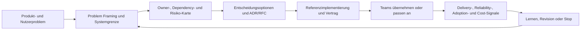

# Staff Engineer als Zielrolle

## Zweck, Definition und Scope

Ein Staff Engineer löst technische Probleme, die ein einzelnes Team nicht sinnvoll allein lösen kann, bleibt dabei jedoch glaubwürdig nah an Code, Architektur, Betrieb und Produktwirkung. Die Rolle schafft nicht vor allem mehr Meetings. Sie schafft Orientierung und Handlungsfähigkeit: Teams verstehen das Problem, kennen ihre Entscheidungsräume, können sichere lokale Änderungen liefern und sehen, wie diese Änderungen das Gesamtsystem verbessern.

Staff ist kein automatisch nächster Titel nach Senior. Die Wirkung wird an beobachtbaren Ergebnissen sichtbar: Eine Ursache wird klarer statt diffuser; ein unsicherer Change wird in einen überprüfbaren Pfad übersetzt; eine wiederkehrende Entscheidung wird als kleiner Standard, Vertrag oder Golden Path einfacher; Ownership wird sichtbar; eine Abhängigkeit wird mit realem Nutzen abgelöst; ein Incident hinterlässt eine bessere Systemgrenze. Direkte Implementierung bleibt relevant, weil sie Architekturannahmen testet und abstrakte Vorgaben von hilfreichen Standards trennt.

Eigene technische Konzepte, Workflows, Integrations-, Runtime- und Prozessverbesserungsfälle eines Lernenden liefern Kontext. Sie belegen für sich allein keine Staff-Engineer-Tätigkeit, keine formale Führung, keine organisationsweite Entscheidungshoheit, keine Teamgröße oder gemessene Mehrteamwirkung. Dieses Kapitel hält deshalb Rollenanspruch, Lernziel, Fallarbeit und tatsächliche Evidenz sauber auseinander.

Nach diesem Kapitel kann der Leser:

1. ein mehrteamiges Technikproblem als Wirkungskette aus Nutzerziel, Systemgrenze, Ownership, Constraints, Optionen und messbarer Verbesserung formulieren;
2. zwischen direkter Implementierung, Architekturentscheidung, technischer Strategie und formaler Führungsverantwortung unterscheiden;
3. einen Entscheidungsprozess mit Discovery, ADR/RFC, Referenzimplementierung, Contract, Rollout, Observability, Feedback und Revisionskriterium aufbauen;
4. Einfluss ohne Weisungsbefugnis durch Evidenz, klare Entscheidungsschnittstellen und respektierte Gegenargumente ausüben;
5. technische Wirkung über Delivery, Reliability, Sicherheit, Kosten, Adoption und Lernfähigkeit messen, ohne Menschen mit Einzelkennzahlen zu bewerten;
6. eine Staff-Praxis als Vorbereitung für Principal- und Chief-Entscheidungen nutzen, ohne diese Ebenen vorwegzunehmen.

## Kompetenzmarker und Evidenzgrenzen

| Marker | Status | Bedeutung |
|---|---|---|
| CURRENT-EVIDENCE | offen | Eigene Selbsteinschätzung: belegte Praxis zu diesem Thema festhalten, Lücken als Lernziel markieren. |
| HANDS-ON-TARGET | aktiv | Ein konkreter Mehrteam-Fall führt von Problem über Referenzpfad und Rollout bis zu messbarer, begrenzter Verbesserung. |
| ARCHITECT-TARGET | aktiv | Systemgrenzen, technische Optionen und Konsequenzen werden für betroffene Teams nachvollziehbar gemacht. |
| STAFF-TARGET | aktiv | Wiederkehrende Reibung wird durch Standards, Beispiele, Entscheidungshilfen und Coaching reduziert; die Wirkung wird überprüft. |
| CHIEF-TARGET | aktiv | Wirkungsnachweise können als Input für Portfolio-, Risiko- und Investitionsentscheidungen dienen. |
| SPECIALIST-OPTIONAL | aktiv | Personalführung, Recht, Finance, Security, Privacy, Change-Management und spezialisierte Technik werden mit ihren Owners bearbeitet. |

## Mental Model: Verkehrsnetz statt Heldentat

Ein Staff Engineer ist nicht die Feuerwehr, die jeden Engpass selbst umgeht. Er gestaltet eher ein Verkehrsnetz: Er entdeckt wiederkehrende Staus, versteht Straßen, Eigentümer und Unfallfolgen, baut eine sinnvolle Abzweigung, erklärt die Regeln und misst, ob mehr Menschen zuverlässig ans Ziel kommen. Die Abzweigung darf nicht jede Fahrt erzwingen. Sie muss einen klaren Nutzen haben, einen Owner besitzen und bei falscher Annahme zurückgebaut werden können.



Die wichtige Grenze: Einfluss ist nicht dasselbe wie Anweisung. Ein Staff Engineer kann eine Entscheidung vorbereiten, Alternativen fair darstellen, technischen Beweis liefern, einen Standard vorschlagen, eine Implementierung vorantreiben und Teams beim Lernen unterstützen. Er soll nicht verdeckte Entscheidungsmacht erfinden, Fach-/Produktowner übergehen oder eine Standardisierung mit seiner Person verwechseln.

Die Staff-Invarianten:

1. **Wirkung vor Aktivität.** Ein RFC, Framework oder Portal ist nur Mittel; entscheidend ist eine überprüfbare Verbesserung für Nutzer, Teams oder Systemrisiko.
2. **Direkte technische Evidenz.** Eine Referenzimplementierung, ein Contract-Test, ein Fehlerfall oder ein Messwert verhindert Entscheidungen auf Basis von Folien allein.
3. **Ownership ist ein Vertrag.** Für Service, API, Daten, Modell, Standard und Ausnahme müssen Team/Owner, Verantwortungsgrenze und Betriebsweg sichtbar sein.
4. **Standards sind opt-in durch Nutzen und opt-out durch begründete Ausnahme.** Sie helfen nur, wenn Teams einen nachvollziehbaren, sicheren Pfad erhalten.
5. **Reversibilität ist eine Kompetenz.** Ein kleiner Pilot, Flag, Canary, Migration und Rollback liefern bessere Erkenntnis als ein Big-Bang-Programm.
6. **Metriken dienen Entscheidungen, nicht Menschenbewertung.** Sie zeigen Systemreibe, Qualität oder Risiko und werden mit Kontext besprochen.

## Prerequisites und Dependencies

Die [Rollen-Kompetenz-Matrix](../00-navigation-governance/02-rollen-kompetenz-matrix.md), die [Selbsteinschätzung und Evidenzgrenzen](../00-navigation-governance/04-cv-istbild-und-zielkompetenzen.md), das [Kompetenzmodell](../00-navigation-governance/05-kompetenzmodell-fuer-staff-principal-und-chief.md), die [praktische und architektonische Lerntiefe](../00-navigation-governance/06-praktische-und-architektonische-lerntiefe.md) und die [Laborstrategie](../00-navigation-governance/09-laborstrategie-und-beweisartefakte.md) sind harte Voraussetzungen.

| Beziehung | Kapitel | Anschluss |
|---|---|---|
| related | [KB-0011: GenAI Solution Architect](01-genai-solution-architect-als-zielrolle.md) | GenAI-Entscheidungen brauchen klare Produkt-, Sicherheits- und Ownershipgrenzen über Teams hinweg. |
| related | [KB-0013: AI Platform Architect](03-ai-platform-architect-als-zielrolle.md) | Eine AI-Plattform ist nur wirksam, wenn Golden Paths und Betrieb für Teams konkret nutzbar sind. |
| related | [KB-0014: Platform Architect](04-platform-architect-als-zielrolle.md) | Plattformarbeit liefert ein häufiges Staff-Feld: interne Produkte, Standards und Adoption. |
| related | [KB-0015: Enterprise Architect](05-enterprise-architect-als-zielrolle.md) | Staff macht Portfolio- und Zielbildentscheidungen durch reale technische Folgen prüfbar. |
| related | [KB-0016: Cloud Architect](06-cloud-architect-als-zielrolle.md) | Teamgrenzen, Konto-/Landing-Zone-/Cost-Entscheidungen und Operations müssen in der Delivery wirken. |
| related | [KB-0017: Solution Architect](07-solution-architect-als-zielrolle.md) | Eine Lösung wird erst belastbar, wenn beteiligte Teams Verträge, NFR und Abnahme verstehen. |
| related | [KB-0019: Software Architect](09-software-architect-als-zielrolle.md) | Modul-/Contract-/Changeabilityentscheidungen werden als wiederverwendbare technische Praxis verstärkt. |
| related | [KB-0020: MLOps Architect](10-mlops-architect-als-zielrolle.md) | Lifecycle-Golden-Paths und Model Ownership brauchen wirkungsorientierte Teamadoption. |
| related | [KB-0021: LLMOps Architect](11-llmops-architect-als-zielrolle.md) | LLM Releasebundles, Evaluationspfade und Action Boundaries müssen für Produktteams handhabbar sein. |
| related | [KB-0023](13-principal-engineer-als-zielrolle.md) | Principal erweitert die Reichweite von wiederholten Staff-Wirkungen auf längerfristige, organisationsweite Programme. |
| related | [KB-0025](15-chief-architect-als-zielrolle.md) | Chief bestimmt Strategie, Portfoliorisiko und Entscheidungshoheit, nicht jede lokale Umsetzung. |
| applies | [KB-0221](../00-navigation-governance/01-master-index-und-wegweiser.md#kb-0221) | Spätere Team- und Architekturwirkungsmechanismen werden kanonisch vertieft. |
| applies | [KB-0550](../00-navigation-governance/01-master-index-und-wegweiser.md#kb-0550) | Delivery und Supply Chain vertiefen die sicheren Veränderungspfade. |
| applies | [KB-0565](../00-navigation-governance/01-master-index-und-wegweiser.md#kb-0565) | SLO- und Error-Budget-Entscheidungen verbinden Produkt-, Delivery- und Reliabilitywahrheit. |
| applies | [KB-0612](../00-navigation-governance/01-master-index-und-wegweiser.md#kb-0612) | Architecture Governance vertieft Entscheidungsgremien, Ausnahmen und Nachverfolgung. |
| applies | [KB-0720](../00-navigation-governance/01-master-index-und-wegweiser.md#kb-0720) | Portfolioevidenz hält tatsächliche Wirkung von Rollennamen getrennt. |

## Core Concepts und Mechanismen

### Problem Framing: Vom Symptom zum System

Ein Staff-Problem beginnt häufig als Satz wie „Deployments sind zu langsam“, „AI-Projekte sind unsicher“, „Teams kopieren dieselbe Authentisierung“ oder „Wir haben zu viele Incidents“. Diese Aussagen sind noch keine Architekturentscheidung. Sie benötigen einen Context:

| Frage | Beispiel: Quellenassistenten werden uneinheitlich ausgeliefert |
|---|---|
| Nutzer-/Geschäftswirkung | Produktteams liefern unterschiedliche Quellenqualität, Safety und Fallbacks; interne Nutzer vertrauen Antworten unterschiedlich stark. |
| Systemgrenze | Repository, CI, Prompt-/Corpus-/Modelbundle, API, Identity, Observability, Plattform, On-call, Docs. |
| Betroffene Teams | Knowledge Product, Platform, Security/Privacy, SRE, einzelne Produktteams, Fachowner. |
| Beweis heute | Wiederholte manuelle Checklisten, fehlende Bundle-IDs, unklare Owner, späte Regressionen. |
| Nicht-Ziele | Keine sofortige zentrale AI-Plattform für alle Fälle; keine autonome Compliancefreigabe. |
| Constraints | Bestehende Teams, Datenklasse, Zeit, Budget, Skills, Provider-/Cloudgrenzen, Reliability. |
| Erfolgshypothese | Ein kleiner Golden Path reduziert manuelle Nacharbeit, macht Owner/Release sichtbar und verhindert definierte Regressionen. |
| Gegenhypothese | Der Pfad ist zu schwer oder deckt nicht die reale Reibung ab; er bleibt Pilot statt Standard. |

Gutes Framing unterscheidet **Symptom**, **Ursache**, **Constraint**, **Option** und **Entscheidung**. Eine Plattform zu bauen ist keine Ursache. Ein einzelnes Ticket zu lösen ist oft keine nachhaltige Wirkung. Die Staff-Aufgabe ist, ausreichend breit zu denken und ausreichend klein zu beginnen.

### Technische Strategie als Hypothese

Eine Staff-Strategie ist ein Satz aus Ziel, Hebel, Grenzen und Evidenz:

> „Wenn wir für Quellenassistenten ein versioniertes Releasebundle mit Evalset, Citation-/Safety-Gate, Owner und Rollback als selbstbedienbaren Referenzpfad anbieten, können drei Produktteams sichere Änderungen schneller prüfen; wir messen Adoption, Time-to-Change, Regressionen, Fallbackrate und Kosten. Falls die Teams die Artefakte nicht übernehmen oder die Gate-Last den Nutzen übersteigt, vereinfachen oder stoppen wir.“

Diese Form hat keine geheime Autorität. Sie ist überprüfbar, kann abgelehnt werden und enthält eine Rücknahmebedingung.

| Strategieelement | Schlechte Form | Belastbare Form |
|---|---|---|
| Ziel | „Wir brauchen eine moderne Plattform.“ | „Wir reduzieren die durch fehlende Releaseevidenz verursachten Regressionen in einem klaren Scope.“ |
| Hebel | „Backstage/Kubernetes/AI Gateway einführen.“ | „Owner/Bundle/Eval/Runtimepfad als minimalen Golden Path liefern.“ |
| Scope | „Für alle Teams und Systeme.“ | „Für drei Quellenassistenten ohne Toolactions in Pilotphase.“ |
| Metrik | „Teams sind zufriedener.“ | „Adoption, Durchlaufzeit, Gate-/Regressionergebnis, SLO, Support-/Costsignal plus qualitative Feedbacks.“ |
| Governance | „Architecture Review entscheidet.“ | „Benannte Owner prüfen Data-/Security-/Product-Constraints; Ausnahme hat Ablaufdatum.“ |
| Revision | „Danach ist es Standard.“ | „Nach sechs Wochen werden Nutzen, Reibe, Ausnahmen und Risiko überprüft.“ |

### Direct Work, Delegation und Multiplikation

Staff Engineers delegieren nicht nur. Sie wählen bewusst die Ebene ihrer Tätigkeit.

| Tätigkeit | Direkter Beitrag | Multiplikator | Grenze |
|---|---|---|---|
| Diagnose | Trace/Logs/Contract/Code lesen, Hypothese testen. | Gemeinsames Incident-/Debugging-Playbook entsteht. | Nicht jede Debugsession selbst besitzen. |
| Referenzimplementierung | Kleinsten vertikalen Pfad bauen. | Teams sehen Contract, Tests, Telemetrie und Rollback als lebendes Beispiel. | Kein Framework bauen, bevor Wiederholungsbedarf bewiesen ist. |
| Entscheidung | ADR/RFC schreiben, Alternativen und Evidenz strukturieren. | Künftige Teams verstehen warum und wann neu entschieden wird. | Nicht die Freigabe oder Fachownerrolle simulieren. |
| Review | Kritische NFR/Boundary an konkretem Change prüfen. | Reviewheuristik, Beispiele und Self-Service-Checks verbessern sich. | Kein Dauer-Review-Bottleneck werden. |
| Coaching | Pairing, Architektursprechstunde, Feedback auf Entscheidungen. | Andere können ähnliche Entscheidungen später selbst treffen. | Kein unbelegtes People-Management behaupten. |
| Standard | Template, SDK, CI rule, catalog metadata, runbook bereitstellen. | Sicherer Weg wird leichter als lokaler Sonderweg. | Ausnahmen brauchen echten Bedarf und Owner statt Zwang. |
| Kommunikation | Risiko und Trade-off für Fach-/Produkt-/Plattformpartner übersetzen. | Entscheidungen werden schneller und mit weniger Missverständnis getroffen. | Nicht mit Vereinfachung Unsicherheit verstecken. |

### Ownership, Katalog und technische Gedächtnisbildung

Ownership ist keine E-Mail-Adresse in einer Wiki-Tabelle. Sie umfasst zuständiges Team, technische Grenze, API-/Daten-/Modellverantwortung, On-call/Incidentpfad, Lebenszyklus, Dokumentation und Ausnahmeweg. Ein Katalog kann helfen, diese Informationen auffindbar zu machen.

Backstage Software Catalog beschreibt einen zentralen Katalog für Ownership und Metadaten zu Services, Websites, Libraries, Datenpipelines und ML-Modellen. Metadaten können gemeinsam mit Code in YAML gepflegt werden. Backstage betont zugleich, dass der Katalog nicht die ultimative Quelle für jede dynamische Beziehung ist; er sollte menschliche Konzepte und Ownership sichtbar machen, während operative Details aus passenden Systemen verknüpft werden. Quellen: [Backstage Software Catalog](https://backstage.io/docs/features/software-catalog/), [Catalog Graph Guidance](https://backstage.io/docs/features/software-catalog/creating-the-catalog-graph/).

Ein minimales Katalog-/Ownershipartefakt:

```yaml
apiVersion: backstage.io/v1alpha1
kind: Component
metadata:
  name: policy-assistant
  description: "Quellengebundene interne Assistenz"
  annotations:
    example.org/release-bundle: "policy-assistant/2026-09-15.3"
    example.org/slo: "docs://slo/policy-assistant"
spec:
  type: service
  lifecycle: experimental
  owner: group:knowledge-product
  system: internal-knowledge
  dependsOn:
    - resource:policy-corpus
    - component:ai-gateway
  providesApis:
    - policy-answer-api
```

Diese Datei macht niemanden automatisch verantwortlich. Sie macht offene Lücken sichtbar: Wer aktualisiert den Owner? Gibt es einen on-call-Pfad? Ist die API real? Wie stimmen Katalog, IAM und Organisation überein? Für eine Staff-Rolle ist die richtige Reaktion auf solche Lücken ein kleiner, überprüfbarer Verbesserungsprozess, nicht das Verstecken der Lücke.

### Entscheidungsmechanismen: ADR, RFC und Decision Log

Ein ADR hält eine zeitpunktbezogene, lokal bedeutende technische Entscheidung fest. Ein RFC eignet sich für breitere, diskutierbare Veränderung. Ein Decision Log verknüpft Entscheidung, Owner, Evidenz, Folge, Reviewdatum und tatsächliches Ergebnis. Entscheidend ist nicht das Dateiformat, sondern die Anschlussfähigkeit an Code, Vertrag, Rollout und Messung.

| Artefakt | Geeignet für | Muss enthalten | Anti-Pattern |
|---|---|---|---|
| ADR | Konkrete Architektur-/Technologiewahl. | Kontext, Optionen, Entscheidung, Konsequenz, Nachweis, Revisions-Trigger. | „Wir wählen X, weil Best Practice.“ |
| RFC | Mehrteamige Änderung mit offenem Design. | Problem, Scope, non-goals, stakeholders, alternatives, migration, rollout, risks, decision rights. | Pseudokonsens ohne benannte Entscheider. |
| Design Doc | Ausführbarer technischer Zuschnitt. | Boundary, flows, APIs/data, NFR, security, operations, tests. | Schöne Boxen ohne Owner und Failure Mode. |
| Runbook | Wiederkehrende oder kritische Betriebsreaktion. | Trigger, evidence, safe actions, escalation, recovery, update owner. | Ungetestete Befehlsliste ohne Kontext. |
| Scorecard | Wiederkehrende Reife-/Adoptionseinsicht. | Kleine, prüfbare Kriterien mit Owner/Quelle. | Menschliche Leistungssorte oder Checkbox-Theater. |
| Post-incident Review | Lernen nach Störung. | Timeline, impact, contributing conditions, follow-ups, owner, due-date, verify. | Schuldzuweisung ohne Systemverbesserung. |

### Einfluss ohne Weisungsbefugnis

Ein Staff Engineer gewinnt Vertrauen durch Klarheit und faire Behandlung von Alternativen. Er beginnt nicht mit der Lösung, sondern mit gemeinsam prüfbaren Fakten und Fragen. Er benennt Unsicherheit, lädt relevante Gegenargumente ein, dokumentiert warum eine Entscheidung getroffen wurde und liefert einen Rückweg. Der Einfluss kommt aus Nützlichkeit und Verantwortlichkeit, nicht aus Lautstärke.

Ein Gesprächsablauf:

1. **Gemeinsame Wirkung formulieren:** „Welche Nutzer-/Betriebsfolge wollen wir verbessern?“
2. **Constraints sichtbar machen:** Sicherheit, Datenklasse, SLO, Kosten, Zeit, Teamkapazität, bestehende Verträge.
3. **Optionen ehrlich machen:** Einfacher Fix, Referenzpfad, größerer Plattformansatz, nichts tun.
4. **Evidenz vereinbaren:** Welche Messung, Prototyp-/Failureprobe oder Review könnte Alternativen unterscheiden?
5. **Entscheidungsrecht klären:** Wer berät, wer entscheidet, wer kann Risiken akzeptieren, wer implementiert?
6. **Kleinen Schritt liefern:** Referenz oder Pilot mit Review-/Stopdatum.
7. **Ergebnis zurückspiegeln:** Annahme bestätigt, widerlegt, angepasst oder gestoppt; keine stillschweigende Dauerentscheidung.

## Architecture und Data Flow: Mehrteamiger Golden Path

Ein Staff-Fall lässt sich als Veränderungsfluss modellieren. Beispiel: Drei Produktteams bauen Quellenassistenten. Wiederkehrende Sicherheits- und Releaseprobleme sollen reduziert werden, ohne eine zentrale, allmächtige Plattform zu bauen.

```text
Product team request
  → context / ownership / risk discovery
  → minimal release-bundle contract
  → reference implementation + CI checks
  → catalog entry + API/asset owner
  → review for data, action boundary and NFR
  → feature-flagged pilot
  → runtime traces + SLO + quality / cost signals
  → team feedback and exception log
  → staff decision review: adopt, simplify, revise or stop
```

| Flussphase | Staff-Beitrag | Team-/Owner-Beitrag | Nachweis |
|---|---|---|---|
| Discovery | Problem und Cross-Team-Impact strukturieren. | Lokale Reibe, Bedarf und Constraints belegen. | Context map, stakeholder/owner list, baseline. |
| Contract | Minimalen gemeinsamen Release-/Ownershipvertrag vorschlagen. | Contract gegen Produkt und Betriebsrealität prüfen. | Versioniertes Schema, examples, exceptions. |
| Reference | Vertikalen Referenzpfad implementieren oder paaren. | Code/CI/Runtime in eigenem Scope einpassen. | Repo, tests, trace, runbook, feedback. |
| Review | Trade-offs, Risiken und unverstandene Annahmen sichtbar machen. | Entscheider akzeptieren oder begrenzen Risiko. | ADR/RFC, approval/decision record. |
| Rollout | Kleine, rücknehmbare Einführung anregen. | Traffic/tenant/scope kontrollieren, Incidentpfad bedienen. | Flag, canary, SLO/quality/rollback signals. |
| Learning | Wirksamkeit und Ausnahmearten zusammenführen. | Feedback, support/review burden und result share. | Scorecard, post-pilot review, changed plan. |

Die Rolle baut keine heimliche Governancekette. Ein Team kann eine Alternative wählen, wenn es Constraints, Risiko und Owner klar macht. Ein Standard gewinnt, wenn er wiederholt die bessere Entscheidung ermöglicht, nicht wenn er alle Abweichungen versteckt.

## Protocols, Standards und Tools

| Bereich | Standard oder Tool | Sinnvoller Einsatz | Grenze |
|---|---|---|---|
| Ownership / Discovery | [Backstage Software Catalog](https://backstage.io/docs/features/software-catalog/) | Services, APIs, Ressourcen, Pipelines, Modelle und Teams mit Ownership auffindbar machen. | Katalog ist kein Live-CMDB und keine automatische Ownershipwahrheit. |
| Developer portal | [Backstage Technical Overview](https://backstage.io/docs/overview/technical-overview/) | Golden Paths, Templates, Docs und verknüpfte Tooling-Erfahrung als interne Plattform. | Portal ohne zuverlässige Quellen/Owner wird eine weitere Oberfläche. |
| Controlled rollout | [OpenFeature](https://openfeature.dev/docs/reference/intro/) | Anbieterneutrale Feature-Flag-Abstraktion für Canary, Kill Switch und begrenzte Aktivierung. | Flags brauchen Owner, Default, Audit, Targeting-Privacy, Expiry und Cleanup. |
| Remote flag protocol | [OFREP](https://openfeature.dev/docs/reference/other-technologies/ofrep/) | Standardisierte Kommunikation zwischen App und Flagmanagementsystem. | Protokoll löst keine Policy über erlaubte Zielgruppen oder Wirkung. |
| Reliability decision | [Google SRE Error Budgets](https://sre.google/sre-book/embracing-risk/) | Gemeinsame, messbare Abwägung von Deliveryrisiko und Reliability. | SLO/SLI müssen zum Produkt passen; Budget ist kein Freifahrtschein für Schaden. |
| SLO Design | [Google SRE SLOs](https://sre.google/sre-book/service-level-objectives/) | Nutzerzentrierte Messung, mehrere Workloadklassen und Rolloutinput. | Eine SLO-Zahl ersetzt keine Produkt-/Security-/Qualityentscheidung. |
| Architecture communication | C4/arc42/ADR/RFC, diagram-as-code, code review | Grenzen und Entscheidungen knapp und prüfbar kommunizieren. | Ein Diagrammformat beweist keine Richtigkeit. |
| Delivery evidence | Git, CI, Contract-/Architecture tests, SBOM/scan, GitOps/Change record | Direkte technische Evidenz und sichere Änderung. | Green CI deckt nicht automatisch Produkt-/Betriebs- oder Risikofolge ab. |
| Observability | OpenTelemetry, SLI dashboards, incident tools, cost tags | Change zu Nutzerwirkung und Betriebsrisiko korrelieren. | Metriken ohne Kontext oder Datenminimierung erzeugen falsche Sicherheit. |
| Knowledge systems | Docs-as-code, catalog, decision log, runbook, post-incident review | Entscheidungswissen für neue Teams auffindbar halten. | Unowned Dokumentation und automatisierte Kopien veralten schnell. |

OpenFeature beschreibt Feature Flags als zur Laufzeit steuerbare Änderung des Anwendungsverhaltens, etwa für Canary, A/B, sichere Degradation und kontextabhängige Aktivierung. Der Nutzen ist ein begrenzter, rücknehmbarer Rollout; die Risiken sind unklare Defaults, dauerhaft vergessene Flags, unfaire Targetinglogik, Daten in Evaluation Context und fehlendes Audit. Quelle: [OpenFeature Introduction](https://openfeature.dev/docs/reference/intro/).

## Konfiguration und Implementierung: Ein kleiner Staff-Golden-Path

Die folgende Konfiguration zeigt den Zuschnitt eines Beispiel-Golden-Paths. Sie ist weder eine reale Backstage-Instanz noch ein freigegebener Releaseprozess. Sie dient als Diskussions- und Prüfartefakt.

```yaml
golden_path:
  name: evidence-bounded-genai-release
  scope: "assistive, source-bound answers without external actions"
  owners:
    product: knowledge-product
    platform: developer-platform
    security: product-security
    operations: service-reliability
  required_evidence:
    - service_catalog_owner
    - versioned_release_bundle
    - data_and_retrieval_boundary
    - golden_and_regression_evaluation
    - fallback_and_rollback
    - trace_redaction_policy
    - slo_and_cost_signal
  exceptions:
    required: true
    fields: [reason, risk_owner, expiry, compensating_control]
  pilot:
    traffic_scope: "synthetic or named non-production testers"
    rollout_flag: "policy_assistant_golden_path_v1"
    review_after_days: 42
  stop_conditions:
    - "privacy or security boundary unresolved"
    - "defined regression gate fails"
    - "no accountable service owner"
```

Ein zugehöriger Featureflag-Vertrag:

```json
{
  "$schema": "https://raw.githubusercontent.com/open-feature/cli/refs/heads/main/schema/v0/flag-manifest.json",
  "flags": {
    "policy_assistant_golden_path_v1": {
      "description": "Enables the bounded pilot release path for the synthetic policy assistant.",
      "flagType": "boolean",
      "defaultValue": false
    }
  }
}
```

Ein Flag ist nur sicher, wenn sein Standardwert, Owner, Zweck, Targetingkontext, Audit, Abbruchregel und Ablaufdatum dokumentiert sind. Der Featureflag-Provider darf nicht selbst unkontrolliert über Berechtigungen entscheiden. Security-/Produkt-/Datengrenzen bleiben separate Kontrollen.

### Referenzimplementierung statt abstrakter Vorgabe

Ein Staff Engineer liefert die kleinste vertikale Referenz:

- ein Service-/Releasebundle mit klarer ID;
- ein Contract-Test für Input/Output und eine negative Berechtigungsprobe;
- eine `catalog-info`-Datei mit Teamowner und verlinktem Runbook;
- ein Trace-/Dashboardbeispiel mit Releaseversion, SLO-/Quality-/Costsignal und Redaction;
- einen Flag mit Default `false`, Scope, Stoprule und Cleanupissue;
- einen ADR mit Alternativen: manueller Checklistprozess, Golden Path als Template, große zentrale Plattform;
- eine kurze Anleitung, wie Teams den Pfad übernehmen oder eine begründete Ausnahme anmelden.

Die Referenz wird nicht zur Plattform, weil sie sauber geschrieben ist. Erst wiederholte Nutzung, positive Wirkung und übernehmende Owner rechtfertigen weitere Produktisierung.

## Scalability, Performance und Capacity

Staff-Wirkung skaliert nicht durch mehr Dokumente oder größere Gremien, sondern durch Verringerung wiederkehrender Entscheidungs- und Deliveryreibung. Ein Standard, der zehn Teams zwingt, mehr Tickets zu öffnen, ist möglicherweise ein zentralisierter Engpass statt Multiplikation.

\[
Time\ to\ safe\ change =
T_{understand} + T_{decide} + T_{implement} + T_{verify} + T_{release} + T_{recover}
\]

Diese Formel ist ein Gesprächsrahmen. Jede Zeitkomponente braucht lokale Messdefinitionen und darf nicht als Einzelpersonenkriterium benutzt werden.

| Engpass | Staff-Hebel | Messung | Fehlinterpretation |
|---|---|---|---|
| Unklare Ownership | Katalog-/Contract-/On-call-Referenz und Review. | Anteil kritischer Komponenten mit Teamowner und Runbook; Handovers. | Ein Ownerfeld bedeutet echte Betriebsfähigkeit. |
| Wiederholte Architekturfrage | ADR/RFC template, referenzierter Code und Example. | Reviewdurchlaufzeit, Ausnahmearten, spätere Rework-/Incidentdaten. | Schnellere Freigabe ist immer bessere Entscheidung. |
| Manuelle Deliverychecks | CI-/Contract-/Policy-as-code Golden Path. | Fehler vor/nach Release, lead time, adoption, false blocks. | Mehr Gates bedeuten automatisch mehr Sicherheit. |
| Deploymentrisiko | Flag/Canary/SLO/Rollbackpath. | Change failure, detection/recovery, error budget. | Jeder Change braucht denselben schweren Rollout. |
| Plattformadoption | Docs, template, migrationshilfe, feedback loop. | Aktive Nutzer, completion, support, time-to-first-safe-change. | Anmeldezahlen beweisen nachhaltigen Nutzen. |
| Tech debt | Context, ownership, economics, staged migration. | Rework, incident frequency, upgrade/EOL exposure, cost of delay. | Alle alte Technologie ist gleich dringend. |
| Cognitive load | Reduzierte Auswahl, klare defaults and escape hatch. | Onboarding, self-service success, exception distribution. | Weniger Optionen ist immer besser. |

Google SRE beschreibt Error Budgets als gemeinsamen Anreiz, Produktgeschwindigkeit und Zuverlässigkeit anhand eines vereinbarten SLO objektiver abzuwägen. Das ist für Staff-Arbeit nützlich, wenn Release-/Rolloutentscheidungen wiederholbar werden sollen. Es ist nicht dafür gedacht, jedes Risiko in eine einzelne Verfügbarkeitszahl zu komprimieren. Quelle: [Google SRE: Embracing Risk](https://sre.google/sre-book/embracing-risk/).

## Reliability und Failure Modes

Die Staff-Rolle ist besonders wichtig, wenn lokale Optimierungen Systemrisiko erzeugen. Ein Standard kann Falsches multiplizieren; ein selbstbedienbarer Template kann schwache Defaults massenhaft verbreiten; eine individuelle Heroics-Kultur kann On-call und Wissen an einzelne Personen binden.

| Failure Mode | Ursache | Staff-Reaktion | Nachweis |
|---|---|---|---|
| Standard erzeugt mehr Reibung | Realität/Teams/Scopes zu verschieden, Template zu schwer. | Adoption/Friction messen, Scope reduzieren, modularisieren oder stoppen. | Exception-/Abbruch-/Supportdaten und Teamfeedback. |
| Staff wird Review-Bottleneck | Jede Entscheidung benötigt dieselbe Person. | Self-service criteria, delegated reviewers, automation, office hours, klarere decision rights. | Reviewqueue, lead time, Bus factor. |
| Unsichtbare Ownershiplücke | Katalog, docs und Reality weichen ab. | Owner-/On-call-/runbook discovery, escalate to accountable group, no false assignment. | Incident handoff, catalog audit, owner confirmation. |
| Big-bang platform | Vermeintliche Vereinheitlichung vor validiertem Bedarf. | Referenz-/Pilot zuerst, staged adoption, kill criteria. | Nutzungs-/Outcomeevidence vor Investitionsausbau. |
| Metrik-Gaming | Individuelle Bewertung oder Ziel ohne Kontext. | Entscheidungsmetriken kombinieren, qualitative evidence, no people ranking. | Metric definition, review notes, anomalous patterns. |
| Change without rollback | Template fördert Deployment, nicht Recovery. | Flags, safe default, data migration and runbook as mandatory counterpart. | Failure drill, recovery time, last-safe-version evidence. |
| Security exception becomes permanent | Druck/Adoption verdrängt Grenze. | Time-bound exception, risk owner, compensating control, review/expiry. | Exception register, expiry alert, follow-up decision. |
| Architecture debt hidden by delivery speed | Teams ship, but coupling / EOL / risk grows. | Debt/register economics and staged investment case. | Change rework, incidents, EOL, cost/risk trend. |
| Cross-team conflict escalates personally | No explicit decision process. | Separate facts/options/rights; document dissent and resolution. | RFC/ADR, decision owner, follow-up outcome. |
| Knowledge loss | Decisions exist in heads/slack. | Code-linked ADR/catalog/runbook/post-incident docs with owners. | New team can safely change/operate without oral history. |

A Staff Engineer does not promise zero incidents. The role creates better detection, recovery, ownership and learning. If a shared SLO is justified, the error budget may tell teams when riskier experimentation is permitted and when reliability work has priority. Security, privacy, customer harm and irreversible data loss remain independent stop conditions even with remaining availability budget.

## Security, Governance und Compliance

Staff influence must not weaken legitimate control boundaries. It can improve them by reducing manual ambiguity: templates make security review earlier; ownership makes escalation faster; contracts reduce shadow integrations; feature flags make exposure smaller; evidence packs make exceptions explicit.

| Area | Staff contribution | Boundary |
|---|---|---|
| Security | Threat-model prompts, least-privilege default, supply-chain/secret checks, negative tests. | Security owner decides policy interpretation and accepts risk according to organization rules. |
| Privacy | Dataflow, minimization, retention/redaction fields in Golden Path. | Privacy/legal experts determine legal basis, rights and jurisdictional requirements. |
| Governance | ADR/RFC, decision rights, exception lifecycle, audit links and review dates. | Governance should not turn a local technical template into a hidden approval hierarchy. |
| AI | Purpose/action boundary, evalset, human gates, trace redaction, rollback. | High-impact classification and legal requirements need competent responsible functions. |
| Reliability | SLO, error budget, incident/recovery criteria. | Product sets user expectations; SRE/operations own service response. |
| Finance | Cost signal and options/economics. | Finance/procurement owns budget and contractual approval. |
| Access | Catalog owner maps, role-based portal visibility, documented escalation. | Catalog metadata does not replace authoritative IAM. |

Backstage itself notes that catalog ownership and structure need trustworthy organization data and that catalog graphs should not be treated as exhaustive real-time truth. This is a useful Staff lesson: a tool can visualize a decision; it cannot erase the need for the real accountable team to maintain it. Source: [Backstage Catalog Graph Guidance](https://backstage.io/docs/features/software-catalog/creating-the-catalog-graph/).

## Observability und Troubleshooting

Staff observability asks: *Is the system of work improving, and can we identify why it is not?* It joins technical and delivery evidence without exposing people or sensitive work contents.

| Signal layer | Examples | Diagnostic value |
|---|---|---|
| Product | Task completion, fallback/escalation, complaint, support load, user feedback. | Is the intended user outcome improving? |
| Delivery | Time to safe change, deploy attempts, change failure, rollback, review queue. | Is a golden path speeding safe delivery or creating friction? |
| Runtime | SLI/SLO, error budget, p95/p99, saturation, dependency error, alert quality. | Is the change safe in operation? |
| Security/privacy | Denied action, secret scan, policy exceptions, redaction event, access anomaly. | Is a shared path preserving boundaries? |
| Architecture | Contract/architecture-test failure, dependency exception, ownership gap, upgrade/EOL risk. | Is coupling or unmanaged debt growing? |
| Adoption | Active teams, completed onboarding, path abandonment, override/exception reason. | Is the product solving a real need and for whom does it not fit? |
| Economics | Cost per useful outcome, platform/support cost, repeated manual work avoided. | Is investment justified against alternatives? |
| Learning | Post-incident actions verified, recurring issue rate, new regression checks. | Does the system improve after evidence arrives? |

Troubleshooting path for a Golden Path with falling adoption:

1. Segment the evidence: Is adoption low because teams lack need, cannot find the path, hit security/technical constraints, consider it too costly, or use an untracked alternative?
2. Inspect a small number of real onboarding/change attempts with team consent. Do not infer developer behavior from portal clicks alone.
3. Compare stated requirements with reference implementation. Is the path missing a common contract, identity, language/runtime, migration or operational mode?
4. Inspect exception log: a cluster of valid exceptions is evidence that the default scope is wrong, not necessarily noncompliance.
5. Check whether review/approval has become a queue. Reduce staff-only touchpoints through clear criteria, automation, examples and delegated ownership.
6. Check production evidence: a safe but unusable path needs a different product trade-off; a fast but incident-prone path needs stronger controls.
7. Decide openly: simplify, split into patterns, invest in missing platform capability, retain a small guided path, or retire the initiative. Record outcome and migration/cleanup.

## Cost / FinOps

Staff investments have direct and indirect costs: engineering, platform, support, migration, documentation, review, training, security, reliability reserve and exit. Their return is not „number of templates“. It is a change in useful outcomes and avoided risk/rework.

\[
Value_{staff\ intervention} =
Benefit_{user} + Avoided_{risk/rework} + Learning_{reuse}
- Cost_{build/run/support/migrate/exit}
\]

This is an option model, not a balance-sheet formula. It forces a comparison with not acting, a smaller local fix and a larger platform initiative.

| Investment | Expected value | Cost/risk to expose |
|---|---|---|
| Reference implementation | Fast evidence and learning. | May become unsupported de facto platform. |
| Self-service template | Repeated safe starts and lower cognitive load. | Maintenance, dependencies, wrong defaults, supply-chain surface. |
| Catalog/ownership | Faster discovery and incident handoff. | Metadata drift, privacy/org-data integration, tool adoption. |
| Feature flags | Bounded rollout and recovery. | Provider/SDK, flag debt, targeting privacy, hidden config state. |
| Automated contract/gate | Earlier regression detection. | False blocks, slow CI, maintenance, test-data quality. |
| Central platform capability | Reuse and consistent operation. | Team formation, support/SLO, migration, vendor and opportunity cost. |
| Migration program | Lower EOL/coupling risk. | Dual run, data consistency, delivery slowdown, unproven benefit. |
| Coaching/documentation | More autonomous choices. | Time, uneven adoption, knowledge becomes stale without owner. |

A Chief-level discussion needs actual scale, budget and risk data; this chapter supplies a method to make smaller Staff pilots relevant inputs. It does not claim financial results from any learner's own projects.

## Trade-offs und Anti-Patterns

| Decision | Benefit | Trade-off |
|---|---|---|
| Staff directly fixes issue | Fast diagnosis and credibility. | Can hide systemic issue or make person a bottleneck. |
| Staff builds standard | Repeated safe path. | Requires ownership, adoption, exception and lifecycle design. |
| Central platform | Shared control and reuse. | Can create queue, mismatch and large operating surface. |
| Federated implementation | Local product fit and autonomy. | Duplication and inconsistent risk controls. |
| Mandatory review | Risk visibility. | Scales poorly unless criteria/automation/decision rights are clear. |
| Self-service guardrails | Faster learning and delivery. | Wrong defaults can scale harm; escape hatch required. |
| Metrics dashboard | Shared evidence. | Goodhart risk and false confidence without qualitative context. |
| Feature flag | Safe exposure/rollback. | Flag debt and context/identity privacy. |
| Consensus | Wider buy-in. | Can delay legitimate decision; distinguish consultation from authority. |
| Strong recommendation | Clear direction. | Must retain alternative/uncertainty and accountable decision owner. |

Anti-Patterns:

- **Hero architect:** One person fixes every crisis, while ownership, documentation and recovery remain unchanged.
- **Title substitution:** „Staff“ is used as evidence instead of demonstrated scope, technical depth, learning and results.
- **Framework first:** A portal, platform or governance committee is built before a repeated problem and minimal reference case are proven.
- **Invisible governance:** Decisions are made in informal channels with no owners, risks, alternatives or revision.
- **Review theater:** Many reviewers approve a design, but nobody owns production outcome or exception.
- **Metric weaponization:** Delivery or incident numbers are used to rank individuals instead of understand system constraints.
- **Mandatory golden path without escape:** Teams hide valid exceptions or build shadow paths.
- **Standard by slide:** Documentation declares a rule with no executable check, reference implementation, training or lifecycle.
- **Flag forever:** Every release uses flags, but no owner/expiry/cleanup produces combinatorial configuration debt.
- **Cross-team dependency as personal favor:** Critical interfaces depend on goodwill rather than contract, roadmap and escalation.

## Staff-, Principal- und Chief-Entscheidungen

| Ebene | Entscheidung | Evidence and trigger |
|---|---|---|
| Staff | Mehrteamiges Problem in ein begrenztes, überprüfbares Pilotvorhaben übersetzen. | Context, owner map, alternatives, reference and outcome signals exist. Unclear benefit or no owner stops expansion. |
| Staff | Minimalen Golden Path und exception path liefern. | Adoption, time-to-safe-change, failure/rollback, feedback and exception clusters determine revision. |
| Staff | Architektur- und Deliveryentscheidungen mit echter Implementierung verbinden. | Contract tests, traces, runbooks, code and pilots validate claims. Review bottleneck triggers delegation/automation. |
| Staff | Ownership-/operational gaps sichtbar und bearbeitbar machen. | Catalog/incident evidence identifies gaps; real accountable team confirms ownership before system claims it. |
| Staff | Coaching als technische Multiplikation praktizieren. | Others make safe decisions and improve artifacts; no claim of formal people management. |
| Principal | Grenzen und Roadmaps mehrerer Staff-Initiativen auf gemeinsame Systemrichtung ausrichten. | Cross-domain dependency, platform/economic/risk data and organizational constraints justify a program. |
| Principal | Invest or retire shared capability decide. | Repeated needs, adoption, operating team, standard/interface maturity and exit cost guide choice. |
| Chief | Portfolio-/risk-/strategy and decision-rights framework define. | Aggregate evidence, market/regulation, capital, organizational capabilities and long-horizon architecture determine investment. |
| Chief | Technical leadership model fund and evaluate. | Outcomes, risk reduction, autonomy, succession and customer value matter; title counts do not. |

## Production Checklist

| Bereich | Prüfnachweis | Owner | Stop-/Rollbackkriterium |
|---|---|---|---|
| Problem | Nutzer-/Betriebswirkung, baseline, scope, non-goals, constraints. | Product + affected technical owners | Problem is merely a preferred solution or no evidence of repeated impact. |
| Ownership | Service/API/data/model/team/on-call/decision ownership and escalation. | Accountable teams | Owner unknown, contradictory or unable to operate proposed scope. |
| Decision | ADR/RFC with options, risks, assumptions, rights, revision date. | Named decision owner | Decision is implicit or critical dissent/risk has no disposition. |
| Reference | Small vertical implementation, code/contract/test/trace/runbook. | Staff + pilot team | Architecture cannot be tested in a bounded non-production scope. |
| Security/privacy | Dataflow, least privilege, threat/negative tests, exception process. | Security/Privacy + team | Boundary unclear or compensating control absent. |
| Reliability | SLO/SLI appropriate to scope, error/rollback/incident path, recovery evidence. | Product + SRE/team | No safe degradation or known recovery. |
| Rollout | Flag/canary/targeting/default, monitoring, stop rule, communication. | Release owner | Flag/rollout cannot be reversed or targeting lacks policy. |
| Adoption | Docs/template/portal, onboarding, exception and feedback path. | Platform/Staff owner | Standard is imposed without product value or maintainers. |
| Economics | Build/run/support/migration/exit hypothesis, cost per useful outcome. | Product/Architecture/Finance | Costs/owners/exit omitted. |
| Learning | Post-pilot/incident review, evidence update, owner/date for follow-ups. | Staff + affected teams | No learning signal or actions become unowned backlog. |
| Cleanup | Flags, templates, docs, exceptions, pilot resources and stale paths retire. | Initiative owner | End-of-pilot leaves conflicting standard or permanent temporary control. |

## Interviewfragen mit Antwortleitfäden

1. **Woran erkennen Sie ein Staff-Level-Problem?** Es berührt mehrere Teams oder einen kritischen Systempfad, lässt sich nicht durch eine lokale Optimierung lösen und braucht zugleich konkrete technische Evidenz. Ich formuliere Nutzerwirkung, Ownership, Constraints, Alternativen und einen kleinen prüfbaren ersten Schritt.

2. **Wie bleiben Sie hands-on, ohne zum Bottleneck zu werden?** Ich arbeite direkt an Diagnose, Referenzimplementation oder kritischer Migration, überführe das Wissen dann in Contracts, Tests, Templates, Runbooks und Coaching. Der Erfolg ist, wenn andere sicher handeln können, nicht wenn jede Änderung über mich läuft.

3. **Wie üben Sie Einfluss ohne Weisungsbefugnis aus?** Ich zeige Wirkung und Constraints, lade Gegenargumente ein, unterscheide Beratung und Entscheidung, liefere eine kleine reversible Evidenz und dokumentiere Konsequenzen. Ich übergehe keine legitimen Owner.

4. **Wann sollte ein Standard verpflichtend sein?** Wenn ein klarer gemeinsamer Risiko-/Interoperabilitäts- oder Betriebsgrund besteht, der Standard einen nutzbaren Pfad und begründete Ausnahme bietet, ein Owner ihn betreibt und Wirkung/Erosion messbar bleiben. Ein Dokument allein reicht nicht.

5. **Wie messen Sie technische Wirkung?** Über eine kleine Mischung aus Ergebnis-, System- und Lernsignalen: Nutzer-/Taskoutcome, Change-/incident-/recovery data, contract/quality/security findings, adoption/exception pattern, cost and qualitative feedback. Ich nutze sie nicht zur individuellen Leistungsrangliste.

6. **Wie gehen Sie mit einer Plattforminitiative um, die nicht adoptiert wird?** Ich diagnostiziere Bedarf, Findbarkeit, Scope, Friction, missing capabilities and exceptions with real teams. Dann simplify/split/invest/stop openly. Forced adoption hides the evidence needed for a good decision.

7. **Was ist der Unterschied zwischen Staff und Principal?** Staff löst und standardisiert oft konkrete teamübergreifende Probleme mit direkter technischer Nähe. Principal hält mehrere solche Wirkungsräume und langfristige Systemrichtung zusammen. Die tatsächliche Reichweite und Evidenz zählen mehr als Titel.

8. **Wie nutzen Sie Error Budgets als Staff Engineer?** Für passende Service-SLOs helfen sie Product und SRE, Release- und Reliabilityrisiko transparent abzuwägen. Ich halte Security, privacy, data loss, harmful AI action and legal obligations als separate Grenzen sichtbar.

9. **Wie verhindern Sie, dass Feature Flags technische Schuld erzeugen?** Jede Flag hat purpose, owner, default, target/context policy, audit, stop/rollback rule, expiry and cleanup issue. Der Flagdienst wird nicht mit Fachautorisation verwechselt.

10. **Wie sprechen Sie über eigene Staff-Readiness ohne Titelübertreibung?** Ich zeige begrenzte, überprüfbare Artefakte und Wirkung: Kontext, Entscheidungslog, Implementierung, Tests, Rollout, Outcome, Feedback and unresolved limits. Ich benenne klar, was belegte Praxis, gelernt oder noch Ziel ist.

## Praktisches Lab / Fallarbeit: Mehrteamiger Golden Path für Quellenassistenten

**Status:** **reviewed_only**, Stand 2026-09-15. Diese Fallarbeit ist kein Nachweis einer realen Staff-Rolle oder Teamleitung. Es wurden keine realen Teams, Kundensysteme, Budgets, Providerkonten, Portalinstanzen, Featureflag-Dienste, Personaldaten oder Produktivrollouts erstellt, verändert oder bewertet.

### Ziel und Scope

Drei fiktive Produktteams wollen kleine Quellenassistenten bauen. Sie wiederholen Release-/Ownership-/Eval-/Rollbackarbeit und kennen nicht immer den zuständigen Betriebsweg. Der Pilot soll einen **minimalen**, optionalen Golden Path für assistive, nicht handelnde Quellenantworten liefern. Nicht im Scope: globale Plattform, Toolactions, hochriskante Entscheidungen, echte Kundendaten und verpflichtende Organisationstandards.

### Aufbau

1. Erstelle Problemstatement mit Nutzerwirkung, Systemgrenze, baseline assumptions, non-goals, constraints and risk. Nenne mindestens eine Alternative: lokale Checkliste, Referenzpfad oder zentraler Plattformausbau.
2. Zeichne Context-/Ownerkarte: Product Team, Platform, Security/Privacy, SRE, Knowledge Owner, API/Corpus/Runtime/On-call. Markiere unbekannte Owner ausdrücklich.
3. Schreibe ein kurzes RFC mit minimalem Bundlecontract, Katalogmetadaten, Evalset, Trace-/Redactionregeln, Fallback, Flag und Ausnahmeprozess. Lege Entscheidung/beratende Rollen getrennt fest.
4. Erstelle eine Referenzimplementierung als Pseudocode/Template: versioniertes Bundle, `catalog-info`, Contract-/negative Authztest, trace fields, runbook and default-disabled flag.
5. Erzeuge ein kleines statisches Katalogartefakt für den fiktiven Service und einen Eigentümer, ohne eine echte Organisation/LDAP zu behaupten.
6. Definiere SLO-/Quality-/Safety-/Cost-/Adoption-/Exception-Signale. Für jedes Signal erläutere Nutzerwert, Datenklasse, Owner, Zeitfenster und welche Entscheidung es beeinflusst.
7. Entwerfe Canary: nur synthetische Tester, Flag default false, positive/negative test suite, kill switch, Rollbacktarget, communication and cleanup.
8. Baue eine Scorecard mit maximal acht Kriterien, beispielsweise Owner, contract, eval, data boundary, SLO, rollback, runbook, exception expiry. Sie bewertet Artefakte, nie Menschen.
9. Simuliere eine Reviewrunde: ein Team findet den Pfad zu schwer; eines braucht eine Sicherheitsausnahme; ein Incident zeigt fehlende Ownership. Dokumentiere Reaktion, nicht nur „approved“.
10. Führe einen Post-Pilot-Review durch: Adoptionhypothese, Friction, Quality/Reliability findings, cost/effort, exception pattern, decision (adopt/simplify/split/retire), owners and next evidence.
11. Assemble Evidence Pack: problem/context map, RFC/ADR, reference artifacts, scorecard, review/exception records, rollout/rollback, dashboard sketch and clear limitations.

### Negative Gegenproben

| Probe | Erwartete Beobachtung | Was sie nicht beweist |
|---|---|---|
| Katalog zeigt einen Personennamen, aber kein Team/on-call. | Scorecard markiert Ownership als unvollständig; keine produktive Zusage oder Standardpromotion. | Tatsächliche Org-/IAM-/On-call-Integration. |
| Ein Team kann die Referenz nur mit großer Abweichung einsetzen. | Ausnahme fordert reason, risk owner, expiry and compensating control; Muster fließt in Designreview ein. | Dass jede Ausnahme sicher oder dauerhaft berechtigt ist. |
| Featureflag wird versehentlich ohne Zielgruppe aktiviert. | Default/targeting/rollback rule and test reveal wrong scope; kill switch stops exposure. | Konkretes Verhalten eines Flagproviders. |
| Contracttest für Citation-/Output-/Authzgrenze fehlschlägt. | Canary blockiert; kein Portalstatus kann den fehlenden technischen Nachweis überdecken. | Vollständige LLM-/Securityqualität. |
| Errorbudget/SLO ist gut, aber Security-/Privacyreview offen. | Rollout stoppt trotz Reliabilitysignal; unabhängige Grenzen bleiben sichtbar. | Konkrete Legal-/Complianceabnahme. |
| Staff-Reviewqueue wächst. | Entscheidung wird in Criteria, template, automation and delegated ownership zerlegt; keine Dauerabhängigkeit. | Verfügbarkeit eines echten Teams oder Zeitgewinn. |
| Adoptiondaten sind hoch, aber Support-/Exceptionlast steigt. | Pilotreview bewertet Outcome nicht über Klickzahlen; scope/UX/support changes or stop considered. | Endgültigen ROI einer realen Plattform. |
| Ein Incidentrunbook fehlt nach Pilot. | Scorecard blocks expansion; owner/trigger/recovery must exist before broad rollout. | Produktionsrecovery in einer konkreten Umgebung. |
| Initiative verliert den Sponsor. | Dokumentierte owner/decision/cleanup path prevents abandoned artifacts from becoming shadow standard. | Organisationelle Umstrukturierungen. |
| Reviewindikatoren werden für persönliche Rangliste verwendet. | Messvertrag verbietet individuelle Bewertung; Kontextreview/Safeguard korrigiert Nutzung. | Vollständige Kulturveränderung. |

### Auswertung und Cleanup

Die Fallarbeit ist dann gut, wenn sie ein wertvolles „Nein“ erlaubt: Der Golden Path kann zu schwer, zu breit oder nicht der richtige Hebel sein. Ein sauber dokumentiertes Stoppen verhindert mehr technische Schuld als ein unadoptierter Standard. Erfolg ist ein überprüfbares Ergebnis, nicht ein Staff-Titel.

Bei einer späteren echten nicht produktiven Ausführung werden fiktive Repositories, Katalogentitäten, Flags, Dashboards, synthetische Testdaten, temporäre CI-Artefakte und Dokumententwürfe gemäß vereinbartem Retentionplan entfernt oder klar als abgeschlossener Pilot archiviert. Diese Bearbeitung ist `reviewed_only`; es gibt keine Ressourcen zum Bereinigen.

## Dependencies, Cross-References und Quellen

Die Methodik und Evidenzgrenzen stehen in [KB-0002](../00-navigation-governance/02-rollen-kompetenz-matrix.md), [KB-0004](../00-navigation-governance/04-cv-istbild-und-zielkompetenzen.md), [KB-0005](../00-navigation-governance/05-kompetenzmodell-fuer-staff-principal-und-chief.md), [KB-0006](../00-navigation-governance/06-praktische-und-architektonische-lerntiefe.md) und [KB-0009](../00-navigation-governance/09-laborstrategie-und-beweisartefakte.md). Die fachlichen Nachbarn sind [KB-0013](03-ai-platform-architect-als-zielrolle.md), [KB-0014](04-platform-architect-als-zielrolle.md), [KB-0019](09-software-architect-als-zielrolle.md), [KB-0020](10-mlops-architect-als-zielrolle.md), [KB-0021](11-llmops-architect-als-zielrolle.md), [KB-0023](13-principal-engineer-als-zielrolle.md) und [KB-0025](15-chief-architect-als-zielrolle.md).

| Quelle | Verwendete Aussage | Stand |
|---|---|---|
| Lehrplan-Dateikatalog KB-0022 | Verbindlicher Scope, Reihenfolge und Rollenfokus. | Planstand 2026-09-14 |
| [Backstage Software Catalog](https://backstage.io/docs/features/software-catalog/) | Teamorientierte Software-/Ownershipmetadaten und Katalog als Auffindbarkeitsmechanismus. | Abgerufen 2026-09-15 |
| [Backstage Catalog Graph Guidance](https://backstage.io/docs/features/software-catalog/creating-the-catalog-graph/) | Katalog als menschlich kuratierte Sicht, nicht als komplette Echtzeitquelle. | Abgerufen 2026-09-15 |
| [OpenFeature Introduction](https://openfeature.dev/docs/reference/intro/) | Feature Flags für dynamische, kontextbezogene Aktivierung, Canary und Degradation. | Abgerufen 2026-09-15 |
| [OpenFeature OFREP](https://openfeature.dev/docs/reference/other-technologies/ofrep/) | Anbieterneutrales Protokoll zwischen Anwendungen und Flagmanagement. | Abgerufen 2026-09-15 |
| [Google SRE: Embracing Risk](https://sre.google/sre-book/embracing-risk/) | Error Budget als gemeinsames Signal für Delivery- und Reliabilityabwägung. | Abgerufen 2026-09-15 |
| [Google SRE: Service Level Objectives](https://sre.google/sre-book/service-level-objectives/) | Nutzerbezogene Metriken, mehrere Workloadziele und Relation zu Rolloutentscheidungen. | Abgerufen 2026-09-15 |

## Bonus: New Tech and Innovations

**Stand 2026-09-15 — Developer Portals erweitern den Katalog um AI-Ressourcen und kontrollierte Agenteninteraktion.** Backstage dokumentiert AI-bezogene Ressourcen im Software Catalog sowie MCP Actions und veröffentlichte Skills für AI-Coding-Assistants. **Reifegrad: Adopting.** Der Nutzen liegt in sichtbarer Ownership, Lifecycle und Abhängigkeiten für Skills, Regeln und MCP-Schnittstellen. Risiken sind ein Portal als falsch vertrauenswürdige Quelle, unklare Toolrechte und schnelle Formatentwicklung. Ein Pilot katalogisiert einen nicht sensiblen AI-Ressourcentyp mit Teamowner, Lifecycle, Dependency und Read-only-Sicht; erst danach werden Actions mit OAuth, Policy, Audit und negative Tooltests geprüft. Quelle: [Backstage AI Overview](https://backstage.io/docs/ai/).

**Stand 2026-09-15 — OpenFeature Flag Manifests und OFREP können Rolloutsteuerung portabler und überprüfbarer machen.** OpenFeature definiert eine anbieterneutrale Flag-API; OFREP spezifiziert eine standardisierte Remote-Integrationsschicht. **Reifegrad: Established für die Kernabstraktion, Adopting für organisationsweite Manifest-/Protocol-Standards.** Das kann Providerwechsel, stark typisierte Accessors und sichere Canary-/Kill-Switch-Pfade erleichtern. Risiken bleiben Targeting-Privacy, Flag-Schuld, fehlende Auditierung und die Verwechslung von Flagkontext mit Fachautorisierung. Ein Pilot führt für wenige Flags Manifest, Owner, Default, Expiry, Audit und Cleanup ein und misst Rollbackzeit, Fehlaktivierungen sowie verwaiste Flags. Quellen: [OpenFeature Introduction](https://openfeature.dev/docs/reference/intro/), [OFREP](https://openfeature.dev/docs/reference/other-technologies/ofrep/).

**Stand 2026-09-15 — AI-unterstützte Entwicklung erhöht den Wert kleiner ausführbarer Standards.** Codeassistenz beschleunigt Implementierung, kann aber auch nicht passende Abhängigkeiten, unsichere Defaults und unklare Ownership multiplizieren. **Reifegrad: Adopting.** Der robuste Staff-Hebel sind nicht große Vorgaben, sondern Referenzimplementierung, Contracts, Tests, SBOM-/Secret-/Policychecks, dokumentierte Entscheidung und klares Ownership. Ein Pilot misst Rework, Contractverletzungen, sichere Time-to-Change und die Fähigkeit anderer Teams, den Pfad ohne dauerhafte Expertenwarteschlange zu nutzen. Quellen: [Backstage Technical Overview](https://backstage.io/docs/overview/technical-overview/), [Google SRE SLOs](https://sre.google/sre-book/service-level-objectives/).

